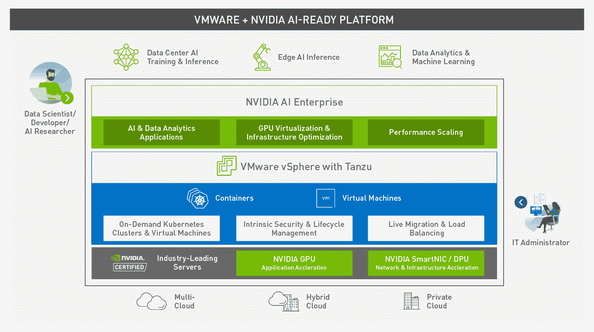
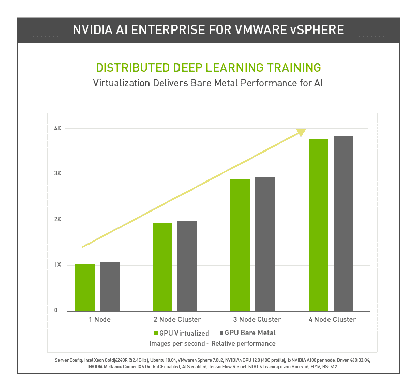

# VMware 的 vSphere 可以直接访问 Nvidia 的人工智能框架和 GPU

> 原文：<https://thenewstack.io/vmwares-vsphere-gets-direct-access-to-nvidias-ai-frameworks-and-gpus/>

直接访问 GPU 巨头 Nvidia 的 AI 企业套件将允许 VMware vSphere 客户受益于大量 Nvidia 框架及其 GPU 硬件，以跨多云虚拟基础架构扩展 AI 应用及其开发。

随着 [VMware vSphere 7 Update 2](http://www.vmware.com/go/vSphere-vSAN-March2021-news) 的发布，根据两家公司之间的许可协议条款，vSphere 现在支持 Nvidia 的 AI 框架、CUDA 应用程序、模型和 SDK。

VMware 云平台业务部门副总裁 [Lee Caswell](https://www.linkedin.com/in/leecaswell/) 对 New Stack 表示:“VMware 和 NVIDIA 联手推动人工智能在企业中的采用，在企业中，具有企业弹性的大规模部署依赖于虚拟化基础设施。

在发布之前，Caswell 表示，vSphere 客户经常在裸机服务器上部署人工智能应用程序，“性能是重中之重，需要有限的规模。”

“通常，这种裸机‘基础设施’是从影子 IT 散兵坑中得到服务的，而没有注意到企业对弹性、服务质量和规模的要求，”Caswell 说。

Caswell 表示，在云环境中，vSphere 客户的人工智能部署仅限于按需基础设施的公共云解决方案。

通过 VMware 和 Nvidia 之间的合作，vSphere 客户受益于 Nvidia 的人工智能硬件和计算设计，包括其用于并行计算和其他应用的计算密集型 [A100 安培架构](https://www.nvidia.com/content/dam/en-zz/Solutions/Data-Center/nvidia-ampere-architecture-whitepaper.pdf)，以及 [VMware](https://tanzu.vmware.com?utm_content=inline-mention) 的虚拟机管理程序设计。“所提供的这种性能实际上与裸机相同，并且可以线性扩展，”Caswell 说。

Caswell 说，VMware 还与 Nvidia 合作，将 VMware 的“弹性功能”，如 vMotion 和[distributor resource schedulers(DRS)](https://www.vmware.com/fr/products/vsphere/drs-dpm.html)，添加到运行在 Nvidia GPUs 上的应用程序中。Caswell 表示，“通过这一版本，可以使用传统应用程序所用的相同 vMotion 和 DRS 企业功能来管理人工智能工作负载”。对于扩展要求，联合解决方案允许 Nvidia GPUs 进行时间分片，并通过低延迟 RDMA 连接在节点之间共享。

“数据科学家不想担心基础设施，企业正致力于更快地将人工智能系统投入生产，”卡斯韦尔说。“通过合作，我们正在加速人工智能部署，并通过共享资源降低总拥有成本——所有这些都不会影响性能。”

虽然开发人员可以从上述部署人工智能应用程序的复杂性降低中受益，但数据科学家可以利用能够构建可通过使用英伟达人工智能企业框架进行扩展的应用程序的优势。这消除了人工智能孤岛，或者如卡斯韦尔所描述的那样，“影子人工智能”。“它降低了将不同的部分组合在一起进行测试的风险，并使[DevOps 团队]能够快速启动，”Caswell 说。

Caswell 传达的面向人工智能的 DevOps 团队针对其人工智能项目使用 vSphere 7 的可能使用场景包括:

*   用于机器学习的 [TensorFlow](https://www.tensorflow.org/?hl=fr) 和 [PyTorch](https://pytorch.org/) 。
*   Nvidia Tensor RT，用于 GPU 优化的深度学习推理，配有 Nvidia Triton 推理服务器，可大规模部署经过训练的 AI 模型。
*   [RAPIDS](https://rapids.ai/) ，用于数据科学和分析管道。

<svg xmlns:xlink="http://www.w3.org/1999/xlink" viewBox="0 0 68 31" version="1.1"><title>Group</title> <desc>Created with Sketch.</desc></svg>