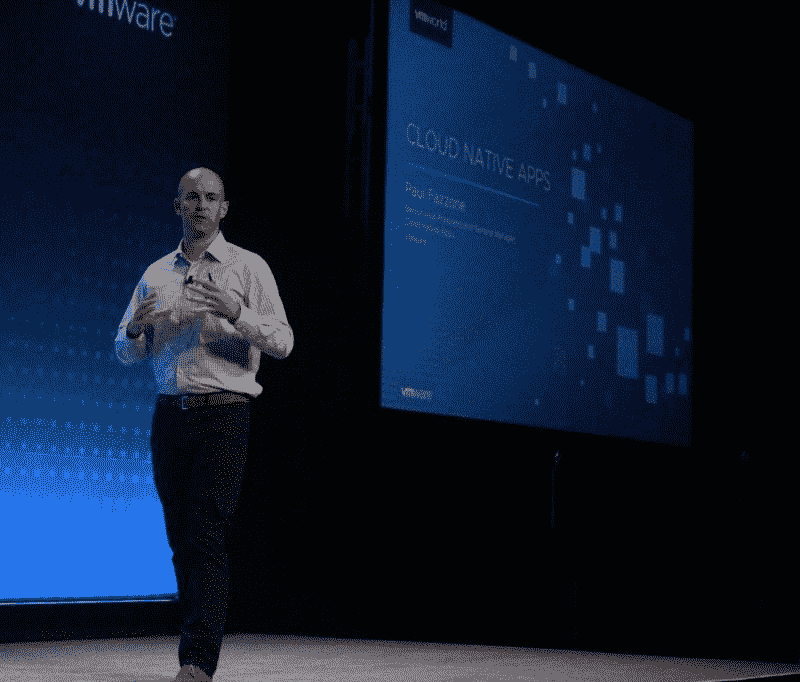

# VMworld 2018: VMware 希望为 NSX 重新设计您的容器

> 原文：<https://thenewstack.io/vmworld-2018-vmware-wants-to-re-architect-your-containers-for-nsx/>

与 VMware 投资的其他容器平台相比，[Pivotal Container Service](https://pivotal.io/platform/pivotal-container-service)(PKS)展现出的一个引人注目的优势是，它有望成为“普通 Kubernetes”的一种实现，不需要开发人员提供任何特殊和排他性的待遇。事实上，为 Kubernetes 设计的插件应该能像其他 CNCF 认证的管弦乐队一样容易地插入 PKS。因此，VMware 官员整个星期都在告诉拉斯维加斯 VMworld 2018 的与会者，你不必改变或调整现有的代码或容器来在 PKS 运行。

但是，如果 PKS 应该为其私有云和混合云客户提供 NSX 的优势，即位于每个 VMware 平台核心的虚拟化网络基础架构，那么开发人员难道没有理由*希望*做出某些调整吗？本周，VMware 高级官员让新的堆栈有理由相信，他们很高兴看到这种情况发生。

PKS 和 [VMware Kubernetes 引擎](https://cloud.vmware.com/vmware-kubernetes-engine) (VKE，该公司最近在亚马逊 AWS 上宣布的基于公共云的完全托管服务，即将在微软 Azure 上推出)都旨在提供 VMware 所谓的“Kubernetes 拨号音”

“我们提供的 Kubernetes 拨号音是 100%香草味的，”云原生应用高级副总裁兼总经理 Paul Fazzone 告诉新堆栈，“无论您是在 PKS 内部运行它，还是在 VKE 作为 SaaS 服务的公共云环境中使用和运行它。就开发者互动而言，它们实际上是相同的。”

Fazzone 继续说道，关键的区别在于平台的运营模式——管理员和 IT 运营商将如何监管 PKS。据说，这种模式的一个要素是更丰富的监控数据，特别是该公司去年收购的名为 Wavefront 的监控服务[，这里的官员称其比 Prometheus 更方便，更适应各种集装箱监控任务。](https://www.wavefront.com/solutions/pks-monitoring/)

如果运营商和 IT 人员确实从 PKS 和 NSX 获得了比其他方式更丰富的性能数据，那么以 DevOps 的名义，难道他们不应该与开发人员分享这些性能数据，以帮助他们提高应用程序的质量吗？

“我们的目标是帮助 IT 运营团队和 DevOps 团队解放他们的开发人员，使他们不必担心基础设施、安全性和运营，”Fazzone 回应道。“我不认为这是一个电灯开关。我们今天到了吗？我不这么认为。我认为仍然有一些步骤需要这些团队对彼此的角色有一点共同的理解。现在我认为，随着时间的推移，德马克将变得更加干净。但在近期，我仍然认为有些事情开发商不能简单地逃避现实。他们必须意识到一些事情。Kubernetes 在帮助你澄清 demarc 并使之成为可能方面大有作为。”

VMware 官员公开表示(特别是两年前 VMworld 上的[)他们相信他们的平台应该在 IT 部门的组织方式上实现*最小的*改变。换句话说，你不应该为了使用 vSphere 或 NSX 而经历彻底的“数字化转型”。在这里，Fazzone 扩展了这一立场，断言 PKS 不需要带来某种组织上的巨变。](https://thenewstack.io/vmware-pitches-nsx-virtual-networking-foundation-every-workload/)

尽管如此，他仍然为一种工作流敞开了大门，也许是通过 Wavefront 触发的，在这种工作流中，管理员迫使开发人员更多地关注某些性能指标。这一点很重要，因为即使是以间接的方式，这也意味着 VMware 仍然对稍微有点 VMware 风味的容器的想法持开放态度。

当然，这与该公司 2016 年的立场仍有根本不同，该公司将让 [Docker 的工具在幕后悄悄补充](https://thenewstack.io/vmware-integrated-containers-may-introduce-docker-enterprise/)，以生产与其 vSphere 环境兼容的专用容器。因为 PKS 是 Kubernetes，它管理的集装箱是标准化码头和/或 OCI 单位。如果有什么变化的话，那就是内在的东西。

如果 orchestrator 下面突然出现了更丰富的基础设施，包括 NSX 和 vSAN，那么运营商和管理员收到的大量信号不会给他们更多的借口来缩小开发和运营之间的差距吗？如果是这样，这难道不会间接影响为该环境构建的容器的架构吗？

“我认为这是真的，”T2，VMware 云计算和网络首席技术官 Guido Appenzeller 回应道。“有一个方面，有更多的可见性——特别是如果你让双方都可以访问它——可以创建一个良好的平台，SRE 人可以与开发人员合作，随着时间的推移改进项目。我认为我们在 Wavefront 上看到了这一点…我们在 Wavefront 上有这些非常大的 SaaS 提供商，基本上很多东西都显示在 SRE 仪表板和开发者仪表板上。如果出了问题，它们会查看相同的数据。这极大地有助于沟通。”

Fazzone 接着引用了开发标准 Kubernetes 生态系统的开发人员如何可能[使用法兰绒作为容器连接的网络覆盖](https://thenewstack.io/three-perspectives-network-extensibility/)。如果正在开发的应用程序依赖于由 NSX-T 网络基础设施托管的容器上管理的数据库(参见[其版本的 NSX 用于云原生环境](https://docs.vmware.com/en/VMware-NSX-T/index.html))，那么如果它继续在容器级别使用法兰绒进行通信，那么无论是谁提供的，任何策略模型都不可能在两个级别上管理这些交互。

“开发人员不需要知道如何编写 NSX，或者知道安全隔离边界是什么，”Fazzone 继续说道。“但他们应该知道，他们的组织已经采取措施来统一容器化应用程序和虚拟机中运行的传统应用程序之间的网络方法，并利用 IT 提供的“服务”将 NSX-T 支持扩展到他们的容器平台中，而不是仅默认使用开源社区中提供的[第 2 层默认设置，以便他们的组织能够以一致的方式实现完整的连接模式。”](http://leebriggs.co.uk/blog/2017/02/18/kubernetes-networking-calico.html)

云计算原生计算基金会、Pivotal 和 VMware 是新体系的赞助商。

斯科特·m·富尔顿三世。

<svg xmlns:xlink="http://www.w3.org/1999/xlink" viewBox="0 0 68 31" version="1.1"><title>Group</title> <desc>Created with Sketch.</desc></svg>