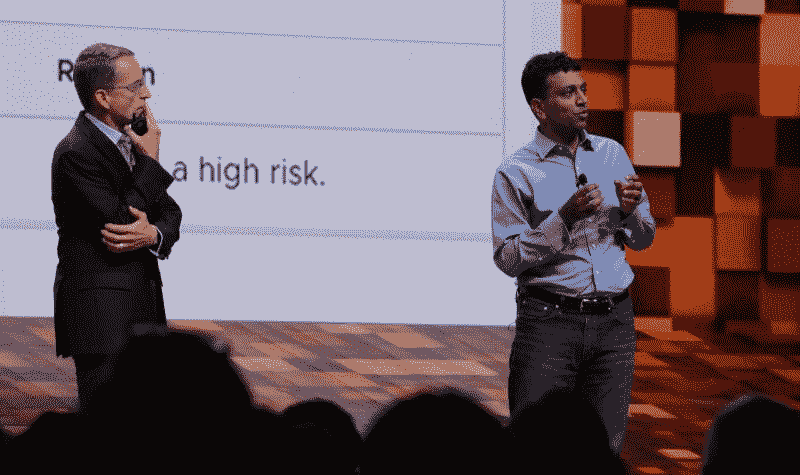
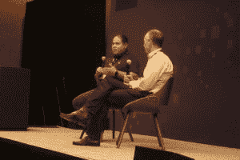

# VMworld 2018:谁负责可编程基础设施？

> 原文：<https://thenewstack.io/vmworld-2018-whos-responsible-for-programmable-infrastructure/>

假设上周在拉斯维加斯举行的 VMworld 2018 大会的许多与会者可以共同表达这个突出的问题，这个问题就在他们的舌尖上，听起来会是这样的:如果未来真的包括基础设施即代码的铺设路线，那么我们作为网络运营商和管理员的工作会受到威胁吗？

这种不确定性似乎集中在缺乏关于这些运营商未来角色的具体信息，一旦他们的网络基础设施发展到融合网络行为监控、机器学习和自适应服务网格的程度。当基础架构变得真正可编程时，谁(或什么)将对此负责？更关键的是，会不会是现在负责的人以外的人？

## 微模糊化 2.0

这种压抑的情绪最初是在该公司披露 VMware 可编程基础架构的核心技术之一的重大更新时出现的。有人称之为“微分段 2.0”，这是对将网络和安全策略应用于根据其功能而非地址指定的网络部分的想法的修改。有了微分段 1.0——新的堆栈是三年前[详细介绍的第一批出版物之一](https://thenewstack.io/microsegmentation-how-vmware-addresses-the-container-security-issue/)——一个抽象层允许更多模糊的对象，如容器，被处理为明确的策略。

这种模式要求微服务时代的改变，在这个时代，容器有越来越多的理由既多元又短暂。

VMware 首席执行官[帕特·基尔辛格](https://www.linkedin.com/in/patgelsinger/)在他的主题演讲中解释道:“我们正在帮助组织保护子网，并以前所未有的方式隔离敏感应用和服务。“这个想法并不新鲜；在 NSX 之前，这是不切实际的，”他继续说，指的是他的公司今天的主要平台，其网络虚拟化层。

“但我们不会停滞不前。我们的团队正在创新，超越微分段，迈向未来，”Gelsinger 继续说道。“想象一下，一个系统可以观察应用程序，了解它们的行为以及它们应该如何运行。我们正在使用机器学习和人工智能，而不是追逐恶意软件，以确保“好软件”。系统可以锁定其行为，这样系统就可以始终如一地运行。"

 在一次新闻发布会上，VMware 美洲首席技术官 [Cameron Haight](https://www.linkedin.com/in/cameronhaight/) 谈到了更多细节。“微分段为我们提供了在虚拟机之间实现零信任环境的能力，”他告诉记者，“以保护虚拟机之间的通信。现在，我们正在将零信任环境扩展到实际的应用程序本身。我们正在结合 NSX 和 AppDefense 的能力来提供这种能力。”

## 已知良好

AppDefense 是该公司的应用程序行为监控工具，该公司上周宣布，该工具将首次作为其 vSphere 环境的白金 SKU 的内置部分。在第一天的主题演讲中，负责 SaaS 安全公司机器学习和人工智能研究的 Vijay Ganti 展示了 AppDefense 的微分段方法，其中包括训练它评估虚拟机内可执行组件的行为。

Ganti 说:“想一想，这是第一次*第一次*，你可以透过应用程序的视角来看待基础设施。尽管他描述了虚拟机环境中的行为监控过程，但借用 Gelsinger 的话来说，人们可以“想象”这样一种场景，其中被监控的每个 IP 地址都解析为一个容器或一个 pod。

在回答 Gelsinger 关于 AppDefense 如何知道哪些行为是好的，哪些是坏的问题时，Ganti 回答说，AppDefense 将建立一种方法，通过这种方法，好的行为将得到*认证*，这是基于“数百万个好的软件实例”的建模尽管 Ganti 没有明确说明，但他表示，这些实例不一定包含在同一个客户网络中 AppDefense 将从所有客户那里收集行为模式，并利用他们的组合历史来确定什么是“好”的行为。

 “我们以两种截然不同的方式减少攻击面，”VMware 新任网络和安全总经理汤姆·吉利斯说，他曾是云运营公司 Bracket Computing 的首席执行官，在此之前是思科的安全技术副总裁。“首先是我们的 AppDefense 技术。我们已经将这一点集成到 vSphere 本身中，并专注于识别我们称之为“已知的好东西”那是永远不应该改变的事情的清单，也是永远不应该发生的事情的清单。"

吉利斯接着说，举个例子，二进制文件不应该被写入。尽管操作系统可以将这样的文件标记为只读，但是一旦恶意有效负载将其权限提升到根级别，任何其他根级别进程都无法停止根级别进程。“在管理程序层，我们实际上就像是‘超级根’，”他继续说道。“我们可以实施这些已知的好政策，这些几乎是常识性的政策:‘不要修改你的二进制文件。’Web 服务器不会产生根外壳。基本的、常识性的、运行时完整性类型的东西。我们对漏洞一无所知。我们不在乎。但是我们知道这些行为是绝对不允许的，因此，这降低了攻击的可能性。"

Gillis 有意识地将软件定义的网络与网络分开，并指出这两种努力发生在分布式计算系统的不同层次。虽然 VMware 的营销可能会将整个网络描绘为正在被该公司的下一波虚拟化浪潮所改变，但 Gillis 试图将未来带出云端，回到现实。

“当客户采用 SDN 时，”吉利斯曾说，“网络不会消失。这些位需要从 A 移动到 b，所以不要让我们来管理您的结构。那不是我们做的。我们不适合做这个。Cisco、Arista、Juniper —他们在提供高性能、高可靠性、高可用性、高可扩展性的网络基础设施方面做得非常非常好。

“所以建立关系网——他们并不是没有工作，没有发言权，没有有趣的事情可做，”他继续说道，沿着一条很可能已经越过刀刃和悬崖的意识流。“更重要的是，用合适的工具做合适的工作，我住在哪里？”

## 跳过第一个问题

一位分析师指出，根据他的经验，他观察到采用 NSX 的组织已经成功地启动了他们的 VxLANs，但从那里开始，他们害怕对设置进行更改。负责 vSphere 的人会反对接触网络，而负责网络的人认为 NSX“不是硬件”，因此超出了他们的权限。结果，这些组织建立了自己的*事实上的*筒仓。

 为了回答这些问题，吉利斯请来了总部位于芝加哥的联合信用合作社的高级系统经理小胡里奥·阿雷巴洛。阿雷巴洛承认，至少在一开始，他自己的公司也出现了类似的分歧。

但是后来，各部门意识到他们相互依赖。例如，infosec 团队可以制定安全策略，但是他们需要系统团队来实现它。“当我第一次开始时，并不容易，”阿雷巴洛说，“但现在我可以说，我们现在都互相信任，我们知道我们的目标是什么，我们一起努力，以确保我们做的是对我们的成员最好的。”

正是在这里，Gillis 插话说，他的新公司正在尽最大努力提供与虚拟基础设施(VI)和网络团队相关的产品。这是一个略有不同的信息，似乎是说，有网络硬件公司在世界上，嘿，你为什么不检查思科？

吉利斯和阿雷巴洛的会议概括了组织今天面临的争论点，其中一些只是刚刚开始。是的，网络和系统管理的人工工作不应该局限于他们使用的平台和工具的范围。但是在一定程度上，人们的技能是根据这些工具来判断的，不可能不评估他们的工作，从而预测这些工作在这些工具的背景下的相关性。当然，NSX 与底层网络基础设施不同，但它的设计绝对不仅仅是为了将应用与基础设施分离，而是为了承担基础设施的支持角色。

不可避免的是，这些工具和平台是这些信息工作者生计的基础。VMware 说它不做结构管理是一回事，但无法回避的事实是，分离效应已经撕裂了人们的职业生涯。对于阿雷巴洛信用合作社来说，修补这些裂缝是一项成功的任务。但这并不能保证每个人都能成功。

首先，他们必须聚在一起讨论。这意味着提出那些渴望逃离他们紧闭的嘴巴的问题。

VMware 是新体系的赞助商。

斯科特 m 富尔顿三世的照片。

<svg xmlns:xlink="http://www.w3.org/1999/xlink" viewBox="0 0 68 31" version="1.1"><title>Group</title> <desc>Created with Sketch.</desc></svg>