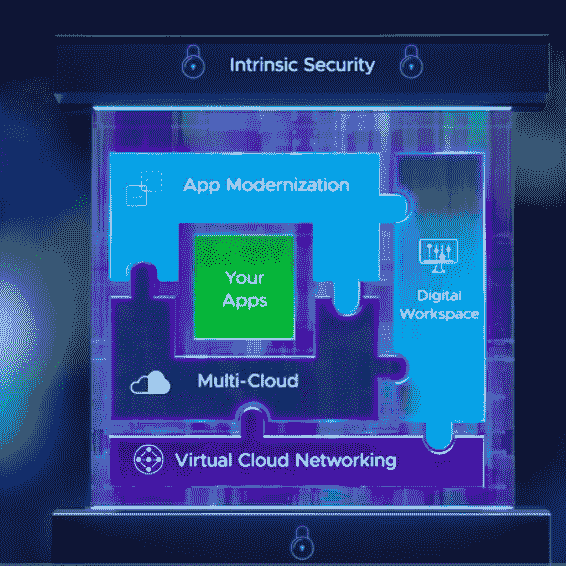

# VMworld 2020:单一供应商能否将 DevOps 整合到一个 API 中？

> 原文：<https://thenewstack.io/vmworld-2020-can-a-single-vendor-pull-together-devops-into-one-api/>

在上周的 [VMworld 2020](https://www.vmworld.com/en/index.html) 大会上，VMware 发布了一系列公告，内容围绕该公司如何寻求通过不断扩展的工具和平台来满足所有开发运维团队的需求。VMware 涵盖传统基础架构和原生云的数据中心和多云运营，寻求在一个保护伞下支持组织需求。

例如，VMware 首席执行官[帕特·基尔辛格](https://www.linkedin.com/in/patgelsinger/detail/recent-activity/posts/)在 VMworld 主题演讲中说，VMware 的安全工具和平台“随着你的应用和数据跨云移动或分解到容器中，内在地延伸到基础设施中”。VMware 服务的 IT 基础架构的基本组件包括应用程序现代化、应用程序开发和管理，适用于多云和传统环境，以及 VMware 描述为“数字工作空间”的需求。

简而言之，VMworld 上有大量关于这些主题的演讲，重点是云原生应用程序、操作和安全性，以及下一代主题，如 5G 和人工智能，包括下面描述的 VMware 与 Nvidia 的合作伙伴关系。

图片:VMware

## 人工智能、5G 和蒙特雷项目

VMware 将使用 GPU 巨头英伟达的硬件框架，为 VMware 的平台提供人工智能(AI)。盖尔辛格说，这旨在帮助人工智能“民主化”，并指出人工智能在组织中的采用“停留在 10%至 15%”。

他说，这种合作将“为每个企业释放人工智能”。英伟达首席执行官[黄仁勋](https://nvidianews.nvidia.com/bios/jensen-huang)在一次主题演讲中表示，英伟达和 VMware 将把人工智能“放在所有公司的手中，这样他们就可以自动化他们的业务和产品。”

虽然人工智能平台将如何工作以及何时可用的时间表的细节尚未披露，但英伟达表示，它将为 VMware 的云基础设施提供其人工智能平台和 NGC(英伟达 GPU 云)框架。该公告还与 VMware 的 Project Monterey introduction 重叠，VMware 表示，该项目将支持机器学习和 5G 以及人工智能。例如，作为与 Nivida 合作的一部分，Nvidia(最近同意收购处理器巨头 Arm)将提供其集成到 VMware Cloud Foundation 中的 BlueField-2 数据处理单元(DPU)。

VMware 还表示，将继续开发其 VMware Telco 云平台，以支持 5G 网络部署的虚拟化和容器化。

Gelsinger 说，这些新的人工智能工作负载将有助于满足“越来越复杂的应用程序、云原生应用程序、更大的数据集、更多的带宽要求和更低延迟的 5G”的需求。

值得记住的是，5G 的采用以及未来 It 基础设施将在多大程度上使用 5G 网络还有待确定。例如，VMware 副总裁兼首席技术官 Venkatachalam 在一次小组讨论中表示，5G 正处于我们“弄清楚如何执行”的阶段。

## 安全无处不在

Gelsinger 在他的主题演讲中说，VMware 的安全工具和服务，通过收购，如收购[炭黑](https://www.carbonblack.com/)，现在已经成为“对我们来说超过 10 亿美元的业务”。Gelsinger 说，这个想法是在所有 VMware 产品中添加安全层，当然包括云，以及 NSX 服务定义的防火墙、VeloCloud SD-WAN、Workspace ONE 和 Secure State 等平台，以及炭黑云。

“我从你们那里听到的一个问题是，我如何为我的所有应用和数据提供一致的安全态势？当你跨越数据中心和多个云并进入边缘时，这变得更加困难，”Gelsinger 说。“为了解决这一问题，我们正在通过在基础架构中内置安全控制来颠覆安全行业。当您的应用和数据跨云移动或分解到容器中时，它们会保持一致的安全态势。”

VMware 在会议期间还表示，[同意收购](https://thenewstack.io/vmware-to-acquire-saltstack-for-advanced-multicloud-automation/)配置和安全管理提供商 SaltStack。在 VMWorld 小组讨论期间，VMware 首席技术官办公室高级技术组副总裁克里斯·沃尔夫表示，SaltStack 应该“让我们更加接近内在安全性的愿景…让将安全性自动插入 CI/CD 管道变得更加容易”，同时扩大“我们拥有的强制实施能力”

Gelsinger 说，VMware 还将“安全服务延伸到边缘”。例如，他描述了 VMware 的 SD-WAN 网络现在如何可用于边缘部署，以及 VMware 的 SaaS 产品。

## Kubernetes 的 Tanzu 门户

可以理解的是，VMware 自一年前推出 Tanzu 以来，一直在积极扩大对 Kubernetes 基础架构和应用程序的支持范围。Tanzu 的想法是为开发人员和运营人员简化将应用程序和基础设施移植到 Kubernetes 环境的任务。VMware 最近向 vSphere for Tanzu 添加了新功能，以帮助组织更好地应对在 Kubernetes 部署中选择和添加各种拓扑的挑战。

Gelsinger 说，Tanzu 功能还与 VMware Cloud Foundation 融合在一起，因此包括 Kubernetes 环境在内的部署可以利用“全部在单个集成堆栈中”的计算、存储网络和管理功能。

简化 Tanzu 也是一个关键目标。在主题演讲中， [VMware 高级副总裁兼首席技术官 Greg Lavender](https://www.vmware.com/company/leadership/greg-lavender.html) 对新的 Tanzu 服务网格功能进行了技术预览。他说，这种能力确保“无需重写一行代码”就能满足应用服务水平协议。

在 VMware 之前的几天，[VMware 研发副总裁 Craig McLuckie](https://www.linkedin.com/in/craigmcluckie/)——他也是 Kubernetes 的最初创建者之一——告诉新堆栈“企业面临的最大困难之一不是简单地将 Kubernetes 作为计算的抽象，而是处理集成存储和网络功能的机制，”McLuckie 说。

“在我们与客户合作的过程中，这一直是构建基于 Kubernetes 的功能性抽象的最大挑战之一。我们在将 Kubernetes 集成到 vSphere 方面所做的工作显著降低了这方面的复杂性，”McLuckie 说。“处理网络配置、入口路由和负载平衡等挑战。将通过完全集成的解决方案在基础架构级别得到解决。我们的目标是根据业务需求，以最少的工作和基础设施改造，提供各种配置的交钥匙 Kubernetes。”

通过推出 [VMware vSphere with Tanzu](https://thenewstack.io/vmware-provides-a-kubernetes-on-ramp-for-vsphere-workloads/) ，VMware“提供了一种本质上更加敏捷的以 API 为中心的基础架构，使团队能够从历史上由票证和人工驱动的流程提供的 IT 资源转移到一个完全自主的系统，该系统提供了团队开展工作所需的基础架构功能，”McLuckie 说。

“VMware vSphere with Tanzu 帮助客户快速采用 Kubernetes，允许他们使用现有的技术、工具和技能来配置企业级 Kubernetes 基础架构，而 Tanzu Editions 使客户能够更轻松地确定和部署 VMware Tanzu 产品组合的元素，最大限度地满足他们的需求并加快他们的现代化工作，”McLuckie 说。

VMware 是新体系的赞助商。

<svg xmlns:xlink="http://www.w3.org/1999/xlink" viewBox="0 0 68 31" version="1.1"><title>Group</title> <desc>Created with Sketch.</desc></svg>