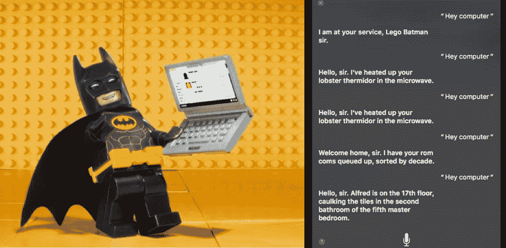

# voice Ops:IT 运营环境的虚拟助手

> 原文：<https://thenewstack.io/voiceops-virtual-assistants-ops-environments/>

 [扎伊娜·沙赫扎德

扎伊娜·沙赫扎德是移动团队中担任传呼机职务的软件工程师。她负责通过 App Store 和 Play Store 提供的 Android 和 iOS PagerDuty 应用程序。在这篇文章中，她分享了她跟随我们客户支持团队的经历。在 Github 和 Twitter 上找到她。](https://www.pagerduty.com/) 

自从*“按 1 表示是，按 2 表示否”*在过去的十年里，亚马逊、苹果、谷歌和微软等科技巨头一直在开发专有的语音平台，为与我们交谈的虚拟助手提供动力。基于最近语音识别的巨大进步，这些公司也开始销售内置聊天助手的消费类硬件。

像亚马逊 Echo 和谷歌 Home 这样的家用设备已经成为消费技术领域的热门产品，允许人们询问天气、上班路上的交通状况以及工作日即将召开的会议——所有这些都不用手。一些已经变得如此普遍，他们已经渗透到流行文化，并建立了自己的个性。苹果的 Siri 甚至在乐高蝙蝠侠电影的演员阵容中被认为是蝙蝠电脑的声音。

现在，想象一下 IT 从业者与物联网对话，高效处理日常工作，协调重大事件响应，并检查其服务和团队的健康状况。这是由语音处理的数字操作，或者，如果你喜欢，也可以叫 VoiceOps。虽然仍有工作要做，但考虑到我们目前在[page duty](https://www.pagerduty.com/)开发的原型，这一愿景比电影魔法更接近现实。

## 人们会使用语音——如果它有效的话

 [莉莉娅·古特尼克

Lilia Gutnik 是一名产品人员，白天思考数据科学，晚上是 PagerDuty 乐队的键盘手。](https://www.pagerduty.com/) 

语音范例已经越来越受欢迎，并赢得了消费者的信任。例如，15%的消费者使用聊天与医疗保健提供商互动，33%的消费者与银行聊天，或者与真人聊天，或者通过聊天机器人聊天。尽管这些不是口头互动，但它们表明消费者正在使用自然语言界面来分享敏感细节，如医疗保健和金融信息。

虽然方便个人使用，但 IT 从业者每天都可以使用的语音交互平台具有更大的潜力。亚马逊、苹果和谷歌等大型科技公司开发了最受欢迎的语音助手，它们在消费者身上投入了大量资金，但对企业来说，这些只是皮毛。购买消费品的人也有工作——他们有可能在一家公司工作。语音功能的市场越来越大。9 月，我们参加了由 Menlo Ventures 主办的“学会说话”会议，并很兴奋地遇到了一些为企业设计的公司。[例如，Nuance](https://www.nuance.com/about-us.html) 帮助支持中心转录呼叫，并建议人工代理使用机器生成的解决方案来回应呼叫者的问题。

## 赋予传呼机职责发言权

 [科林娜·谢尔曼

Corinna Sherman 是 PagerDuty 的一名 UX 设计师，是一名即兴艺术家，也是理想未来的想象者。@CorinnaSherman](https://www.pagerduty.com/) 

我们的 VoiceOps 项目几乎是异想天开。我们的产品副总裁 Rachel Obstler 向我们提出了一个鼓舞人心的问题:语音交互将如何改变人们管理数字操作的方式？在规划了各种可能性之后，我们的三人小组——UX 设计师、产品经理和开发人员——开始工作。我们最初的原型使用谷歌 Home 设备和公共[寻呼机工作 API](https://v2.developer.pagerduty.com/v2/page/api-reference)来回答基本的平时问题，比如“我下一次什么时候值班？”

在此基础上，我们考虑了经理或主管如何使用这种功能，并对我们的系统进行了编程，使其能够回答诸如“我的团队晚上过得怎么样？”以及“在过去的 18 小时内是否有任何重大的停机时间？”

2017 年 PagerDuty 峰会的与会者在我们的用户体验实验室展位前停下来，向我们的 PagerDuty 虚拟助理原型提问，并与我们分享他们之前对语音技术的体验。听到他们的第一手反应，与他们一起探索假设的场景，并了解他们希望能够提出什么问题，这很棒。

12 月 5 日，我们与谷歌助理团队合作，举办了一场社区活动，参加者来自 [HackBright](https://hackbrightacademy.com/) 、 [Code2040](http://www.code2040.org/) 和 PagerDuty 社区。对于更广泛的寻呼机工作社区来说，这是一个在支持性环境中探索 VoiceOps 潜力的绝佳机会。通过在将项目带入生活的过程中培养不同的声音，我们希望改善所有人的用户体验。

由于我们一直在试验 VoiceOps 概念，我们在 beta 测试中发现，如果语音识别和交互有效，人们会使用它。如果它不像设计的那样工作，人们会很自然地变得沮丧并停止使用它。让所有的设备可靠地工作也是相当困难的；当处理各种口音或在声学效果不佳的房间中时，语音识别仍然很不稳定。这些早期的调查倾向于试验不太可能被误解的简短查询。

我们也在考虑使用环境以及如何让系统反应听起来自然。例如，如果你有五个不同的值班时间表，完整而准确地回答“我下一次值班是什么时候？”可能会比你在旅途中的耐心多得多。你可能想要一个有用而简洁的回答，而不是你即将到来的随叫随到生活的全部故事，这意味着我们需要在原始数据的基础上应用一个情景意识层。通过继续探索和原型设计，在面对短期挑战时尽可能发挥我们对未来的创造力，我们将为即将到来的事情做好准备，而不仅仅是已经发生的事情。

## VoiceOps 会成为它自己的东西吗？

事故时有发生，晚餐被打断，你的笔记本电脑并不总是触手可及。在我们努力改善 IT 运营前线人员生活的过程中，关于我们的 VoiceOps 概念的反馈既令人鼓舞又富有启发性。至于下一步，我们目前正在设计和测试用于免提事件响应场景。我们还在为经理开发功能，以便他们能够回答有关团队健康、系统性能和事件响应有效性的问题。

VoiceOps 本身是否会成为一种现象还有待观察。至少，我们正在进入一个多模态用户界面的时代。作为你职业角色的一部分，你可能通过手势完成一些事情，通过键入机器人命令完成另一些事情，还有一些事情是通过你的声音完成的。最终，在给定的情况下，无论什么对你来说都是最方便的，都是最好的、最优雅的交互方式。这是理所应当的。

人们通过穿孔卡片、精确配对的括号中隐藏的字母串、键盘、鼠标和涂有指纹的玻璃向计算机传达人类的意图。技术现在已经接近可以用我们自己的方式倾听和与我们交流的程度，难道不是时候了吗？

用 30 Rock fame 的 Liz Lemon 的话说，“我想去那里。”

<svg xmlns:xlink="http://www.w3.org/1999/xlink" viewBox="0 0 68 31" version="1.1"><title>Group</title> <desc>Created with Sketch.</desc></svg>