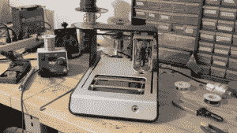
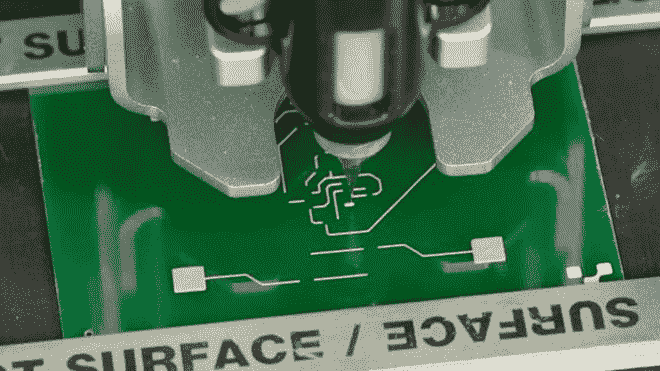
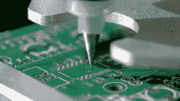

# 使用 Voltera 3D 打印定制电路板

> 原文：<https://thenewstack.io/voltera-3d-prints-circuit-boards-minutes/>

喜欢摆弄 [Arduino](https://thenewstack.io/hang-on-to-your-soldering-iron-heres-a-wifi-system-on-a-chip-that-speaks-to-iots-future/) 或 [Raspberry Pi](https://thenewstack.io/off-shelf-hacker-push-button-slides-pi/) 的制作者和[现成的黑客](https://thenewstack.io/off-shelf-hacker-physical-computing-stack/)都熟悉使用基本硬件组件(如电路板、电线、小灯和传感器)所固有的混乱。如果有一种机器可以减少一些硬件问题，并在几分钟内打印出定制的电路板设计，这不是很方便吗？

这就是 Voltera V-One 背后的目标，这是一款桌面 3D 打印机，通过允许用户快速、无痛苦地快速原型化他们的电路板设计来加速硬件设计过程。 

Voltera V-One 由来自加拿大滑铁卢大学的工程学学生 Jesus Zozaya、Alroy Almeida、James Pickard 和 Katarina Ilic 设计，今年早些时候成功众筹了 502，000 美元，此外最近还获得了戴森奖的 30，000 美元。

该团队受到启发，创造了这款机器，以替代将设计文件发送给第三方制造商、支付运费以及在收到原型之前等待几天甚至几周的耗时过程。

“大约在 3D 打印机开始彻底改变机械原型制作领域的同时，我们有了电路板打印机的想法，并希望为电子原型制作创造类似的东西，”Almeida 说。“这消除了所有硬件开发人员在传统制造过程中面临的挫折，并将开发时间从几个月缩短到几天。”

[https://www.youtube.com/embed/pTnpvHqFIPY?feature=oembed](https://www.youtube.com/embed/pTnpvHqFIPY?feature=oembed)

视频

这台打印机大约有笔记本电脑大小，使用可交换的磁性打印头，其中包含导电的银纳米粒子墨水或绝缘墨水，用于打印双层电路，使用行业标准的输入文件和基底材料。正如阿尔梅达[解释](http://techcrunch.com/2015/01/06/the-voltera-v-one-makes-circuit-boards-in-minutes/)的那样，Voltera V-One 与类似的电子原型机相比有着明显的优势:

> Voltera V-One 不仅仅是在纸上印刷单层电路。我们是第一个能够用这种尺寸和成本(约 2000 美元)的产品在 FR4(行业标准基板)上印刷两层电路的公司。但它并不止于此…打印机也是分发锡膏和烘烤电路板以附着所有小元件的电缆。

这不仅对预算紧张的发明家非常有用，Voltera 加速硬件设计过程的潜力出现在蓬勃发展的 DIY-hacker 和 [maker](https://en.wikipedia.org/wiki/Maker_culture) 运动的激动人心的时刻。这种自己动手的复兴正在起飞，这要归功于越来越多的业余爱好者可以买得起的现成组件，以及将潜在制造商与 3D 打印等快速原型技术联系起来的廉价台式机器。像 Voltera 这样的机器只能让更多的修补者加入进来，使动手操作过程变得更容易，甚至更容易。

无论如何，在一个新兴的[物联网](https://thenewstack.io/what-does-it-mean-to-be-on-the-internet-of-things/)中，到 2020 年可能会有[280 亿台设备](http://www.goldmansachs.com/our-thinking/pages/internet-of-things/iot-report.pdf)，有太多的机会让有事业心的工程师、设计师、开发人员和技术人员进一步发展物理计算堆栈，创造出人意料的发明和服务来解决现实世界的问题。要了解更多或预订，请访问 [Voltera](http://voltera.io/) 网站，并开始一些 DIY 项目，请查看我们的[现成黑客](/tag/off-the-shelf-hacker/)教程系列。

图片: [Voltera](http://voltera.io/)

<svg xmlns:xlink="http://www.w3.org/1999/xlink" viewBox="0 0 68 31" version="1.1"><title>Group</title> <desc>Created with Sketch.</desc></svg>