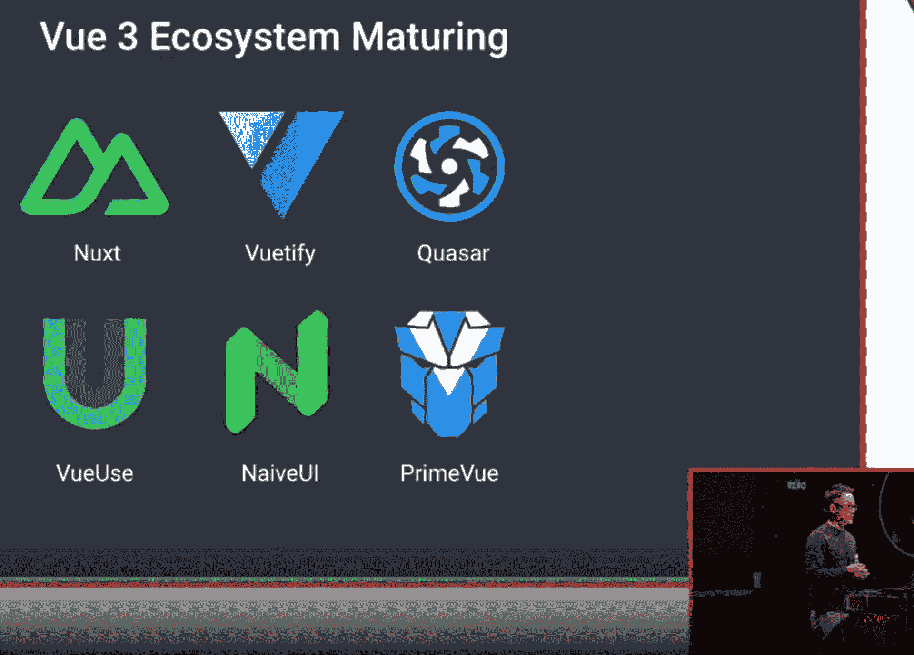
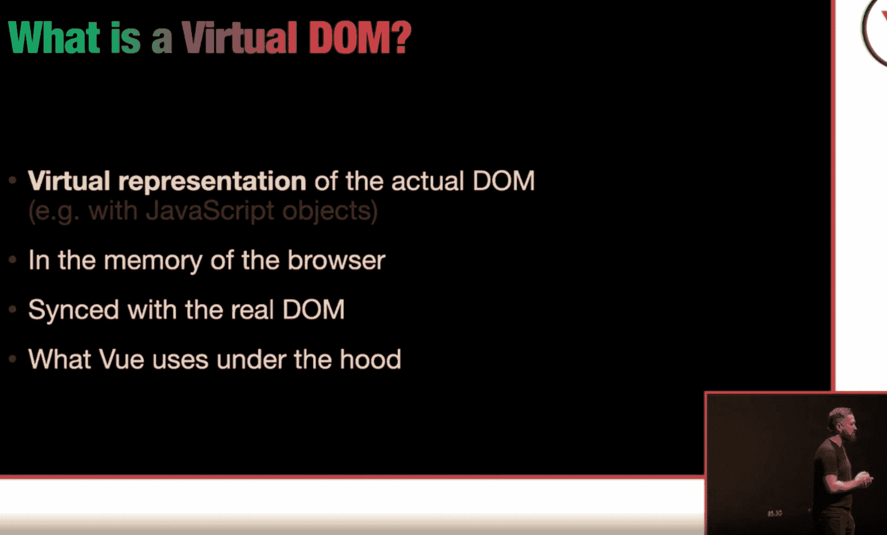
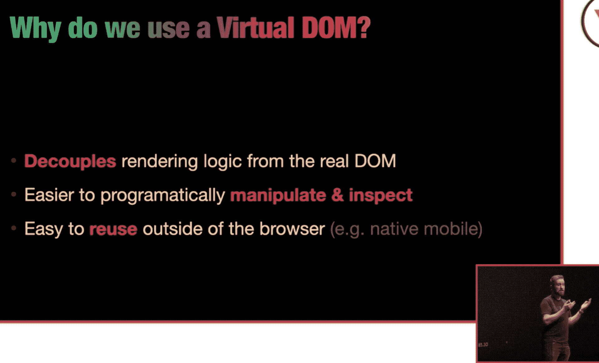
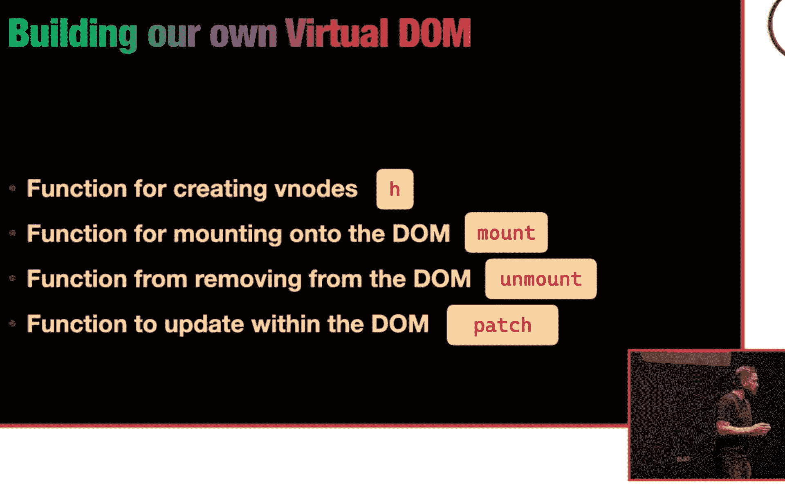
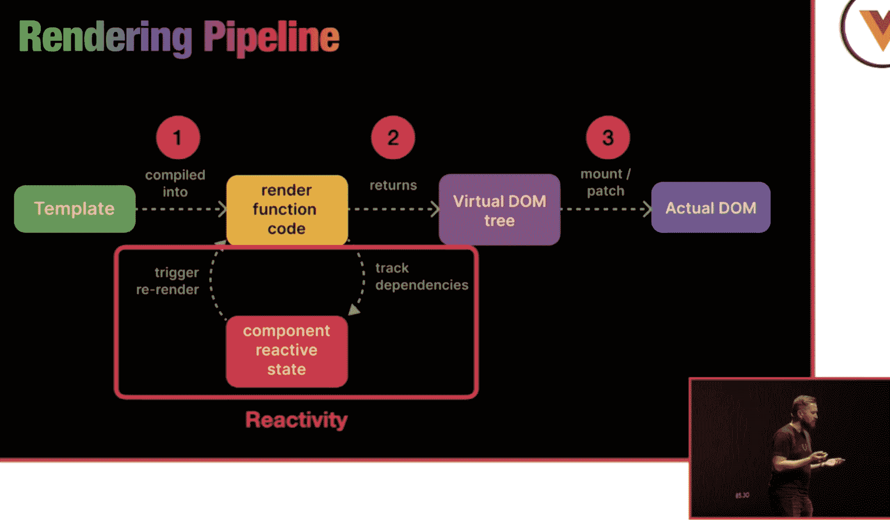
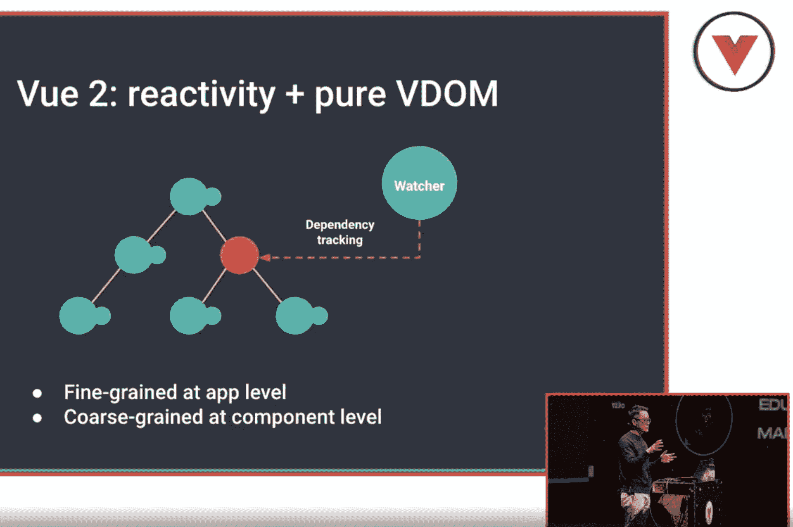
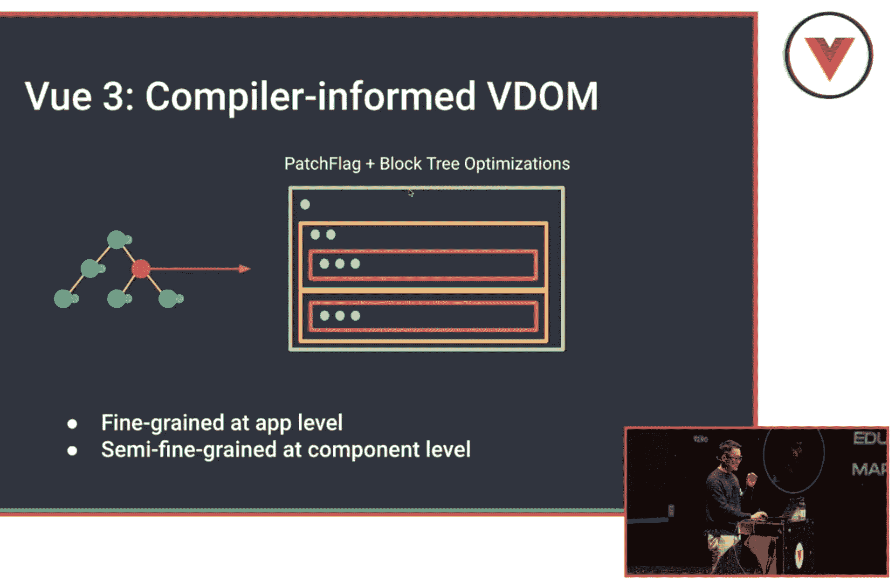

# 对 2023 年的 Vue 有什么期待，它与 React 有何不同

> 原文：<https://thenewstack.io/vue-2023/>

在两年前一部关于 JavaScript 框架 Vue.js 的纪录片中，它被描述为 JavaScript 生态系统中的一种独立替代品，与两个领先的框架——脸书的 React 和谷歌的 Angular 相比。“感觉不那么公司化了……更草根化了，”一位负责人这样描述。

与最时髦的 JavaScript 框架 React 相比，最明显的区别是 Vue 得到了 web 标准倡导者的支持。Vue 的[自己的文档](https://v2.vuejs.org/v2/guide/comparison.html)中提供了一个线索，其中指出“在 React 中，一切都只是 JavaScript。不仅 HTML 结构是通过 JSX 表达的，最近的趋势也倾向于将 CSS 管理放在 JavaScript 中。”另一方面，Vue 说它“拥抱经典的网络技术，并建立在它们之上。”(注意:这些引用来自 Vue 2 文档；我在它最新的 v3 文档中找不到这个比较。)

最近几年，React 的重 JavaScript 方法和使用它的框架(例如 [Next.js](https://thenewstack.io/how-next-js-12-connects-to-low-code-and-visual-design-tools/) )受到了很多反对，还有[一场运动](https://thenewstack.io/case-against-web-frameworks/)朝着 Vue、Svelte 和 Lit 等更现代的框架所提供的方向发展:建立在 Vue 所说的“经典 web 技术”之上。

## 尤雨溪的国家

正是在这种背景下，我很想知道 Vue 的创造者尤雨溪在他的年度“Vuenion 状态”报告中说了些什么，该报告于本月在阿姆斯特丹举行的 [JSworld 大会](https://jsworldconference.com/)上发表，包括现场会议和虚拟会议。

你在他的主题演讲中提到，由于疫情，他最后一次出现在 JSworld 是在三年前。于是他列出了三年前 Vue 生态系统中要么不存在，要么还不稳定的东西:Vue 3“还不稳定”， [Vite](https://vitejs.dev/) (一个构建工具)、 [Volar](https://volarjs.github.io/) (一个“构建嵌入式编程语言工具的框架”)和[Pinia](https://www.vuemastery.com/courses/from-vuex-to-pinia/what-is-pinia)(Vue 生态系统的状态管理库)都不存在。

“我们基本上围绕 Vite 创建了一个全新的生态系统，”他评论道，“除此之外，我们还在它的基础上构建了所有这些令人兴奋的新东西——不仅仅是在 Vue 生态系统内，甚至还连接了所有其他框架。”

Vue 生态系统

他称赞了当前的 Vue 工具生态系统，标题是 [Nuxt，](https://nuxtjs.org/)构建 Vue.js 应用的主要框架。但他说，2023 年的主要重点将继续是让 Vue 3 保持稳定。尽管 Vue 3 在一年前的二月成为了新的默认[，Vue 2 仍然被你们称为“遗留项目”的项目所使用他指出，Vue 3 的大部分被“新项目”采用。](https://blog.vuejs.org/posts/vue-3-as-the-new-default.html)

“我们仍处于从 v2 向 v3 过渡的阶段，”尤说，并指出许多大型项目仍在 Vue 2 上，或计划迁移到 Vue 3。

## Vue 3 及其虚拟 DOM 的新方法

在讨论了今年为 Vue 3 计划的各种管理变化后，您花了一些时间解释了 Vue 3 与 Vue 2 相比在“渲染内容”方面的差异。“渲染策略一直在变化，”他指出，特别是在处理虚拟 DOM (VDOM)的方式方面。

在我开始之前，先简单介绍一下 VDOMs，我发现它对我理解 Vue 3 很有用。当天晚些时候，在 JSworld，[马克·巴克斯](https://twitter.com/themarcba)做了一个题为“让我们建立一个虚拟 DOM”的会议接下来的三张幻灯片很好地总结了什么是 VDOM，以及它在 Vue 这样的框架中的用途。(VDOMs 由 React 推广[，但是这个概念也被许多其他框架采用，包括 Vue。)](https://reactjs.org/docs/faq-internals.html)

什么是虚拟 DOM

为什么要使用虚拟 DOM

构建虚拟 DOM

巴克斯还展示了 Vue 使用的渲染管道的以下可视化表示(这是 Vue 的文档[中同一图表的更丰富多彩的版本](https://vuejs.org/guide/extras/rendering-mechanism.html#render-pipeline)):

Vue 渲染管道

现在回到尤雨溪的演讲。他说，在 Vue 2 中，“我们使用的是纯虚拟 DOM，这意味着它与 React 使用的类似，它并不真正做任何编译时优化——嗯，有一点，但真的不多。”

Vue 2 渲染

“因此，在组件树或应用程序级别，”他继续说道，关于 Vue 2，“我们通过让每个组件跟踪其自身的依赖关系来实现细粒度的更新。”

这样做的缺点是虚拟 DOM 开销，他将其描述为“重新创建虚拟 DOM 节点，然后遍历树进行区分的成本。”他补充说，“Vue 2 一直在支付那笔开销。”

为了解决这个问题，他们对 Vue 3 采取了不同的方法。您将它描述为“编译器通知的虚拟 DOM”，这意味着它“在编译时做了更多的优化”

Vue 3 渲染

## 单列组件

撇开 VDOM 的复杂性不谈，Vue 越来越受欢迎的很大一部分是它的“单文件组件”(SFC)方法。Vue [将 SFC 定义为“一种特殊的文件格式，它允许我们将模板、逻辑、*和*Vue 组件的样式封装在一个文件中。”在别处](https://vuejs.org/guide/scaling-up/sfc.html)，Vue 称 SFC 为“一种类似 HTML 的文件格式”

在 2017 年对 Vue.js 核心团队成员 Damian Dulisz 的采访中，他说 SFC 格式“使代码更容易理解和推理。”

新堆栈的工程总监 Aaron Ban 是 Vue 的粉丝，主要是因为 SFC 方法。他喜欢它提供的“干净的组织”，认为这是模块化的一个很好的例子。“实际上，强迫自己画出正确完成 sfc 所必需的简洁的线条是一项困难的训练，”他告诉我。但他认为这是对许多开发人员在过去十年左右学到的破坏性“快速行动，打破常规”心态的一种解毒剂。他说，这种心态助长了坏习惯，比如开发人员“懒得画正确的说明，只是想着‘我们以后会解决它’，让事情正常运转。”"

Ban 也喜欢 Svelte 和 Lit 的外观，这是另外两个提供单文件组件的框架。

开发人员并不普遍喜欢 sfc。甚至 Vue.js 文档[也承认了这一点](https://vuejs.org/guide/scaling-up/sfc.html#what-about-separation-of-concerns):“一些来自传统 web 开发背景的用户可能会担心 sfc 在同一个地方混合了不同的关注点——而 HTML/CSS/JS 本应该将这些关注点分开！”

针对这一反对意见，Vue 认为 SFC 方法“实际上使组件更具内聚性和可维护性。”

## 结论

如果尤雨溪的 JSworld 主题演讲值得一提的话，2023 年不会给 Vue 开发者带来任何惊喜。它将继续让开发者从 Vue 2 升级到 Vue 3，并对其不断增长的生态系统进行进一步迭代。

对于像我们这样的技术出版物来说，Vue 可能不是很有新闻价值，但它值得每年左右与这样一个符合 web 标准的 JavaScript 框架接触一下。我们当然很享受它的持续发展。

<svg xmlns:xlink="http://www.w3.org/1999/xlink" viewBox="0 0 68 31" version="1.1"><title>Group</title> <desc>Created with Sketch.</desc></svg>