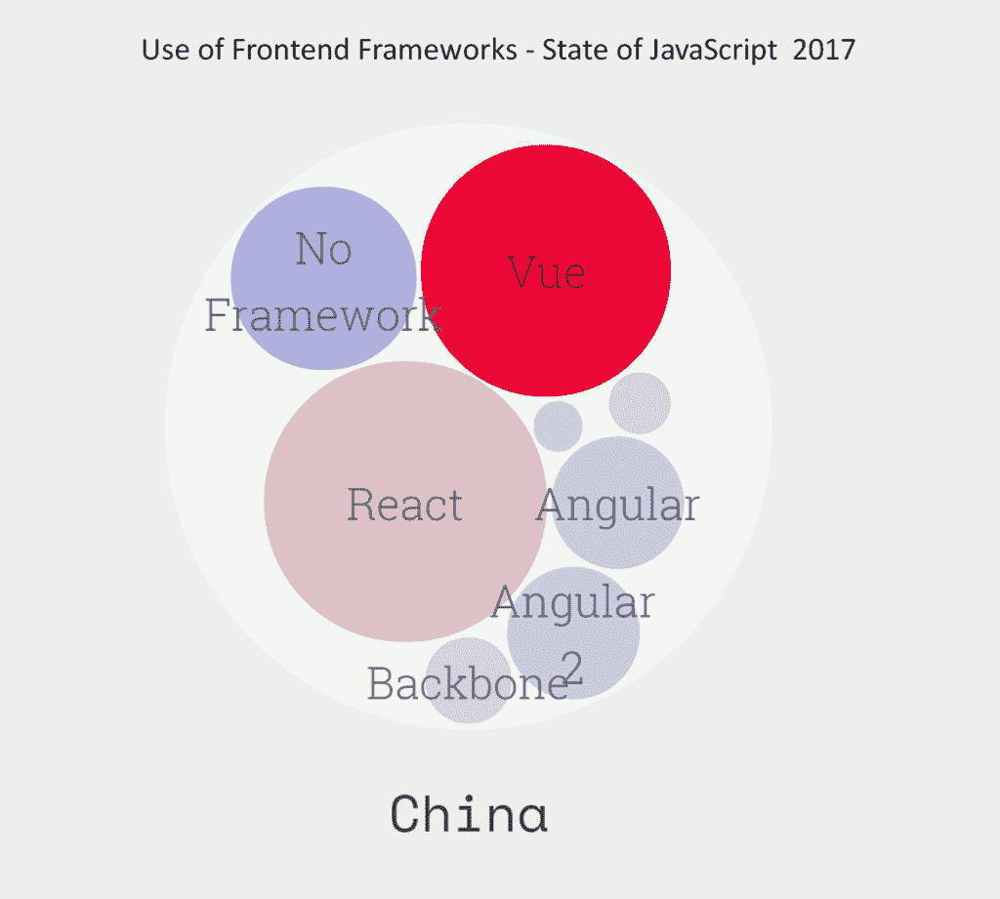

# 本周的数据显示:React 领先，尽管 Vue.js 在中国取得了长足的进步

> 原文：<https://thenewstack.io/vue-js-big-china/>

React 仍然是领先的前端 JavaScript 框架。远远超出我们所涉及的其他技术， [React](https://reactjs.org/) 现在已经成为一个关于开发者工作的[帖子中提到的顶级技能。事实上，根据 2017 年 JavaScript 现状调查的 23，000 多份回复，58%的受访者表示他们以前使用过 React，并将在未来使用。相比之下，有 20%的人已经使用过](https://thenewstack.io/blockchain-hot-react-js-top/) [Vue.js](https://vuejs.org/) ，并将再次使用。

这些框架，以及 [Angular 2](https://angular.io/) 、 [Aurelia](http://aurelia.io/) 和 [Polymer](https://www.polymer-project.org/) ，都有更多的人计划再次使用它们，而不是拒绝其未来的使用。已经尝试过 Ember 和 Backbone 的开发者不太可能在他们未来的计划中包含这些框架。

与所有网络调查一样，结果可能会因参与人员而有所偏差。此外，这份报告的两位作者似乎对 React 很感兴趣。也就是说，基于中国 JavaScript 用户的小样本，我们注意到了一个有趣的趋势。在中国，对于每一个已经使用并计划再次使用 Vue 的开发者，只有 1.1 个开发者对 React 说同样的话。在世界范围内，有 2.9 个开发者对每个人都有积极反应，其中一个对 Vue 有类似的倾向。

我们不知道 [Vue](https://thenewstack.io/meet-vue-js-flexible-javascript-framework/) 相对于其他框架是否会继续上升。Vue 会越来越受欢迎。我们不知道它是否会补充或取代其他框架。然而，Vue 确实获得了关注，也许是因为它在中国获得了关注。

通过 Pixabay 的特征图像。

<svg xmlns:xlink="http://www.w3.org/1999/xlink" viewBox="0 0 68 31" version="1.1"><title>Group</title> <desc>Created with Sketch.</desc></svg>