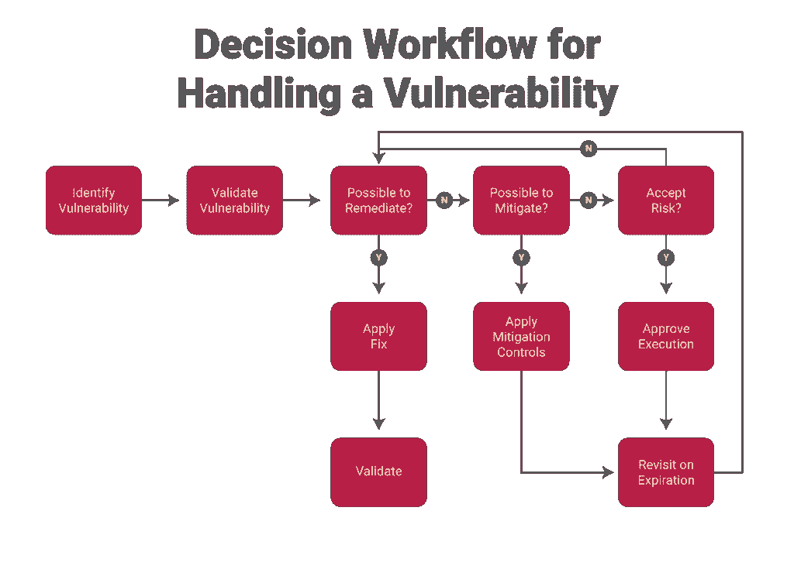

# 漏洞管理可以使用一些验证

> 原文：<https://thenewstack.io/vulnerability-management-could-use-some-validation/>

[Rezilion](https://www.rezilion.com/) 赞助了这篇文章。

 [塔尔·克莱因

Tal 是行业领先的自主云工作负载保护平台 Rezilion 的 CMO。他在 IT 和信息安全行业拥有 20 多年的经验，与云安全、客户端虚拟化、网络和数据通信领域的领导者和令人兴奋的新兴供应商合作。](https://www.linkedin.com/in/talmklein/) 

DevOps 中“宠物与牛”的比喻可能会被指责为跳过了鲨鱼，但是在漏洞管理的世界中，每个漏洞仍然是宠物。虽然每个公司都有自己的 [MTTP(平均修补时间)](https://securityintelligence.com/posts/how-do-you-measure-the-success-of-your-patch-management-efforts/)指标，但行业共识是，修补一个漏洞至少需要 38 天，甚至可能长达 150 天。要计算您的 MTTP，请将您上次扫描时发现的漏洞数量乘以您的团队修复单个漏洞平均需要的工作日。

惰性是 DevOps 的敌人。漏洞困境在 CI/CD 范围的左侧和右侧都产生了问题。在右边，花费在补救漏洞上的时间要么迫使服务和应用程序停止运行，要么为攻击者创造了可乘之机。在左边，漏洞产生风险债务，迫使开发者在特性和安全性之间做出选择。

## **脆弱焦虑是真实的**

扫描程序发现的每个漏洞都会产生工作。首先，与漏洞相关的风险是什么？我们已经知道，CVSS 分数并不能说明全部情况，因为攻击链通常从更容易被利用的低分数漏洞开始。关键任务服务中的漏洞？它是在虚拟机、容器中还是在代码中？然后我们必须想出把它分配给谁。那个人必须弄清楚是否有补丁；如果是，该补丁对性能有什么影响？修补一个东西会破坏生产中的其他东西吗？[而这只是开始](https://medium.com/@wan0net/blue-team-cyber-anxiety-a41273c07ee3)。

因此，在我们生活的世界里，安全和开发人员被淹没在比他们有时间或资源修补的更多的漏洞中。漏洞优先级解决方案带来了分析和漏洞智能，可减少执行漏洞管理的资源需求。有一些很好的优先级划分工具可以帮助识别哪些漏洞正在被恶意利用，哪些已经被成功修补而不会影响性能。一些解决方案甚至有预测模型，以预测哪些漏洞更有可能被武器化，应该优先修复。

优先排序作为一种分类机制非常有用，但是即使是最低级别的漏洞最终也必须得到处理，对吗？例如，一个低 CVSS 分数的漏洞没有被主动利用，但仍然需要在某个时候进行补救；因为如果有 CVE，就会有人利用它。该漏洞可能处于分类阶梯的最底层，但最终需要有人来处理它——这是补救债务。或者是？

## **不在运行时的漏洞被恶意利用也没关系**

想想看:如果您的 Kubernetes 容器中有一个 FPGA 驱动程序，并且该驱动程序有一个 CVSS 分数为 9 的漏洞，该漏洞正在被广泛利用，漏洞优先级机制可能会将其归类为高优先级。但是，当您深入研究后，发现您的环境中没有 FPGAs，因此驱动程序永远不会被加载到内存中，因此不构成威胁。然而，如果你有一个 CVSS 分数为 2 的 NGINX 漏洞，它没有在野外被利用，而是被加载到内存中，那么你不同意它比 FPGA 漏洞具有更大的风险吗？

在我们筛选漏洞之前，弄清楚这些漏洞是否确实与我们的特定环境相关，难道不是很有意义吗？

https://www.youtube.com/watch?v=xTI6eXZcGTs

与其根据客观风险进行优先级排序，不如根据实际的上下文风险进行筛选，这似乎是优先级排序工作流程中必要的第一步。在对需要缓解的漏洞进行优先排序之前，让我们过滤掉所有永远不会被利用的漏洞——然后*再*按照风险顺序对它们进行排序。

## **一个问题:这个漏洞在运行时是否存在？**

有时增加一个齿轮可以优化整个装配线。通过在您的漏洞处理工作流中插入一个验证步骤，您可以减少您的团队需要做的补救工作量，同时减少您的攻击面。这一步可以通过将您的团队的工作集中在代表实际(而不是感知的)风险的漏洞上，来简化您的补救工作。

我们如何量化这种优化？您可能已经熟悉我们进行的研究[,该研究证明 DockerHub 中前 20 个容器中 67%的“高严重性”漏洞从未加载到内存中。在我们的客户中，我们看到这一数字高达 75%。想想看，您的漏洞扫描器识别的 75%的漏洞可能完全是良性的，不构成任何威胁。如果有人根据外部攻击和 CVSS 分数来确定漏洞管理的优先级，他们可能会将 70%以上的时间和精力花在对生产环境没有风险的漏洞上。](https://thenewstack.io/why-vulnerability-management-needs-a-patch/)

如果在您开始分配漏洞优先级和补救工作之前，您知道哪些漏洞实际上会对您的应用和服务构成威胁，这不是很好吗？这对你的 MTTP 有什么影响？同样重要的是，如果漏洞不会经常导致构建失败，您的 DevOps 团队的部署速度会提高多少？您已经有了自动化漏洞扫描和优先级排序的工具，但是，如果这种自动化不能将您从“补丁债务”中解救出来，那么也许是时候投资漏洞验证了。

通过 Pixabay 的特征图像。

<svg xmlns:xlink="http://www.w3.org/1999/xlink" viewBox="0 0 68 31" version="1.1"><title>Group</title> <desc>Created with Sketch.</desc></svg>