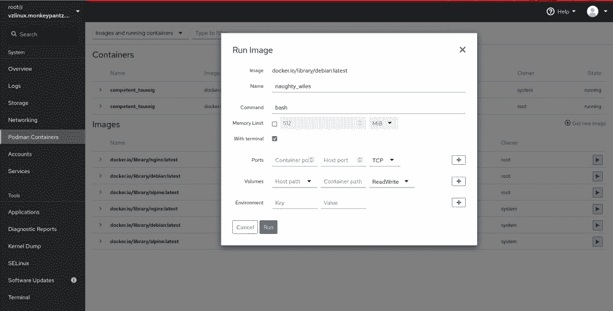

# VzLinux 是你从未听说过的基于 RHEL 的 Linux 操作系统

> 原文：<https://thenewstack.io/vzlinux-is-the-rhel-based-operating-system-youve-near-heard-of/>

现在你可能已经听说了， [Red Hat](https://www.openshift.com/try?utm_content=inline-mention) 已经[将其社区 CentOS 分发](https://thenewstack.io/red-hat-deprecates-linux-centos-in-favor-of-a-streaming-edition/)转移到云原生滚动发布模式，让 IT 管理员和企业陷入困境。但是不要害怕，[大量的克隆版本已经出现](https://thenewstack.io/where-to-turn-for-a-centos-replacement-heres-5-solid-linux-distros-to-check-out/)，每一个都承诺与红帽企业版 Linux 1:1 二进制兼容:

*   AlmaLinux
*   洛基 Linux
*   云 Linux 操作系统
*   Oracle Linux

以上每一种都是 CentOS 的绝佳替代品。事实上，任何熟悉 CentOS 的人都可以深入其中的任何一个发行版，并立即熟悉它。

但是还有另一个类似 CentOS 的 Linux 发行版，它已经存在了 20 多年， [VzLinux](https://docs.virtuozzo.com/virtuozzo_linux_8_quick_start_guide/about.html) 。您可能从未听说过这种针对企业级 Linux 发行版的特别做法。这是因为 VzLinux 是 OpenVz 和 Virtuozzo 提供的几个商业产品的基础。

你现在可能会问，“OpenVz 和 Virtuozzo 是什么？”让我告诉你。

Virtuozzo 于 1997 年以 SWoft 的名字在弗吉尼亚州的 Herndon 成立。它的主要关注点是虚拟化和存储，直到 2002 年，该公司才发布了其容器/虚拟化存储解决方案的 2.0 版本。2008 年，SWsoft 更名为 Parallels。

但是，随着这些类型业务的发展，Parallels 的一部分决定剥离(2015 年)，因此 Virtuozzo 诞生了，2016 年 Virtuozzo 加入了[开放容器倡议](https://opencontainers.org/)，计划开发基于云的服务器和专门的 Linux 发行版。

这就是我们选择 Virtuozzo 的原因，Virtuozzo 是一个操作系统级的服务器虚拟化平台，它通过减少所需的物理服务器数量来帮助整合工作负载。今天这是相当普遍的。然而，这是有区别的。

与传统的虚拟机平台不同，Virtuozzo 在单个物理服务器上创建隔离的虚拟专用服务器。在其他虚拟平台可以运行各种客户操作系统的情况下，Virtuozzo VPS 平台可以运行同一操作系统的多个实例，每个 VPS 都作为独立的服务器运行，可以独立于其他服务器重新启动。

那么 VzLinux 在哪里发挥作用呢？它被用作 Virtuozzo VPS 平台上的客户操作系统。而且虽然 VzLinux 仍然可以在 Virtuozzo 平台上运行，但它也可以在众多的虚拟机管理程序(如 OpenVZ、KVM，甚至 VirtualBox)下运行。VzLinux 甚至在各种超大规模市场中通过模板提供(如[亚马逊网络服务](https://aws.amazon.com/?utm_content=inline-mention)，Azure 和谷歌云平台)。您甚至可以从云映像(在 OpenStack 上)和通过 Docker 部署 VzLinux。

换句话说，VzLinux 可以部署在您需要的任何类型的平台上。对于那些习惯于免费部署 CentOS 的人来说，甚至有社区版的 [VzLinux 8](http://repo.virtuozzo.com/vzlinux/8/iso/) 可供下载。

## VzLinux 提供了什么别人没有的东西？

这可能是你感兴趣的地方。VzLinux 包括一些额外的特性，云原生和容器开发者可能会觉得很有吸引力。这些功能包括:

*   CentOS 转换模拟。
*   快照创建和回滚。
*   无人值守批量转换。

这些工具都非常适合 CentOS 的转换。因此，对于那些依赖 CentOS 多年的云原生和容器开发人员来说，知道您可以整体迁移*，而不用担心迁移会导致您当前的服务器不可用，这是一大优势。*

 *但这并没有结束。Virtuozzo 还计划发布两个新版本的 VzLinux，其中一个针对容器进行了优化，另一个针对虚拟机。

对于容器开发人员来说，另一个好处是，默认情况下，VzLinux 包括一个基于 web 的 Cockpit 版本，该版本支持 Podman 容器。因此开箱即用(一旦您使用命令`sudo systemctl enable cockpit.socket`启用了驾驶舱服务)，您就可以立即开始管理和部署您的容器(**图 1** )。

图 1:基于 DockerHub 的官方 Debian 映像部署容器。

另一个值得注意的重要事情是，Virtuozzo 有一个清晰的 VzLinux 平台路线图，一直到 2022 年。这个路线图看起来像是:

*   2021 年第 3 季度–CentOS 7 升级到 VzLinux 8，适用于社区版的虚拟机和裸机。
*   2021 年第 4 季度–Acronis agent 对 Community Edition 的备份支持，Virtuozzo Linux Enterprise Edition 的发布，包括所有开源功能和 ReadKernel 实时补丁，以及商业支持/故障排除。
*   Q1 2022-WordPress 风格(Hoster 版)和企业版的企业数字签名。

和所有的 CentOS 克隆一样，Virtuozzo 声称 VzLinux 将永远完全免费和开源。

## 其他功能

除了我们已经讨论过的，您会发现 VzLinux 充满了突出的特性，例如:

*   GNOME 桌面环境 3.32.2
*   Anaconda 安装程序
*   系统初始化软件
*   XFS 日志文件系统
*   bash 4.4
*   内核 4.18
*   open JDK–8b 292
*   OpenSSH 8.0p1
*   Perl
*   Python 3.6.8
*   桑巴
*   系统 d 239

当然，通过 GNOME 软件中心，你可以安装大量的软件工具。当然，如果您计划安装各种服务器栈(比如 LAMP)，您将需要通过命令行来完成这个任务， *dnf* (因为像 Apache 这样的软件在 GUI 工具中是找不到的)。

## 结论

如果你正在寻找 CentOS 的替代品，VzLinux 绝对不会错。Virtuozzo 在容器和虚拟化领域有着丰富的 Linux 开发经验，所以任何想让 Linux 走上这两条路的人都会在这个发行版中做得很好。

<svg xmlns:xlink="http://www.w3.org/1999/xlink" viewBox="0 0 68 31" version="1.1"><title>Group</title> <desc>Created with Sketch.</desc></svg>*