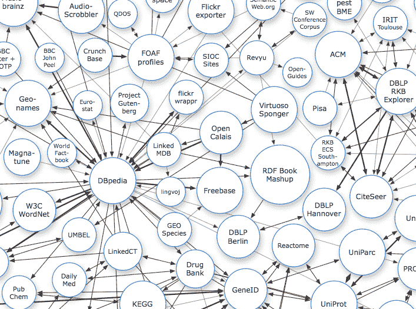

# W3C:关联数据是标准化物联网的关键

> 原文：<https://thenewstack.io/w3c-linked-data-help-standardize-internet-things/>

在[蒂姆·伯纳斯·李爵士的愿景下，](https://www.w3.org/People/Berners-Lee/)“网络的起源是试图连接各种设备，”[戴夫·拉格特](https://www.w3.org/People/Raggett/),[万维网联盟](https://www.w3.org/) (W3C)的成员指出。

然而，这些天来，W3C 正试图将所有相互竞争的利益、协议和标准聚集在一起，为互联网的下一次演进，即物联网(IoT)创建建议。

走向合作的举动首先是由西门子发起的，该公司在 2014 年柏林的一次研讨会上成立了一个兴趣小组，旨在将主要和次要的物联网参与者聚集在一起，讨论预标准化。在这项工作的基础上，W3C 成立了第一个官方工作组，为物联网设备创建身份识别提取层。

“当你看着物联网，人们在谈论事物、温度、环境、行动、打开加热器、打开洒水器、用一大堆标准与物理世界互动时，对开发者来说[这变得]有点混乱，”Raggett 说，他是物联网工作组[的技术负责人](https://www.w3.org/WoT/)

## 共同的语言

那么，在 W3C 的 440 个成员组织中，80 个大大小小的组织如何在无限的主题中找到足够的共同点来创建标准或建议呢？

拉格特说这一切都归结于语义学。他解释说，虽然可以有无限数量的连接对象，但它们往往有共同点。绝大多数联网设备都具有以下一些(如果不是全部的话)方面:

*   具有某些特性的物体(如温度。)
*   行动(如打开暖气。)
*   事件(当温度下降时，将其重新打开。)
*   一个业主。
*   一个小贩。
*   一个地点。

标准化物联网就是要找到对事物的描述。Raggett 将该过程描述为一种尝试:“找到一种描述事物的方式，这样开发人员就不必知道细节[或]潜在的通信模式，”他说。

工作组将与其他组织合作，以发现这些抽象如何适合特定的方法。参与组织包括:

“这些组织显然关心他们自己的平台和标准，然后我们有实际描述实际位置的位置标准，”Raggett 说。

## 关联数据和语义互操作性

为了克服碎片化，物联网工作组希望模仿伯纳斯-李为互联网本身所做的事情，为物联网平台、协议、数据格式和通信模式定义一个抽象层。

“互联网引入了一个抽象层，这意味着开发者可以在不了解任何网络或技术的情况下创建跨网络的端到端服务，”Raggett 说。"抽象层非常强大."

将如何组织？当然，应用程序编程接口(API)是为了在应用程序的标识提取层中扮演角色而构建的，以便与事物进行交互。

应用程序本身可以与基于链接数据的外部信息模型签订合同，链接数据是在 web 上共享数据的过程。使用关联数据意味着开发人员有一种共同的语言来交流，而不必了解底层技术和网络。在这里，关联数据充当了事物描述的跨领域词汇表。

[关联数据专家、APIWise 联合创始人迪米特里·范·赫斯](https://twitter.com/dvh)解释道:

*“就像现在的美国政府一样，如果你有一个‘纽约’的数据集，它就有一个‘州’的数据集，值是‘NY’你可以使用关联数据来告诉机器和人类某样东西的含义。在 API 社区中，人们仍然试图在这方面重新发明轮子。他们仍然试图创建属性名。如果你总是使用完全相同的列名和标题描述，我们可能会比较一切。但是链接数据实际上解决了这个问题。”*

Van Hees 在这里解释了链接数据是如何直观、语义化地使用的，机器会将“NY”读作纽约州，而不需要仔细注意列名。

“关联数据是关于三元组的——主语、谓语和宾语。如果我是主语，你是宾语，那么谓语现在就在和你说话，”范希斯解释道。“所有的东西都是三个一组的。迪米特里正在和詹妮弗说话。只要你提供链接，所有的三元组一起使得创建图表和分散的数据集成为可能。如果我在一个小时后告诉我的邻居，我说我在和詹妮弗说话，但他们可能不知道我在说哪个詹妮弗，这是缺乏上下文的。这就是关联数据解决的问题。"

铭记这一价值，W3C 的最终目标是实现一个开放的服务生态系统，因为正如 Raggett 所说，“我们认为价值在于服务，而不是设备本身。”

现在，除了一口之外，什么是语义互操作性？按照 Raggett 的说法，它是关于拥有“不同的服务，它们在交流，但却没有相同的意义。”

W3C 相信，通过 API 将关联数据和互操作性结合起来，可以在不同的标准和平台之间建立一致性和流畅性。

没听说过关联数据？正如 Raggett 所说，“关联数据越来越多地被公司使用，尽管他们没有花很多时间谈论它。”

他说，它“需要新的标准来验证语义互操作性，我们看到了这方面的差距。我认为 web 开发人员……之所以退缩，是因为他们看到了语法，而社区与他们现在所做的事情有些脱节。”

但是他说现在网络已经在网页上这么做了，并指出 Schema.org“被证明非常成功”

## 物联网下一步将走向何方？

[物联网工作组的下一步](https://www.w3.org/2016/12/wot-wg-2016.html)？这些知名人士正汇聚成专注于家庭自动化、医疗保健和智能城市等特定领域的焦点小组。到目前为止——因为同时应付这些大公司和小供应商是一个后勤挑战——每个小组只有大约三四次面对面的会议。这些面对面的交流“宣传”有点像黑客马拉松的结尾，成员们炫耀如何使用一个品牌的东西与另一个品牌的东西进行互动。

IBM、西门子和思科等物联网系统提供商已经有了概念验证实验室来展示这种互操作性是如何工作的，但现在要靠 W3C 来将其提升到下一个水平，即通过吸引埃森哲这样的集成商。Raggett 说，最终目标是“通过跨公司执行互操作性来建立对底层方法的信心。”

最终目标当然是开发跨组织的共同愿景或共同标准，然后在 W3C 一致同意的建议中解释它。下一个里程碑将于今年年底完成，届时将有 40 家公司和标准化组织合作重新发布关于互操作性语义的联合白皮书。

Raggett 说，最初的再现是一篇相对技术性的论文，但现在他们将专注于引入语义互操作性的概念，以说服工程师为什么这个概念是重要的。

当你听到物联网时，“人们通常会想到传感器，但不仅仅是传感器——物联网比物联网更普遍，它是关于将物理部分连接到云中的服务。你可以谈论网络边缘的传感器，但我们如何在组织内集成服务？我们有不同的平台，不同的供应商和不同的标准，”Raggett 说。

他继续说，公司希望提高他们的灵活性和竞争力，使他们更容易横向和纵向整合。他举了智能制造的例子，智能制造允许企业转移小得多的生产环节，制造定制产品，而不是传统的装配线。它是关于适应，并在整个组织上下进行适应，但也横向跨越物流和价值链。

但是，虽然每个人似乎都同意标准是一个好主意，但有这么多重量级人物参与其中，可能会令人惊讶。

“我们必须非常小心地区分通信协议和设备供应商的特定数据格式。物联网平台[机器商店](http://www.machineshop.io/)的首席执行官迈克尔·坎贝尔说:“这两个支柱都需要做工作，但标准机构很容易说这太专有和异构了。

虽然 W3C 的冒险似乎仍然相当年轻，但该联盟正在采取措施，将物联网领域的大型和小型参与者聚集在一起，并相信 API 是一种很好的方式。

通过 Pixabay 的特征图像。

<svg xmlns:xlink="http://www.w3.org/1999/xlink" viewBox="0 0 68 31" version="1.1"><title>Group</title> <desc>Created with Sketch.</desc></svg>