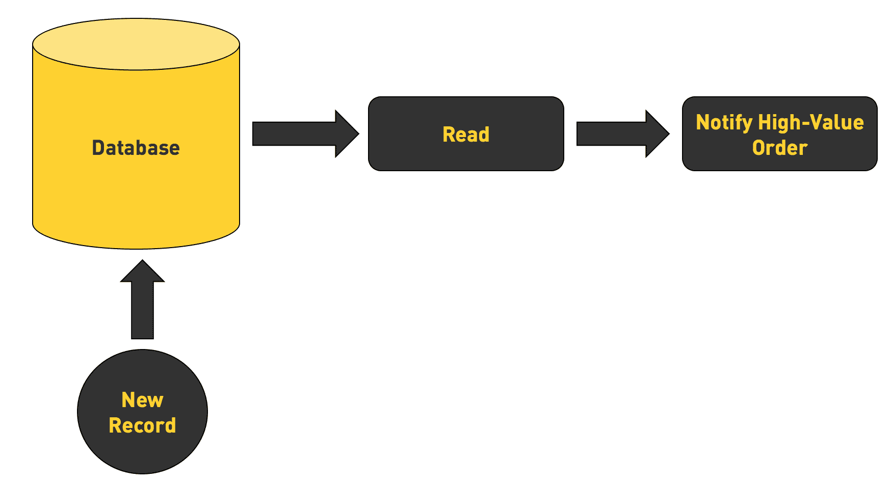
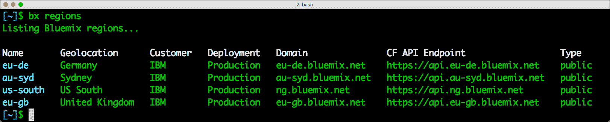
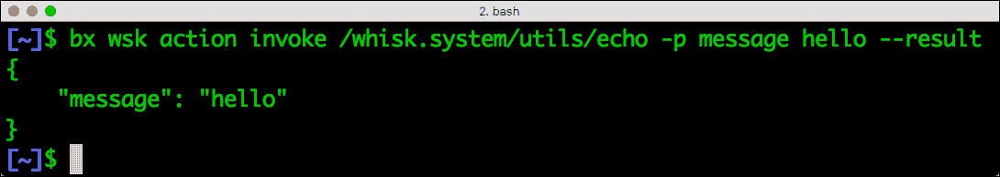
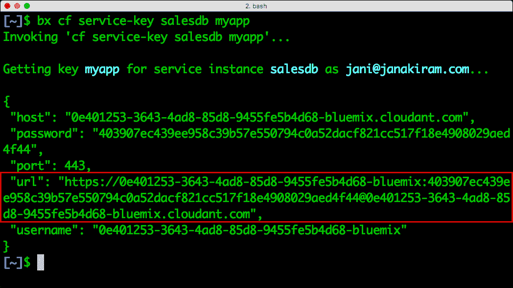
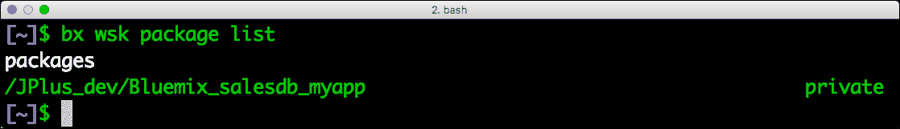

# 演练:在 IBM Bluemix 上构建数据库驱动的无服务器应用程序

> 原文：<https://thenewstack.io/walkthrough-building-serverless-applications-ibm-bluemix/>

对于新的堆栈阅读器来说，IBM Bluemix 和 OpenWhisk 并不陌生。我们讨论了各种文章，包括 OpenWhisk 的概述和架构。

本教程帮助您配置 Node.js 函数，每当向数据库中插入新行时，该函数都会自动触发。我们将利用[cloud ant“DB as a Service”](https://www.ibm.com/analytics/us/en/technology/cloud-data-services/cloudant/)和 [IBM Bluemix PaaS](https://console.bluemix.net/openwhisk/) 中的 open whisk“Functions as a Service”之间的集成。

假设我们有一个数据库来捕获销售订单。销售经理每完成一笔交易，表中就会添加一个新行。我们的目标是，如果订单值超过特定阈值，就发出电子邮件警报。



由于我们将通知引擎构建为一个[无服务器](/category/serverless/)应用程序，因此我们可以将警报交付扩展为 SMS、移动推送通知，甚至是一个空闲通道通知。

本教程有三个步骤:配置环境，创建 Cloudant NoSQL 数据库，最后配置和部署 OpenWhisk 函数。

## 配置环境

如果你还没有注册 IBM Bluemix，那就为自己创建一个账户吧。空闲层配额足以完成本教程。

一旦您有了一个有效的 Bluemix 帐户，下载并使用以下命令配置 CLI:

```
$  sh  &lt;(curl  -fsSL https://clis.ng.bluemix.net/install/osx)

$  bx api https://api.ng.bluemix.net

$  bx login

```

用 bx 区域命令测试配置。它应该显示所有可用的 Bluemix 区域。



如果 Bluemix CLI 按预期运行，使用以下命令配置并测试 open whish CLI:

```
$  bx plugin install Cloud-Functions  -r  Bluemix

$  bx wsk action invoke  /whisk.system/utils/echo  -p  message hello  --result

```



## 创建 Cloudant 数据库实例

让我们继续创建一个 Cloudant 数据库实例，作为 OpenWhisk 函数的事件源:

```
$  bx cf create-service cloudantNoSQLDB Lite salesdb

```

我们还需要为 OpenWhisk 创建一组凭证来与 Cloudant 对话。让我们将凭证密钥称为 myapp:

```
$  bx cf create-service-key salesdb myapp

```

运行下面的命令，记下嵌入了用户名和密码的 URL。我们将使用它来访问 Cloudant 的 REST API:

```
$  bx cf service-key salesdb myapp

```



让我们启动 [**cURL**](https://curl.haxx.se/) 来测试与数据库的连接性。如果有效，我们将初始化一个环境变量，以便于其他操作。请下载并安装 [**JQ**](https://stedolan.github.io/jq/) ，处理 JSON 文件的命令行工具:

```
$  curl  &lt;URL&gt;

$  export CLOUDANT  =  “&lt;URL&gt;”

```

让我们检查一下 Cloudant 中数据库的可用性:

```
$  curl  -s  -X  GET  $CLOUDANT/_all_dbs   |  jq  .

```

列表为空，因为我们尚未创建数据库。运行以下命令创建一个名为 sales:
的集合

```
$  curl  -s  -X  PUT  $CLOUDANT/sales

$  curl  -s  -H  "Content-type: application/json"  -d  "{\"name\":\"John Doe\"}"  -X  POST  $CLOUDANT/sales

```

确认文件已创建，然后将其删除。在尝试删除操作之前，确保您正在获取文档 id 和修订 id:

```
$  curl  -s  -X  GET  $CLOUDANT/sales/_all_docs    |  jq  .

$  curl  -s  -X  DELETE  $CLOUDANT/sales/&lt;DOC_ID&gt;?rev=&lt;REV_ID&gt;  |  jq  .

```

## 创建 OpenWhisk 函数来发送电子邮件通知

IBM Cloud Functions，OpenWhisk 的商业实现附带了预定义的包，这些包集成了 Bluemix PaaS 服务，如 Cloudant、Weather data、Watson Translator 等等。每个包都附带一组操作、触发器和馈送，以便更容易与无服务器环境集成。

运行下面的命令来查看所有预定义的包:

```
$  bx wsk package list  /whisk.system

```

该命令显示特定于 Cloudant 的包的详细信息:

```
$  bx wsk package get  --summary  /whisk.system/cloudant

```

由于我们在上一步中已经创建了 Cloudant 数据库的实例，我们可以访问特定于我们的数据库 salesdb 的包:

```
$  bx wsk package refresh

$  bx wsk package list

```



我们已经准备好将与 salesdb 相关联的触发器和动作连接到我们的应用程序。让我们首先为数据库发生的变化创建触发器:

```
$  bx wsk trigger create data-inserted-trigger  --feed Bluemix_salesdb_myapp/changes  --param dbname sales

```

触发器就绪后，我们现在可以创建一个动作来发送包含订单详细信息的电子邮件。将以下内容保存到 mail.js。我们使用 SendGrid 发送出站电子邮件。参考本[教程](https://thenewstack.io/hands-guide-creating-first-serverless-application-apache-openwhisk/)了解更多关于使用 SendGrid 和 OpenWhisk 的细节。

```
function main(params)  {

   return new Promise(function(resolve,  reject)  {

       if  (!params.order  ||  !params.manager)  {

           reject("Insufficient number of parameters");

       }

       if  (params.order  &lt;  10000)  {

           console.log(message);

           resolve({

               order:  "Low value order"

```

```
             });

           return;

       }

       var helper  =  require('sendgrid').mail

       var sg  =  require('sendgrid')("&lt;API_KEY&gt;");

       from_email  =  new helper.Email("&lt;FROM_EMAIL&gt;")

       to_email  =  new helper.Email("&lt;TO_EMAIL&gt;")

```

```
       subject  =  "High Value Order Alert"

       message  =  'High value order worth $'  +  params.order  +  ' is closed by '  +  params.manager;

       content  =  new helper.Content("text/plain",  message)

       mail  =  new helper.Mail(from_email,  subject,  to_email,  content)

       var request  =  sg.emptyRequest({

           method:  'POST',

           path:  '/v3/mail/send',

```

```
body:  mail.toJSON()

});

sg.API(request,  function(error,  response)  {

if  (error)  {

reject(error);

           }  else  {

               console.log(response.statusCode)

               console.log(response.body)

               console.log(response.headers)

               resolve({

                   msg:  "Message sent!"

               });

           }

       })

```

```
   });

}

exports.main  =  main;

```

基于上述函数创建一个 OpenWhisk 动作:

```
$  bx wsk action create high-value-order mail.js

```

我们可以通过传递虚拟参数来快速测试动作。运行下面的命令应该会向函数中提到的地址发送一封电子邮件:

```
$  bx wsk action invoke  --blocking  --result  --param order  10000  --param manager Joe high-value-order

```

在 OpenWhisk 中，可以链接多个动作来创建一个序列。这类似于 Unix 管道，其中一个命令的输出被传递给下一个命令。由于 Cloudant 已经附带了一个读取数据库的动作，我们将把它以菊花链的形式连接到我们在上一步中创建的高值订单动作:

```
$  bx wsk action create high-value-order-sequence  --sequence Bluemix_salesdb_myapp/read,high-value-order

```

该是我们用数据库触发器连接函数的时候了，插入数据时会调用数据库触发器。我们通过创建一个将动作与 Cloudant 触发器连接起来的规则来做到这一点:

```
$  bx wsk rule create log-high-value-order data-inserted-trigger high-value-order-sequence

```

我们几乎完成了所需的配置。让我们插入订单值大于 10000 的数据。这将触发电子邮件通知:

```
$  curl  -s  -H  "Content-type: application/json"  -d  "{\"order\":\"50000\",\"manager\":\"John Doe\"}"  -X  POST  $CLOUDANT/sales

```

除了等待电子邮件送达，您还可以使用下面的命令检查调用的输出。它应该将输出显示为“消息已发送”:

```
$  bx wsk activation list

$  bx wsk activation result  &lt;ID&gt;

```

通过创建一个基于 Twilio 的新动作，您可以轻松地扩展这个场景来发送 SMS。

通过 Pixabay 的特征图像。

<svg xmlns:xlink="http://www.w3.org/1999/xlink" viewBox="0 0 68 31" version="1.1"><title>Group</title> <desc>Created with Sketch.</desc></svg>