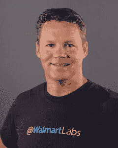

# 沃尔玛实验室首席技术官:OpenStack 如何防止云锁定

> 原文：<https://thenewstack.io/walmart-labs-cto-openstack-can-prevent-cloud-lock/>

谈到 OpenStack 的部署，很少有人比沃尔玛更大。下周，在得克萨斯州奥斯汀举行的 2016 年 Open Stack 峰会上，零售巨头沃尔玛将详细介绍该公司[如何将单个 Open Stack 区域扩展到 400 个计算节点，这些节点可以托管 30，000 多个虚拟机](https://www.openstack.org/summit/austin-2016/summit-schedule/speakers/5720)。自[去年的峰会](https://www.openstack.org/summit/vancouver-2015/summit-videos/presentation/walmart-and-039s-cloud-journey)以来，该公司发布了自己的基于 OpenStack 的 [OneOps](https://thenewstack.io/devops-walmart-way-newly-released-oneops-cloud-platform/) 应用生命周期平台，以在私有云与公共云之间无缝移动工作负载。我们采访了[沃尔玛实验室](http://www.walmartlabs.com/)的首席技术官[杰里米·金](https://twitter.com/jeremybking)，以了解更多关于沃尔玛内部 [DevOps](https://thenewstack.io/tns-research-devops-factions-software-development-world/) 流程的信息，以及该公司如何使用开源和云原生技术在不断发展的电子商务市场中保持敏捷。

**TNS** :你是怎么来到沃尔玛的？

国王:今年夏天将是我的五岁生日。沃尔玛实验室是作为【2011】[收购 Kosmix](https://dealbook.nytimes.com/2011/04/19/wal-mart-buys-social-media-site-kosmix/?_r=0) 的一部分而创建的。我在那之后不久就加入了，对我来说，这是沃尔玛实际上要进入电子商务游戏的信号。在此之前，沃尔玛并没有在电子商务方面投入太多。

这真的是一个转变。在沃尔玛实验室之前，沃尔玛很大程度上会外包给第三方，我们使用专有软件供应商。但我们决定，我们将向数亿顾客[提供]数百万件商品，我们将把它整合到我们的商店、五千个提货点和所有配送中心。世界上没有你能买到的软件来实现它。

五年后，我们收购了其中的 15 家公司，并在组织中雇佣了 2000 多名员工。它真的转型成了一家硅谷创业公司。我们使用了大量的开源软件。我们是 OpenStack 的大用户。我们希望尽可能地为开源做出贡献，因此，我们得到了许多了不起的人，他们在硅谷四处奔走，热爱解决我们这里的这些大问题。

**TNS:** 建立一个庞大的电子商务运营是一项相当艰巨的任务。你是怎么做到的？

**金:**我之前在另一家大型电子商务公司工作过几年，也经历过类似的重新启动——一个新的堆栈，从零开始。它的代号[沃尔玛项目]是[盘古](https://www.internetretailer.com/2013/03/26/wal-mart-we-can-do-what-no-one-else-does)，实际上我们想做的是使堆栈现代化。工程师们实际上已经 13 年没有碰过这个堆栈了，所以这确实是很老的技术了。

当然，工程师是伟大的，但显然对他们的速度感到沮丧。所以，我们决定完全重启它。在当时这样做的时候，我们说，“嘿，这将是完全开源的。它将从一开始就是云原生的。”因此，我们能够跟踪一些非常有才华的人。

当你和人们说，“嘿，我们要重新搭建世界上最大的零售商的平台。”人们只是，“是啊。你得到了一些有趣的东西。”所以，我能够吸引一些真正伟大的人才来做这件事。

仅仅是构建盘古的基础核心平台和基础设施的四五大部分就花了大约 18 个月的时间:搜索引擎、整个平台服务器、云原生基础设施等等。 ****

**TNS:** 从之前对沃尔玛的采访中，我们了解到让开发者对应用的运营负责的概念。"[您部署它，您拥有它](https://thenewstack.io/devops-walmart-way-newly-released-oneops-cloud-platform/)。"你能多谈谈沃尔玛的 DevOps 流程吗？

国王:让我告诉你一点我的哲学。当我与其他电子商务公司合作时，那是在开源革命到来之前。因此，他们建立了一个非常可扩展和非常创新的平台，但在某种程度上；如果你知道我的意思，它是紧缩的。每一个架构决策都经历了严峻的考验，我们完全偏执于可伸缩性和后端。结果，我们有了一个很棒的网站，我们有了一个很好的可扩展的基础设施。但是，当我们雇人的时候，他们花了几个月的时间来学习系统，而且添加新的功能真的很难。

从那家公司，我去了一家小初创公司，大约有一百名工程师，情况正好相反。那是绝对的混乱，工程师可以在任何他们想要的平台上工作。我们有 100 名工程师，使用了大约 30 个不同系统的不同平台。但是工程师们非常高兴，因为他们可以从事最新最棒的东西。但是，我试图建立一个“四个九”的能力，在这样做的过程中，我在五个平台上复制高可用性，我对此感到非常厌倦。

有了沃尔玛实验室，我想要这两个世界。这才是一个人真正想要达到的。我绝对讨厌治理这个词，但是在某种程度上，我们有一个系统的清单。

OneOps 不仅仅是云管理工具。这是一个应用程序生命周期管理工具，这意味着[沃尔玛开发人员]不仅能够控制部署，还能给我统计数据。谁会使用它？他们拥有什么版本？最后一次部署是什么时候？多少交易？这在多少台机器上运行？这在哪个云上运行？

因此，我对我正在使用的系统的每个部分都有一个清单，无论是数据库、NoSQL 数据库、缓存服务、Ruby 或 Java 还是 Node.js 系统。我知道他们运行的是什么版本。我知道谁在用它，这让我可以运行一个模板。

如果你明白我的意思，这是一种有所控制的 DevOps 文化。这是一件美好的事情。

**TNS:** 几个月前，沃尔玛发布了 OneOps 平台。接待怎么样？

**国王:**太棒了。似乎我们每周都在为人们做演示，大部分是和其他公司的朋友一起，然后也是为那些有兴趣将插件嵌入其中的厂商。我们非常致力于保持其与时俱进。我们继续投资于我们正在构建的不同连接器，无论是数据库服务器还是新的云。我们已经为几乎所有 OpenStack 云提供商制作了连接器。我们现在正在开发 Azure connect。

我们内部有很多用户。去年 11 月我们做了 3 万次部署，通常 11 月是零售商的冻结期，因为他们不想在黑色星期五之前卷入任何疯狂的事情。因此，这是我们能够管理的一种控制，因为拥有这些功能有如此多的可见性，我们甚至可以在黑色星期五前一周安全地部署。

**TNS:**open stack 在沃尔玛运营中扮演什么角色？

**王:**绝对是它的关键一片。正如我提到的，我们现在已经在 OpenStack 上很长时间了。我们三年多前就开始接触它了。你可能知道，一开始它并不稳定。我们最初有很多问题，但我们从未回头，即使在过去的两年里，我们也非常满意。我们没有因为 OpenStack 而出现任何站点中断。

因此，我们现在非常重视在 OpenStack 上运行的所有基础设施。我们一度是世界上最大的部署，但我知道许多公司已经开始做了很多，所以我们我不知道我们是否还拥有这个头衔，但我们相当大。

**TNS:**open stack 提供了哪些优势？

**国王:**灵活性是它的一大块。因此，许多云提供商也在转向 OpenStack。因此，如果我想在内部进行部署，我想将同样的流程部署到另一个拥有 OpenStack 端点的云提供商。例如，我们用 Rackspace 做了一个 OpenStack 端点，并且我们已经与其他几家拥有 OpenStack 端点的公司完全集成。

**TNS:** 锁定云提供商有什么危险。这是沃尔玛一直在努力解决的问题吗？

**King:** 我们肯定是云用户，从一开始我们就肯定担心锁定。当我们最初构建 OneOps 时，我们并没有真正考虑成为云不可知论者，但我们考虑的是从开发中的云环境迁移到试运行中的云环境，再迁移到生产中的云环境。但我们发现，从这些内部云功能迁移到外部云非常容易，因此。

我认为人们对此有很多担忧，这就是“加州旅馆”的问题:一旦你把所有的数据和应用程序都移入云中，你就绝对无法退出。这是一个真正的问题。因此，当我们构建 OneOps 时，我们已经能够保持与云无关，不仅可以在内部云和任何计算机的外部云之间移动。

OneOps 得到的另一件事，也是我们如此喜爱它的部分原因，是工程师们实际上并不知道它是基于 OpenStack 的。他们不知道一边是 Rackspace，另一边是 Azure，或者是内部云，因为这只是配置管理，我们可以有效地集中控制负载。

图片:沃尔玛。

<svg xmlns:xlink="http://www.w3.org/1999/xlink" viewBox="0 0 68 31" version="1.1"><title>Group</title> <desc>Created with Sketch.</desc></svg>