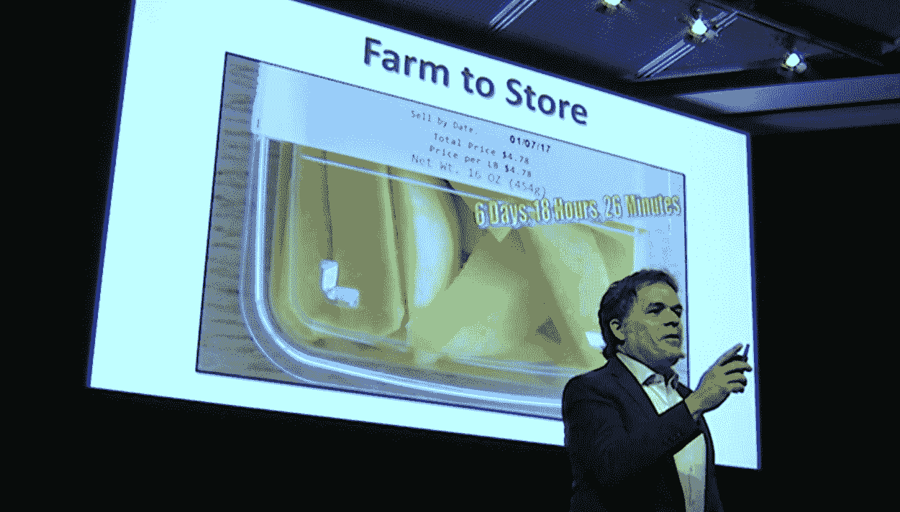
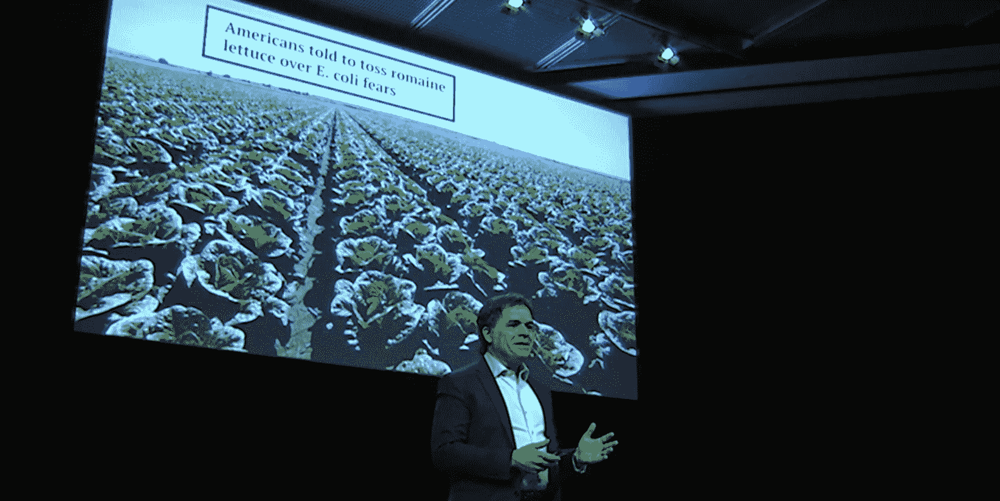
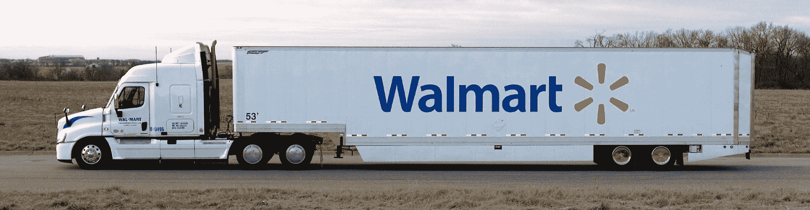

# 沃尔玛的区块链计划可能会改变我们使用数据的方式

> 原文：<https://thenewstack.io/walmarts-blockchain-program-may-transform-the-way-we-use-data/>

沃尔玛是世界上最大的公司，也是最大的雇主，拥有 230 万名员工，每周为 2 亿名顾客提供服务。

因此，当他们将区块链计划投入生产时，这是一件大事，尤其是一项旨在为可能是终极挑战的问题提供新解决方案的计划:在不同公司之间共享数据。

“让我非常清楚，因为我可以向你保证，沃尔玛不是在追逐新的闪亮硬币，”沃尔玛食品安全和健康副总裁 Frank Yiannis 强调说。“我知道区块链很流行，很时尚，但我们试图做的是解决商业挑战。”

在区块链之前，沃尔玛花了 6 天时间来追踪其产品的来源。现在只需要两秒钟。上个月，Yiannis 在《麻省理工技术评论》主办的“区块链商业”会议上描述了他们的方法[,解释说“我们现在已经超越了概念验证…](https://events.technologyreview.com/video/watch/frank-yiannas-walmart-food-safety-supply-chain/)

“为全球 12，000 家商店、成千上万家供应商提供安全食品是一项非常艰巨的挑战，也是一项非常重要的责任。因此，我们一直在寻找更好的方法来做到这一点。”

## 终极用例

在 20 世纪 80 年代，一个典型的杂货店只有 15000 种食品，但今天已经超过 50000 种。在 IBM 的一个视频中，Frank Yiannas 指出，人们有一种“不言而喻的期望”，即食品当然是安全的，当有食品召回时，“在证明无辜之前，该食品是有罪的。”沃尔玛将撤出所有胡萝卜，直到他们确定哪些受到召回影响，然后才退回未受影响的。今天的食物系统涉及许多参与者，每个人都有自己的方式来跟踪食物的去向。

“大多数实际上是在纸上完成的，或者在互不交流的系统上完成的，”Yiannis 说。

[https://www.youtube.com/embed/SV0KXBxSoio?feature=oembed](https://www.youtube.com/embed/SV0KXBxSoio?feature=oembed)

视频

监管机构只要求“上一步，下一步”的可追溯性，因此即使记录被数字化，也是在不同的系统中完成的。区块链提供了一个现成的系统，不仅可以从不同的公司收集数据，还可以从不同的资源收集数据。“如果我们将这些数据与其他数据点，即物联网联系起来，所有这些信息都将产生洞察力，让我们拥有一个更安全、更实惠和可持续的食品系统。”

沃尔玛于 2016 年开始测试 IBM 区块链平台。Qwartz 参观了他们在北京的全球食品安全合作中心，沃尔玛在这里首次推出了区块链试点项目。(“它不是一个挤满了检测肉类或蔬菜毒素的科学家的实验室，而是一系列的会议室，就像中国首都的任何合作空间一样。”)2011 年，沃尔玛在中国遭遇了一些负面报道，2014 年又遭遇了一次，每次显然都是因为与供应商的[问题。沃尔玛的流程现在收集和数字化关于猪肉的数据——农场检查报告、牲畜检疫证书——并将其添加到区块链。](https://www.reuters.com/article/us-china-apec-walmart/wal-mart-to-focus-on-food-safety-in-china-asia-chief-idUSKBN0IT00R20141109)

第二个试点项目涉及芒果，从农场到餐桌需要很长的旅程。首先，它们被运到一个包装厂，运送到美国，然后再进行加工和包装，用卡车运送到数千家沃尔玛(和山姆会员店)商店。Yiannis 记得他带了一包芒果去参加团队会议，要求他的员工告诉他芒果的来源。“我们花了 6 天 18 小时 26 分钟……差不多 7 天……我们做得比大多数人都好。”但在实施了基于区块链的系统后，追溯到源头只需要 2.2 秒。“那是食物以思维的速度追溯。只要你能想到，我们就能知道。”

“这不是实验室。这不是理论，”他告诉 Qwartz。“这是真实的世界。”

**为什么重要**

Yiannis 告诉他在麻省理工学院的听众，区块链存储的数据还包含了大量关于芒果的其他信息。“他们接受热水治疗了吗？农场被检查了吗？如果他们宣称是有机的，我们就能知道它是否真的是有机的。”

但扬尼斯也提醒他的观众，仅在美国，食源性疾病目前估计就要花费 550 亿至 930 亿美元，并指出美国疾病控制和预防中心正在对 T2 莴苣中的大肠杆菌感染做出反应，在 25 个不同的州报告了超过 121 例病例，包括加利福尼亚州的 52 例住院治疗和 1 例死亡。虽然今天的食品系统比以往任何时候都更安全，但“一次食源性疾病就是一次过多的食源性疾病。”

Yiannis 还记得 2006 年的一次健康恐慌，当时卫生官员将所有菠菜下架两周，以追踪一种污染。“说到底，就是一个生产商、一天的产量、一个批号……菠菜供应商会告诉你，他们花了六七年时间才重新赢得销售和客户的信任。”

“在召回事件中，每个人都会受到伤害，”布里奇德·麦克德莫特同意道，他曾是一名软件开发人员，现在是 IBM 区块链业务发展副总裁。在沃尔玛的播客上——“盒子外面的”——她分享了自己的信念，即“将像互联网改变通信方式一样改变交易……这是每天早上让我起床的事情，因为我认为这是真的。”

## 区块链能创造信任吗？

麦克德莫特说，这就像用钢笔而不是铅笔做纵横字谜一样——所以没有回头路可走，也没有改变已经写好的内容。“你说，‘嘿，我需要在整个生态系统中分享很多信息。我想确保人们知道我没有删除这些信息。“这解决了一个信任问题，让整个食品生态系统对共享数据更加放心。”突然之间，世界上 80%的数据现在都可以被访问了，这些数据都存储在世界各地公司的小仓库中。"

“现在我们真的开始接触大数据了，”麦克德莫特说。“这就是大数据的承诺。区块链解决了缺失的一环，那就是我们如何让人们分享信息，这样我们就可以利用信息并从信息中获得洞察力。

“对消费者的好处是更好的健康。不一定对每个消费者都适用，但如果你吃了难吃的沙拉，你会想知道的。”

当然，区块链也解决了其他问题。在麻省理工学院，Yiannis 用这个例子说明了可追溯性的重要性，引得他的听众发出了缓慢的笑声。“你知道世界上出售的有机食品比世界上生产的有机食品还要多吗？”

“这是一个奇迹，”他开玩笑说，在张贴了一张幻灯片说，每年食品欺诈给该行业造成 100 亿至 150 亿美元的损失。“我们设想这样一个世界，通过这种共享的信任概念，区块链将允许你跟踪并真正了解——“当我购买一种有机产品时，它是真正的有机产品，还是有人只是向我收取溢价？"

还有其他的优势。“你每天从配送中心拿走的东西就是你回馈顾客的一天，这有可能减少食物浪费。”

Yiannis 将自己描述为一个几乎皈依宗教的区块链怀疑论者。“30 年来，我一直致力于尝试数字化和创建一个具有更好可追溯性的数字化透明食品系统。从来都做不到。”但是食品供应链上的复杂环节提供了另一个分散和分布式系统的例子。“如果你仔细想想，就好像区块链是为 T2 的饮食系统而生的一样。”

他认为沃尔玛的经历证明了一句老话:区块链是一项团队运动。“我们的首席执行官非常兴奋，他伸出手，开始与其他供应商交谈，现在我们有 10 个大品牌在一起工作。”像都乐、雀巢和泰森食品这样的公司都参与其中，“我们已经跟踪了数百万个食品包装，我们已经跟踪了超过 100，000 个可追溯事件。”

克罗格公司食品技术和监管合规副总裁霍华德·波波拉(Howard Popoola)表示，沃尔玛的参与让其他参与者确信，区块链的想法有一定的“合法性”。根据《财富》杂志的报道，克罗格最终成为了十大参与品牌之一，[Popo OLA 说他已经得出结论“食品行业已经成熟，可以采用这样的解决方案了。”](http://fortune.com/2017/08/22/walmart-blockchain-ibm-food-nestle-unilever-tyson-dole/)

《财富》杂志在另一篇文章中指出，Yiannis 在沃尔玛的年度股东大会上展示了这项技术。

这可能只是开始。据金融网站 *Investopedia* 报道，沃尔玛已经拥有几项与区块链相关的专利，最近[又申请了两项](https://www.investopedia.com/news/why-walmart-filing-blockchain-patents/)。一项专利涵盖了一个系统，该系统可以自动跟踪包裹并加密支付给当天交付的供应商——以新鲜农产品为例。第二项专利涵盖了相关的快递购物系统。这是一个迹象，表明他们可能正在计划对他们与亚马逊的战斗做出雄心勃勃的回应，因为一项更早的专利也描述了一种无人机智能包裹，其中有关于其内容和交付历史的数据。同一篇文章指出，Target 也在开发区块链应用程序。

Yiannis 告诉 Qwartz，他设想有一天包装托盘甚至可以传输食品货物运输时的温度，这些数据也可以存储在区块链上，供监管机构和消费者使用。

回到 YouTube，一位评论者开玩笑说，随着“从农场到餐桌”变成“从云到客户”，食品流行语可能很快就会改变。

* * *

# WebReduce

<svg xmlns:xlink="http://www.w3.org/1999/xlink" viewBox="0 0 68 31" version="1.1"><title>Group</title> <desc>Created with Sketch.</desc></svg>