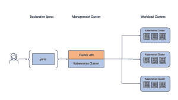

# 想要跨云的一致的 Kubernetes 体验？尝试集群 API

> 原文：<https://thenewstack.io/want-consistent-kubernetes-experience-across-clouds-try-cluster-api/>

[Paul Jenkins](https://www.linkedin.com/in/jenksho/?originalSubdomain=uk)

[Paul 是甲骨文云基础设施团队的产品经理，负责客户采用 OCI 容器原生平台服务。他是许多客户活动和社区会议的发言人。自从 30 多年前用编码纸和穿孔卡编写第一个程序以来，Paul 在信息技术方面有着广泛的经验。](https://www.linkedin.com/in/jenksho/?originalSubdomain=uk)

在 2019 年底，[我在新堆栈](https://thenewstack.io/two-reasons-independent-software-providers-cant-afford-to-ignore-cloud-native/)中写道，独立软件供应商(ISV)如何越来越多地帮助他们的客户采用云原生技术，如容器和 [Kubernetes](https://www.oracle.com/cloud-native/container-engine-kubernetes/what-is-kubernetes/?source=:ex:pw:::::TNS_ClusterAPI_A&SC=:ex:pw:::::TNS_ClusterAPI_A&pcode=) 。几年后，很明显，ISV 和他们的客户已经真正采用了容器化应用范例和多云策略，而且步伐还在加快。

最近[云本地计算基金会(CNCF)的一篇文章](https://www.cncf.io/announcements/2022/02/10/cncf-sees-record-kubernetes-and-container-adoption-in-2021-cloud-native-survey/)发现，2021 年，96%的组织正在使用或评估 Kubernetes，DataArt 的报告[“2022 年塑造云计算的 7 大趋势”](https://www.dataart.com/en/blog/7-trends-shaping-cloud-computing-in-2022)将多云确定为头号趋势。

为什么采用率越来越高？原因有很多:组织正在转向[多云](https://www.oracle.com/cloud/multicloud/)以利用不同的定价模式和地理本地化，以及避免供应商锁定和在服务中断时的冗余。

明确地说，多云方法带来了一些额外的复杂性，因为每个云提供商都有自己的安全模型、管理界面、网络基础设施甚至资源配置(称为“形状”)。因此，每个提供商需要不同的基础设施知识和技能。例如，Amazon Web Services (AWS)有三种不同的负载平衡器服务。微软 Azure 有四个。[甲骨文云基础设施](https://www.oracle.com/cloud/?source=:ex:pw:::::TNS_ClusterAPI_B&SC=:ex:pw:::::TNS_ClusterAPI_B&pcode=) (OCI)有两个。

当您考虑 ISV 和客户可以使用的所有云服务时，选项可能会非常多。事实上，对于使用单一云提供商的组织来说，知道何时使用哪种特定云服务以及如何最好地配置每种服务已经足够具有挑战性了。浏览多云的组合和排列可能会令人望而生畏。

## 容器有帮助吗？

那么[集装箱](https://www.oracle.com/cloud-native/container-engine-kubernetes/?source=:ex:pw:::::TNS_ClusterAPI_C&SC=:ex:pw:::::TNS_ClusterAPI_C&pcode=)呢？由事实上的 Kubernetes 编排平台编排的容器不应该帮助 ISV 和组织跨多个云部署和管理软件和服务吗？

是也不是。

是的，因为 Kubernetes 帮助在标准化容器中部署应用程序，甚至跨多个云。这部分很简单。

不会，因为 Kubernetes 开箱即用，并不能帮助组织管理容器集群和云基础设施。那部分很难。

Kubernetes 是一个复杂的系统，它依赖于许多组件的正确配置来拥有一个稳定的集群。管理 Kubernetes 集群生命周期(创建、更新、删除)的提供商基础设施之间的巨大差异增加了复杂性。

所有主要的云服务提供商都提供托管 Kubernetes 服务(如 AWS Elastic Kubernetes 服务、微软 Azure Kubernetes 服务和 [Oracle Kubernetes 引擎)](https://www.oracle.com/cloud-native/container-engine-kubernetes/?source=:ex:pw:::::TNS_ClusterAPI_C&SC=:ex:pw:::::TNS_ClusterAPI_C&pcode=)，这些服务抽象了 Kubernetes 和相关基础设施的许多复杂性。这使得管理集群生命周期变得更加容易。然而，当跨多个云运行多个集群时，不同需求和不同用户体验的相同问题仍然存在。

## Kubernetes 集群 API

这就是 [Kubernetes 集群 API (CAPI)](https://cluster-api.sigs.k8s.io/) 的用武之地。CAPI 是 Kubernetes 的一个子项目，重点是提供 API 和工具来简化在多个云上(甚至在本地)供应、升级和操作多个 Kubernetes 集群的过程。

CAPI 通过定义一组通用的操作，为各地的 Kubernetes 集群提供一致的体验和生命周期控制。此外，CAPI 为每个主要的云提供商提供了一个默认的实施方案——这个默认方案通常可以轻松部署。(对于有非常具体需求的组织，可以定制默认实现，甚至完全替换默认实现。)

有趣的是，CAPI 用 Kubernetes 自己来管理 Kubernetes。CAPI 采用管理集群来创建和管理工作负载集群。

使用 CAPI 的要求很简单。从 Kubernetes 集群开始——它可以是使用 Kind 或 Rancher Desktop 的本地集群，也可以是现有的托管服务。然后，管理员为每个特定的云提供商安装并初始化 CAPI。

然后，CAPI 的 Kubernetes 管理集群生成工作负载集群，这些集群将运行在所需云服务上部署的应用程序。例如，对于甲骨文的云，CAPI 将生成虚拟云网络(VCN)、子网、安全列表、互联网网关和服务网关。

深入挖掘一下，CAPI 使用自定义资源定义(CRDs)来优化 Kubernetes 安装，并为每个云提供商定义计算环境。四个最重要的 CRD 是机器、机器集、机器部署和机器健康检查:

### 机器

机器是托管 Kubernetes 节点的计算实例的声明性规范。该规范允许管理员为目标工作负载选择适当的特定于提供商的计算形状和功能。例如，OCI 上的轻量级工作负载可以使用基于 Arm 的小型实例，而大型工作负载可以使用最多 128 个 OCPUs 的裸机实例。这些是特定于提供程序的定义，在提供程序之间不可移植。

### 机器组

一台机器维护一个稳定运行的 Kubernetes 集群。MachineSet 的工作方式类似于核心 Kubernetes ReplicaSet。

### 机器部署

MachineDeployment 为机器和机器集提供声明性更新。MachineDeployment 的工作方式类似于核心 Kubernetes 部署，它通过将更改部署到新旧两个机器集来协调对机器的更改。

### 机器健康检查

MachineHealthCheck 定义了 Kubernetes 节点应被视为不健康的条件。通过删除相应的机器来移除不健康的节点，同时 MachineSet 确保将创建新的机器来替换它。

当然，CAPI 还有其他方面可以帮助管理多个 Kubernetes 集群，但是机器的概念是实现这一点的核心。通过 Kubernetes 风格的 API，以类似于 Kubernetes 部署和复制集的方式抽象底层基础设施和管理机器，无论集群在哪里运行，都可以提供直接和一致的体验。

CAPI 是 Kubernetes 特别兴趣小组(SIG)的项目。目前，有超过 20 种云服务的 CAPI 提供商。

## 管理 Kubernetes 的飞跃

随着 Kubernetes 的使用增加，越来越多的组织选择多云供应商战略，对管理 Kubernetes 的一致方法的需求变得更加重要。集群 API 是实现这一目标的巨大飞跃。

关于集群 API 的更多细节，请查看[库](https://github.com/kubernetes-sigs/cluster-api)。你可以在这里看到 Oracle 云基础设施[的 cluster-API-provider-OCI(capo ci)。](https://github.com/oracle/cluster-api-provider-oci)

<svg xmlns:xlink="http://www.w3.org/1999/xlink" viewBox="0 0 68 31" version="1.1"><title>Group</title> <desc>Created with Sketch.</desc></svg>