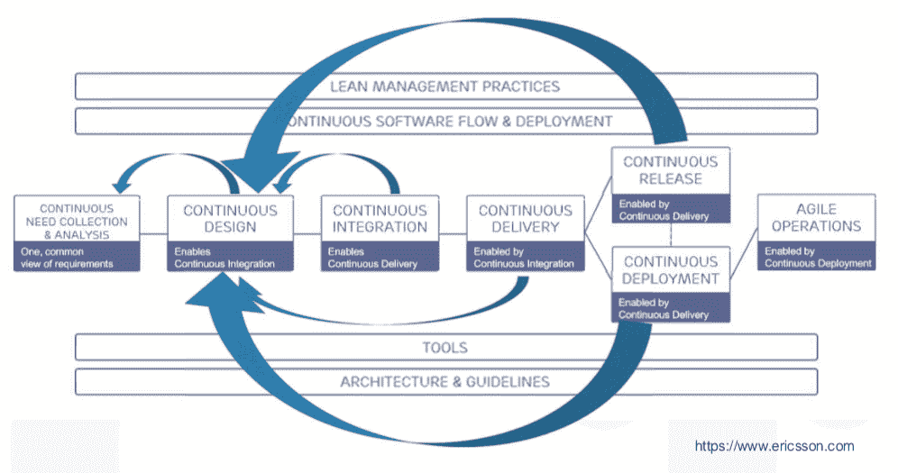
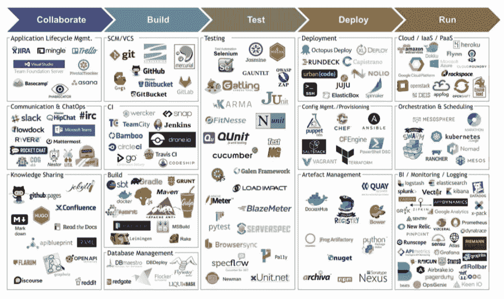
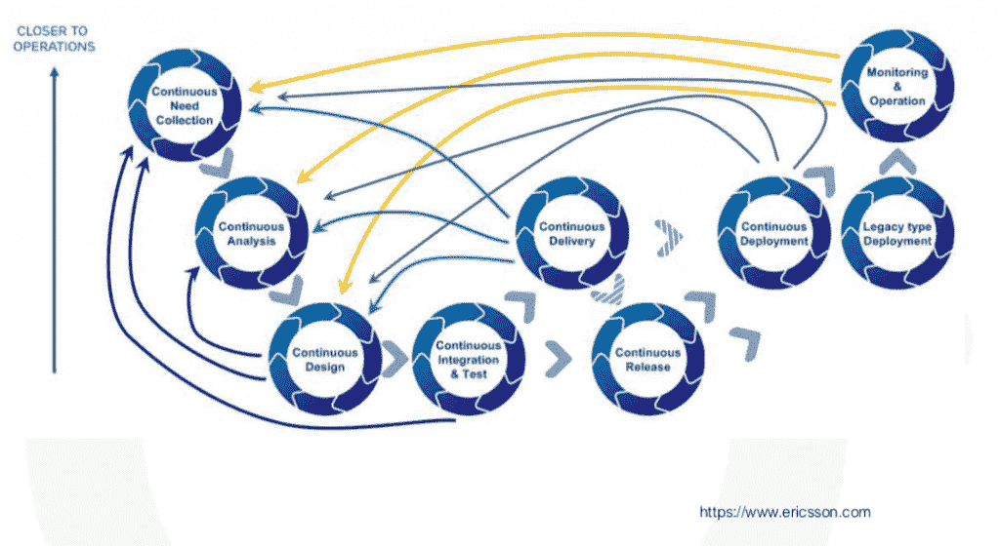
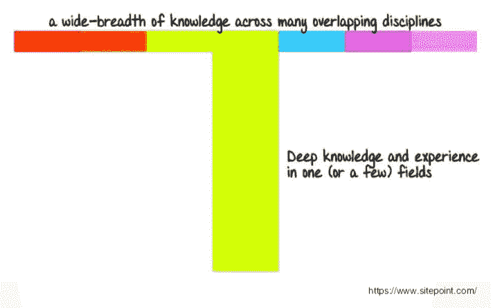
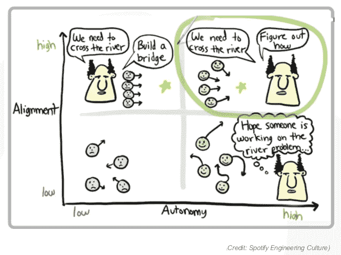

# 想要 DevOps 自动化？管道之前是人

> 原文：<https://thenewstack.io/want-devops-automation-its-people-before-pipelines/>

编者按:这是正在进行的“云原生 DevOps”系列的一部分。请在本月查看更多版本。

“当你提到 DevOps 时，每个人都真的睁大了眼睛，”商业敏捷性顾问[almu dena Rodriguez Pardo](https://www.linkedin.com/in/almrodrpardo/)指出，这是她在 [2018 年敏捷之旅伦敦演讲](http://2018.agiletourlondon.co.uk)中关于 DevOps 自动化人性化方面的开场白。

自动化一切！这就是持续投放的症结所在吧？Rodriguez Pardo 在电信世界的开发者体验领域工作了 20 多年，他说，除了自动化，你还必须关注那些计划和推动这种流动的人。

今天，我们重申她的小步骤，可以应用于任何类型的组织，开始或已经通过 DevOps 转型。

## DevOps 到底是什么？

"不管你有什么样的定义，你都没有错，因为 DevOps 没有官方的定义."

Rodriguez Pardo 指出敏捷如何拥有敏捷宣言来为敏捷软件开发提供指导方针，但是对于 DevOps 来说没有这样的东西，这意味着没有人的定义是错误的。我们同意这意味着开发加运营，但澄清到此为止。

“这实际上是一个相当大的问题，因为每个人都在谈论它，每个人都有别的意思，”她继续说道。

因此，对于她的演讲，她提供了她最喜欢的 VersionOne 对 DevOps 的定义:“DevOps 不是一种工具或过程，而是一种实践，它重视整个组织的持续沟通、协作、集成和自动化。”

这也很合适，因为没有人能够真正同意 DevOps 的 CI/CD 值中的 D(“交付”，或者有时“部署”)的定义。每个人似乎都同意第一个代表持续集成，但是 CD 是持续交付、部署、设计还是其他什么？通常这意味着他们所有人。

Rodriguez Pardo 在她的演讲中首先建立了一个定义，这是为了提醒我们，因为没有标准定义，所以这是讨论任何 DevOps 转型的第一点——首先澄清您甚至在谈论每个部门的内容。

“它包括沟通、协作和集成，而不仅仅是自动化。这是我真正喜欢它的地方，”这是 Rodriguez Pardo 在决定自动化什么时关注的因素。

大多数正在经历 DevOps 转型的公司已经接受了 Scrum 框架 Scrum Master、产品所有者和开发团队成员的角色都有明确的定义——她说，如果你假设产品在领导 Scrum 流程后直接进入客户手中，那么这个框架会很有效。这种情况很少发生。当你谈论电信公司的复杂性时，情况就不一样了。

事实上，Rodriguez Pardo 将 Scrum 和看板简单地称为瀑布项目管理的“敏捷化”。

“现在我们正在前进。我们试图用 DevOps 做的是，我们仍然试图与优秀、高质量的工作代码进行交互，但我们也要照顾周围的环境。所以这不仅仅是修改代码并把它放在门外。我们需要确保运营环境的安全，”她解释道。

她表示，每个行业的连续输送管道都有很大不同。

大多数技术支持的组织现在有持续的设计和集成，但是持续的交付、持续的部署和持续的发布因公司而异。罗德里格斯·帕尔多说，如果你是亚马逊或 Spotify，你可能每分钟交付三次，因为你是直接向你的客户交付。然而，如果你在一家电信公司工作，并且你在全国范围内与一家网络运营商合作，同时有几千人在通话，你可能不希望连续发布。

“有几个预生产和生产步骤你可能会用到，”她说，指的是她所说的高复杂性行业的公司，下面举了爱立信的例子。

她指出了爱立信如何将持续改进和反馈循环整合到开发流程中。无论在预生产中发现什么，都将被考虑到下一个设计迭代中。

多连续才算连续？这也因公司和行业而异。在这种情况下，爱立信能够从每 6 到 12 个月发布一次升级到每月发布一次。罗德里格斯·帕尔多承认这不是连续的，但对于在全英国甚至全欧洲范围内发行来说，这已经很不错了。

“这与你有多连续无关。她说:“关键是你的目标是什么。

对大多数公司来说，“持续一切”可能过于雄心勃勃。然而，像虚拟化和容器化这样的进步意味着每个开发人员都可以获得一个“漂亮的操作环境”这将在许多公司中充当重要的 DevOps 加速器。

## 绘制人际互动的持续管道图

开发运维的第一步是自动化。罗德里格斯·帕尔多说，这听起来合乎逻辑，但通常不是这样。事实上，她引用了一项对欧洲企业 IT 的调查，调查显示大多数公司只有 20%的自动化。

她说她和一些公司谈过，这些公司说他们没有自动化，因为他们没有预算。

“自动化不是一个选项，”她反驳道，分享了几乎所有 DevOps 工具和 orchestrators 的压倒性图像来组合它们，指出其中有多少是明显更便宜的开源。

Rodriguez Pardo 说没有理由不自动化，但是不要忘记自动化中的人为因素。

她的一个电信客户必须与不同的运营商合作。一位 LatAm 运营商表示，他们只想与一个特定的人合作，因此必须将此人添加到 DevOps 计划中。然后，他们必须适应不同运营商的架构。然后，他们必须在不同的结构中进行测试，并对网络进行更改。他们还有一个预先的集成保护，因为提供商希望在发布之前看到自己环境中的变化。

> “安全、测试、开发、运营、集成——无论你的连续管道是什么样的，都要确保完整的质量代码管道能够在尽可能短的时间内让客户满意。”阿尔穆德纳·罗德里格斯·帕尔多

CI/CD 管道必须包括客户以及到他们的距离和连接点。

她说，在这种情况下，你甚至可能会有闯入者，比如需要修改的地方，或者你可能会让开发人员前往客户的场所。她称之为“手动交付”，这是自动化的反义词，但并没有否定其价值，因为 DevOps 的全部目的是让客户满意。

“因为把你的软件亲自带给你的客户，你和他坐在一起，你听到他的评论，你听到他抱怨他不喜欢的东西。你可以感同身受，了解痛点，”罗德里格斯·帕尔多说。

你描绘的反馈回路越宽，听到的操作就越多。每个人都在听，你会发现有时荒谬的不一致。在一个团队中，开发人员要求 KPI(关键性能指标)尽可能少犯错误，而测试人员要求 KPI 尽可能多地发现错误。

“你能想象排球来回跑吗？“不，你错了，”不，你的测试是错误的。"

罗德里格斯·帕尔多诙谐地说，部门经理随后做了一些“革命性的”事情，他们相互交谈，决定共同的目标。

## DevOps:专业化和跨职能的平衡

Rodriguez Pardo 继续说道，“这就是 Scrum 的用途。不仅仅是坐在一起。它是关于分享、达成共识、相互支持和创造交叉功能的。”

无论你有 Scrum、看板还是其他什么，她建议将这些团队的操作包括进来，以便团结在共同的目标周围。

她说 DevOps 不仅仅是打破孤岛，而是发展技能。这通常涉及垂直领域的专业化，但随后对横向的一切有一个总体的理解，从对工具的简单理解到哪个团队做什么，再到透明的目标和跟踪。

为了实现这一点，她建议您可以从与开发人员相关的小型测试实验开始，或者在 Jenkins 为每个人提供一些基本的研讨会，以交叉授粉持续集成。

罗德里格斯·帕尔多说，目的是吸引一些兴趣，让他们体验一下，应用实践社区和其他跨公司协会的想法。

下面的 Spotify 图表最好地说明了最终目标。

“在运营商的支持下，他们达成了一致。他们在团队中很成熟，知道他们有什么，他们没有什么，以及他们可以在哪里合作，”她说，并补充说每个人都是自主的，安全的，并朝着取悦客户的方向前进。

最后，DevOps 只是关于人，包括客户和团队。在为 DevOps 的文化变化而招聘时，你不再只是招聘某一种语言的最佳人才，而是招聘一种个性，以及她如何适应变化，并在你走向跨职能知识时，不仅与自己的团队，而且与其他团队合作。

> “有一件事我们不能忘记，每当它看起来像一个技术问题，每当我们认为我们有一个技术问题，它总是一个人的问题。”阿尔穆德纳·罗德里格斯·帕尔多

<svg xmlns:xlink="http://www.w3.org/1999/xlink" viewBox="0 0 68 31" version="1.1"><title>Group</title> <desc>Created with Sketch.</desc></svg>