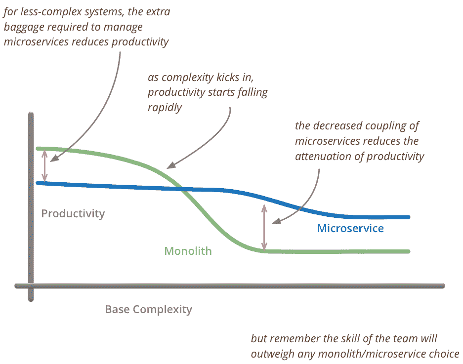

# 那么，您想成为云原生用户吗？首先，问为什么

> 原文：<https://thenewstack.io/want-go-cloud-native-first-ask/>

[Lenny Pruss](http://www.redpoint.com/)

[Lenny Pruss 是 Redpoint Ventures 的负责人，他主要从事云基础设施、开发工具和安全方面的投资。他在 Memory Leak 上写了关于开发人员业务的文章。](http://www.redpoint.com/)

在过去的几年里,“原生云”一词已经成为设计和构建应用程序以及支持它们的基础设施的人们的共同意识。

本质上，云原生指的是为云量身定制的软件架构范式。它要求应用程序 1)使用容器作为打包和部署的原子单元，2)自治，即集中编排和动态调度，3)面向微服务，即构建为松散耦合的模块化服务，每个服务运行一个独立的进程，通常通过 API 通过 HTTP 相互通信。

剖析这些特征进一步表明，现代应用程序需要独立于平台(例如，与物理和/或虚拟资源分离，以便在云和计算环境中同样工作良好)、高度灵活、高度可用且易于维护。

听起来，构建云原生应用对每个组织来说都是显而易见的，无论他们是否考虑编写业务关键型软件。然而，在实践中，云原生化(很像采用 DevOps)需要实施一系列新技术和实践，这些技术和实践有意义地转移与编写、部署和管理软件相关的开销成本。因此，在考虑进行云原生之前，必须从技术和组织两方面了解这种架构转型的动机。

一个很好的起点是 Google，它是这种高度分布式自主计算范例的典型代表。谷歌已经在集装箱化基础设施上运行了近十年，并通过一个名为 Borg 的专有系统管理资源分配、调度、协调和部署。

“博格提供了三个主要好处，”2015 年谷歌的一篇研究论文 [*解释说，谷歌的大规模集群管理有博格*](https://static.googleusercontent.com/media/research.google.com/en//pubs/archive/43438.pdf) 。这种方法“隐藏了资源管理和故障处理的细节，因此用户可以专注于应用程序开发。”Borg-ian 方法还“以非常高的可靠性和可用性运行，并支持做同样事情的应用程序，让我们能够在数万台机器上有效地运行工作负载。”

因此，谷歌进行云原生的理由是实现 1)敏捷性，如开发人员生产力和自助服务所定义的，2)容错和 3)水平可扩展性。虽然几乎没有任何组织需要像谷歌这样大规模地运营，但世界上的每家公司都会问自己“我如何走得更快”和“我如何将风险降至最低？”

然而，当云原生成为目的而不是手段时，问题就出现了。虽然容器、自动调度和面向微服务的设计都是可以提高运营敏捷性并降低与运输软件相关的风险的工具，但它们远不是灵丹妙药，并且涉及到将有意义的成本从开发转移到生产。马丁·福勒和其他人将这种现象称为“[微服务溢价](http://martinfowler.com/bliki/MicroservicePremium.html)”

“[云原生]方法完全是为了处理复杂的系统，但为了做到这一点，该方法引入了自己的一系列复杂性。福勒写道:“当你[采用云原生架构]时，你必须致力于自动化部署、监控、处理故障、最终一致性以及分布式系统引入的其他[复杂性]。”

流行的谬论是将使用 Docker 作为包格式与从一开始就将应用程序构建为复杂的分布式系统的需求混为一谈。

第一条经验法则是“如果没有坏，就不要修复它”，所以如果你的团队在高水平上运行，发布按计划进行，并且你的应用具有弹性并可伸缩以满足用户的需求，就没有必要增加复杂性。持续高水平的开发人员生产力、连续部署和容错系统可以而且经常在不与 docker 文件交互的情况下实现(尽管它可以从根本上简化开发工作流)。事实上，高性能软件组织中许多最优雅的交付管道都是基于 AMI 并由 Slackbots 部署的！

然而，随着您的工程组织膨胀到 100 多个开发人员，云原生化——包括建立整个分布式运行时——很可能开始变得有意义。请记住，所有这些决策都是权衡，复杂性只是被转移了，而不是减少了。

Docker 是新堆栈的赞助商。

由[瑞安·麦奎尔](http://www.laughandpee.com/)通过[地形图](http://www.gratisography.com/)拍摄的特写图像。

<svg xmlns:xlink="http://www.w3.org/1999/xlink" viewBox="0 0 68 31" version="1.1"><title>Group</title> <desc>Created with Sketch.</desc></svg>