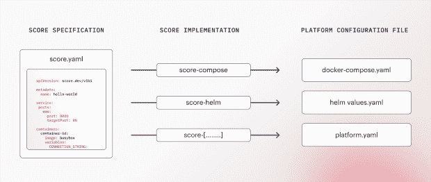

# 警告:配置漂移会让开发者痛苦地死去

> 原文：<https://thenewstack.io/warning-config-drift-causes-a-painful-death-for-developers/>

公元 2353 年。外星考古学家正在梳理古老的原木，以更好地了解人类文明崩溃前的日常生活。他们在所谓的开发团队成员中发现了一个令人惊讶的重复对话:

**会员甲:**“催我改代码。🎉"
**成员 B:** “嗯……我觉得有东西坏了。”
**会员甲:**“等等..但它在我的机器上有效？!"

资料来源:www.picturesso.com

几年前我第一次看到 Docker 的时候，感觉就像魔术一样。最后，我只需构建一个容器，就可以无忧无虑地将其推送到任何环境中。生活很美好。或者是吗？事实证明，要让容器从本地到开发并最终到生产，您需要一个复杂的多利益相关方流程，该流程依赖于手工制作的 YAMLs、有机脚本和公平交易、基于 git 的工作流。部署像 Kubernetes 这样的容器管理系统很快就从入门级发展到击败最终老板的复杂性。

为什么？主要是因为开发人员需要在不同的环境中处理不同的技术堆栈。如果您曾经从本地环境的``docker-compose.yaml`` 过渡到云环境的``chart.yaml`` ，您应该知道我在说什么。有人第一次就做对的可能性非常低。为什么每个开发者都应该是 Helm 或 Kustomize 的专家呢？他们的工作是编码和发布新功能，而不是成为配置向导。

那么实践中会发生什么呢？团队中最有经验的后端工程师(通常是非常有价值的资源)需要介入，帮助让新的或更新的服务在云环境中运行。经验不足的开发人员等待，高级工程师做“影子操作”，整体生产力和创新下降。

大多数开发团队的现实是分散的配置和缺乏标准化和透明性。没有默认的关注点分离，也没有以工作负载和开发人员为中心的部署方法。

我们已经在各种规模的工程组织中一遍又一遍地看到了这一点，这就是为什么我们决定创建并开放源代码 [Score](https://score.dev/) 。它是一个以开发人员为中心、平台无关的工作负载规范，消除了环境之间的配置不一致。

为什么得分？在音乐中，乐谱是告诉音乐家在他们的乐器上演奏哪个音符的音乐符号。它还能让指挥一目了然地知道管弦乐队中的每个音乐家应该演奏什么。它为每个人和谐地一起玩耍提供了基础。类似地，``score.yaml`` 规范使开发人员成为工作负载的指挥，该工作负载跨越了技术和工具的管弦乐队。

一个 YAML 来统治他们。

指定一次与环境无关的工作负载配置，然后随处部署。希望这是许多团队摆脱当前脚本丛林的一种方法。

您可能会说，“等等，我们已经用配置 YAML 来管理我们的部署了。”但是每个团队或组织有不同的规范也不是一个好主意。您可以根据自己的技术堆栈或个人团队的需求，通过无数种方式来配置这样的标准模板。所以每个公司都一次又一次地重新发明轮子，这对于开发者来说是非常令人沮丧的。每次跳槽，你都需要从头开始学习新的约定。我们需要共享和可重复使用的东西。

这就是为什么我们认为是时候制定一个可以在任何平台上工作的以开发人员为中心的工作负载规范了。随着 Score 获得关注，它有可能一劳永逸地为所有开发团队设定一个有用的标准。需要说明的是，这还远远没有完成。我们在这里与你分享的是一个想法，一个 alpha 实现和一个邀请来促成这一切的邀请。

## 核心原则

我们观察到的是，开发人员很难管理本地和远程环境设置之间的差异。如果不同平台之间的实体配置不同，工作负载配置漂移的风险就会增加。

例如:依赖于数据库的工作负载可能指向较低环境中的 Postgres 映像或模拟服务器。然而，在生产过程中，数据库必须通过 Terraform 进行供应和分配。环境之间的这种“转换间隙”存在于所有类型的项目中—卷、外部服务(保险存储或 RabbitMQ)、端口、DNS 记录或路由等。

我们认为开发人员不应该与工具斗争，并提倡以工作负载为中心的开发方法。

您真正想要的是确保平台满足工作负载需求，而不是相反。部署工作负载的平台负责满足开发人员指定的运行时需求。它以工作负载和开发人员为中心。

这意味着:

*   **工作负载配置的真实来源:**Score 独立于工作负载运行的平台和环境，是理解工作负载运行时需求的主要参考。工程师不再需要相互比较平台文件。
*   **严格控制工作负载规格:** Score 保护开发人员免受容器编排工具配置复杂性的影响。
*   **依赖关系管理的声明式方法** **:** 开发人员声明他们的工作负载需要运行什么，包括基础架构依赖关系，而不必担心由谁、何时以及如何在目标环境中提供资源。

基于这些原则，我们开发了平台 gnostic 工作负载规范的思想。它是一个简单的声明性文件，易于理解并捕获工作负载需要运行的内容。

## Score 是如何工作的？

分数依赖于三个相互配合的关键部分:

*   **评分规范**是一个以开发人员为中心的工作负载定义，它让工程师描述工作负载需要独立于环境运行什么。`score.yaml`文件是工作负载需求和依赖关系的唯一真实来源。它可以与任何容器编排平台或工具一起部署。
*   **评分实施 CLI** 是一个 CLI 工具，可以对其执行**评分规范**。它依赖于特定类型的平台，如 Docker Compose([score-Compose](https://github.com/score-spec/score-compose))或 Helm ( [score-helm](https://github.com/score-spec/score-helm) )。CLI 将根据分数规范生成特定于平台的配置文件(如`docker-compose.yaml`、`chart.yaml`)。
*   **特定于平台的配置文件**是将`score.yaml`与实现 CLI 相结合的结果。例如，针对[乐谱编写](https://github.com/score-spec/score-compose)运行乐谱规范将导致生成特定于平台的配置文件`docker-compose.yaml`。该文件可以与特定于环境的参数结合使用，以便在目标环境中运行工作负载。

有了 Score，相同的工作负载可以在完全不同的堆栈上运行，工程师不必担心实现细节或需要掌握所有必需的配置文件。相同的 Score 规范可用于为本地开发生成一个`docker-compose`文件，Kubernetes manifests 用于部署到共享开发环境或无服务器平台，如 Google Cloud Run。

## 加入我们，让分数成为新的标准

如前所述，我们来早了。在[评分规范](https://docs.score.dev/docs/reference/score-spec-reference/)和特别是 CLI 实现方面还有很多工作要做。到目前为止，我们已经发布了[配乐](https://github.com/score-spec/score-compose) (Docker Compose)和[配乐头盔](https://github.com/score-spec/score-helm) (Helm)，等等。

如果你想要一个对开发者来说认知负荷更低、配置漂移或管理不善更少的世界，坦率地说，我们所有人都更有效率、更快乐的日子，[查看 repo](https://github.com/score-spec/spec) ，contribute，reach out。这只是开始。我很乐意一起建设发展的未来。

<svg xmlns:xlink="http://www.w3.org/1999/xlink" viewBox="0 0 68 31" version="1.1"><title>Group</title> <desc>Created with Sketch.</desc></svg>