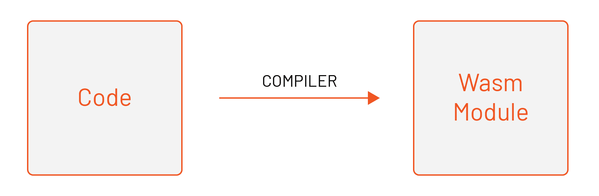
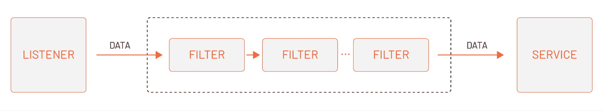
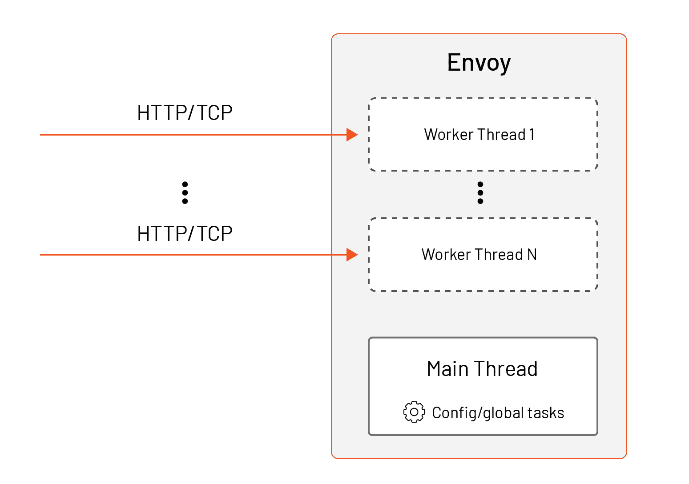
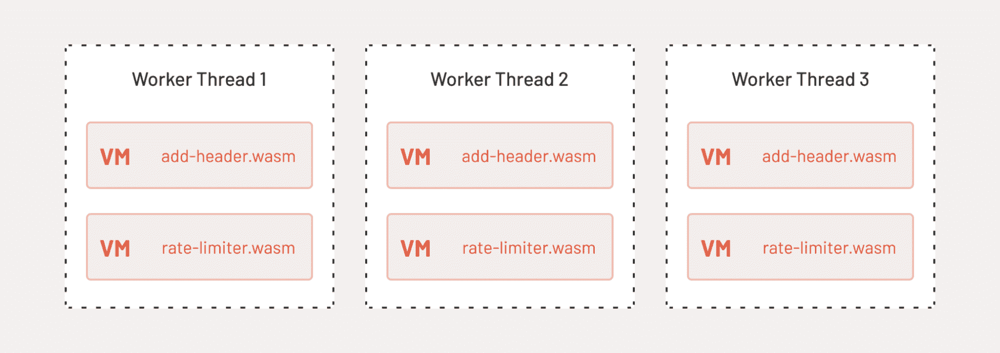
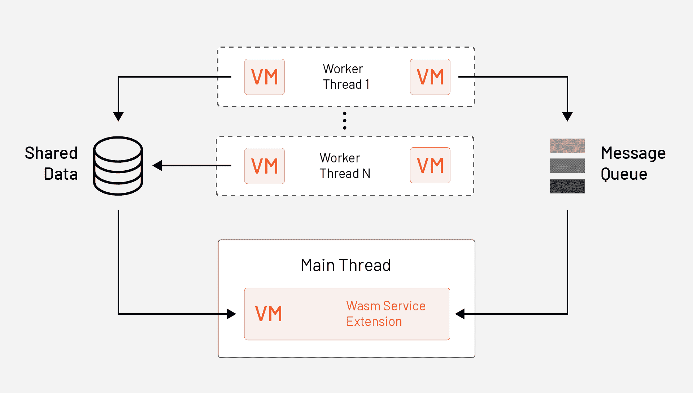
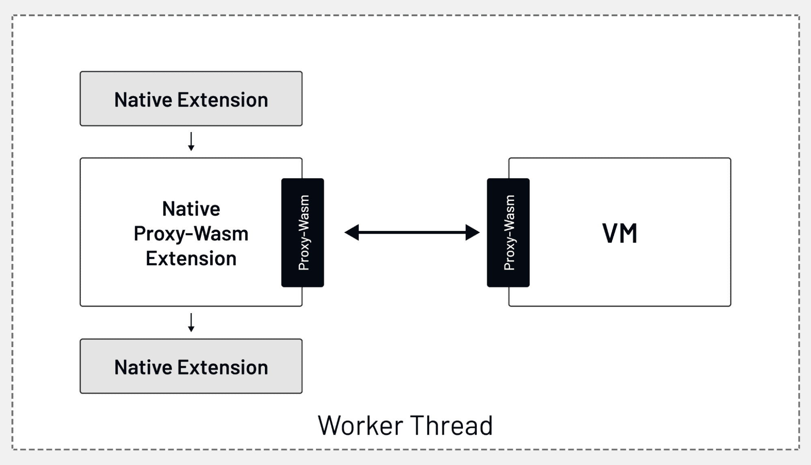

# Wasm 模块和 Envoy 可扩展性解释，第 1 部分

> 原文：<https://thenewstack.io/wasm-modules-and-envoy-extensibility-explained-part-1/>

[Peter Jausovec](https://www.linkedin.com/in/pjausovec/)

[Peter 是 Tetrate 的软件工程师和内容创建者，擅长分布式系统和云原生解决方案。他是关于 cloud native、Kubernetes 和 Istio 的书籍和博客的作者，也是 Istio Fundamentals 的创始人，这是 Tetrate Academy 提供的关于 Istio 的免费入门课程。](https://www.linkedin.com/in/pjausovec/)

如果你想知道什么是 WebAssembly (Wasm ),以及它是如何融入服务网格生态系统的，这就是你想要阅读的文章。

我们将解释 Wasm 能做什么，并通过谈论一点关于 Envoy Proxy 的可扩展性来做准备。Envoy 是一个服务(sidecar)和边缘代理(网关)，可以通过 API 进行配置。接下来我们将讨论 Wasm 如何适应 Envoy，包括 Wasm 服务和代理 Wasm。

本文是为 Wasm 初学者编写的，我们假设您没有任何深入的 Wasm 知识。在一篇配套文章中，我们将使用 Kubernetes 和 Istio 探索 Wasm，这样您就可以轻松地使用这两种工具。您可以查看 [Istio 基础课程](https://academy.tetrate.io/courses/istio-fundamentals)，了解如何开始学习 Istio。

## **什么是 WebAssembly (Wasm)？**

WebAssembly，通常称为 Wasm，是一种依赖于开放标准的可执行代码的可移植二进制格式。开发人员用他们喜欢的语言编码，并编译成 Wasm 模块。虽然为 Wasm 编写有实现细节，但使用熟悉的源语言有助于开发人员快速入门。

Wasm 模块与主机环境隔离，并在一个称为虚拟机(VM)的内存安全沙箱中执行。这些模块可以通过 API 与主机环境通信。

Wasm 的主要目标是在网页上实现高性能的应用程序。例如，假设您正在用 JavaScript 构建一个 web 应用程序。你可以用 Go 或者其他语言写一些代码，然后编译成二进制文件(Wasm 模块)。然后，您可以在与 JavaScript web 应用程序相同的沙箱中运行编译后的 Wasm 模块。

最初，Wasm 被设计为在 web 浏览器中运行。但是，您可以将虚拟机嵌入到其他主机应用程序中并执行它们。这正是[特使](https://envoyproxy.io)所做的。

## **特使兼扩展性**

在我们在 Envoy 的上下文中讨论 Wasm 之前，让我们先介绍几种扩展 Envoy 的方法。Envoy 代理的核心是各种过滤器，提供网络路由、可观察性和安全性等功能。

通过不同过滤器(网络、HTTP 过滤器)的组合，您可以增加传入的请求。您可以翻译协议、收集统计数据、添加/删除/更新报头、执行身份验证等等。

有各种各样的[预建过滤器](https://www.envoyproxy.io/docs/envoy/latest/configuration/http/http_filters/http_filters)可供您使用(例如，允许您为服务配置速率限制的 envoy.filters.http.ratelimit 过滤器，或者 CSRF 过滤器、CORS 过滤器等等)。在考虑扩展 Envoy 之前，您应该检查它所支持的最新版本。但是，您也可以编写自己的过滤器并扩展 Envoy 功能。

让我们举一个例子，向请求添加一个额外的头来介绍 Envoy 的可扩展性选项。

### **原生 C++过滤器**

一种方法是用 Envoy 的本地语言 C++编写过滤器，并与 Envoy 打包在一起。这需要您重新编译 Envoy 并维护您自己的版本。要添加一个头，你必须用 C++写一个新的过滤器，然后用 Envoy 二进制链接它。[这里有一个例子](https://github.com/envoyproxy/envoy-filter-example/tree/main/http-filter-example)，演示了如何创建一个添加 HTTP 头的新过滤器。出于多种原因，走这条路不太实际。你不应该仅仅因为你使用的过滤器而维护你自己的特使版本。

### **基于 Lua 的过滤器**

第二种方法是使用 [Lua](https://lua.org) 脚本编写过滤器。一个名为 [HTTP Lua filter](https://www.envoyproxy.io/docs/envoy/latest/configuration/http/http_filters/lua_filter) 的现有过滤器允许您在配置中包含一个 Lua 脚本。下面是一个配置好的 Lua HTTP 过滤器的例子，它向响应添加了一个新的头:

如果您创建的过滤器不太复杂，您可以使用这种方法。您可以直接在 YAML 配置中编写 Lua 脚本，或者指向一个脚本文件。这种方法的一个缺点是，要么您的脚本是配置的一部分，要么您必须找出一种方法来复制脚本文件，并使其可被 Envoy 代理访问。这两种选择都使得开发和测试变得困难。如果你的过滤器更复杂，你最好选择其他选项。

### **基于小波变换的滤波器**

另一种方法是编写一个特使过滤器作为一个单独的 Wasm 模块，并让特使在运行时动态加载它。

此时，您可以配置 EnvoyFilter 资源，通过指向一个本地。wasm 文件，可由特使代理访问。第二种选择是使用远程抓取并提供一个 URI。在这种情况下，Envoy 下载。你的 wasm 分机。那些使用 Istio 的人可以期待 1.11 版本中的原生 Wasm 支持。一旦可用，sidecars 就可以使用发布到 OCI 兼容注册表的 Wasm 模块，例如通过“getenvoy 扩展推送”

概括地说，使用 Wasm 允许您使用不同的编程语言来编写过滤器。(不用写原生 C++过滤器！)而且不需要你重新编译维护自己的特使专用版。如果我们继续头的例子，我们可以在 Go 中编写扩展，并在代码中为响应添加一个额外的头。

## **Wasm in 特使**

Envoy 嵌入了 V8 虚拟机(VM)的子集。V8 是用 C++编写的高性能 JavaScript 和 WebAssembly 引擎，用于 Chrome 和 Node.js，以及其他应用程序和平台。

Envoy 使用[多线程模型](https://blog.envoyproxy.io/envoy-threading-model-a8d44b922310)运行。这意味着有一个主线程负责处理配置更新和执行全局任务。

除了主线程之外，还有工作线程负责代理各个 HTTP 请求和 TCP 连接。工作线程被设计为相互独立。例如，处理一个 HTTP 请求的工作线程不会影响处理其他请求的其他工作线程，也不受其影响。

为了避免在更高的内存使用率方面任何昂贵的跨线程同步，每个线程都拥有自己的资源副本，其中也包括 Wasm 虚拟机。

Proxy-Wasm 扩展作为 Wasm 模块分发。这意味着带有。wasm 扩展。在运行时，Envoy 加载每个唯一的 Wasm 模块(all *。wasm 文件)转换成唯一的 Wasm VM。由于 Wasm VM 不是线程安全的(即多个线程必须同步对单个 Wasm VM 的访问)，Envoy 为将在其上执行扩展的每个线程创建 Wasm VM 的单独副本。因此，每个线程可能同时使用多个 Wasm 虚拟机。

让我们看一个例子，看看两个扩展是如何加载到工作线程中的。一个示例扩展是添加自定义标头的 add-header.wasm，第二个是我们创建的自定义速率限制器，名为 rate-limiter.wasm *。*

【T2

### Wasm 服务

Wasm 扩展可以是 HTTP 过滤器、网络过滤器、访问记录器或一种称为 WasmService 的专用扩展类型。它们在 Wasm VM 中的一个工作线程上执行。正如我们提到的，线程是独立的，它们天生不知道在其他线程上发生的请求处理。他们也是无国籍的。

然而，Envoy 也支持有状态场景。例如，您可以编写一个扩展来聚集统计信息，比如跨多个请求的请求数据、日志或度量，这实际上意味着跨多个工作线程。对于这个场景，您可以使用 [WasmService](https://www.envoyproxy.io/docs/envoy/latest/api-v3/extensions/wasm/v3/wasm.proto#extensions-wasm-v3-wasmservice) 扩展和一个 API 进行跨线程通信(例如，消息队列和共享数据)。

与 HTTP 过滤器、网络过滤器或访问记录器不同，WasmService 扩展不作为请求处理流程的一部分被调用。相反，它们在主线程而不是工作线程上执行。因为它们是在主线程上执行的，所以这些扩展不会影响请求延迟。

WasmService 扩展的一个示例场景是使用消息队列 API 订阅队列，并从工作线程接收 HTTP 过滤器、网络过滤器或访问记录器发送的消息。WasmService 扩展然后可以聚合从工作线程接收的数据。

WASMService 扩展并不是持久化数据的唯一方式。您还可以调用 HTTP 或 gRPC APIs。此外，您可以使用 timer API 执行请求之外的操作(参见这里的示例)。

### **Proxy-Wasm**

所有这些 API 都是由一个名为 [Proxy-Wasm](https://github.com/proxy-wasm) 的组件定义的，这是一个与代理无关的应用二进制接口(ABI)标准，它指定了代理(主机)和 Wasm 模块如何交互。这些交互以函数和回调的形式实现。

Proxy-Wasm 中的 API 是代理不可知的，这意味着它们与 Envoy 代理以及任何其他实现 Proxy-Wasm 标准的代理( [MOSN](https://github.com/mosn/mosn) )一起工作。这使得 Wasm 过滤器可以在不同的代理之间移植；他们不仅仅局限于特使。

当请求进入 Envoy 时，它们被内置的过滤器处理。数据流经本地或 Lua 过滤器，并最终通过 Proxy-Wasm 扩展，如下图所示。一旦过滤器处理了数据，这个链将继续或停止，这取决于过滤器的结果。

## **结论**

本文向您介绍了 Wasm 模块的世界。我们首先解释了 Wasm 是什么以及它最初的目的是什么。然后我们讨论了不同的 Envoy 扩展点:原生 C++过滤器、基于 Lua 的过滤器，当然还有基于 Wasm 的过滤器。

在下一篇文章中，我们将学习如何使用 GetEnvoy CLI 开始并快速搭建 Wasm 模块。我们将深入到生成的代码中来解释生命周期方法，以及 Wasm 过滤器启动并处理请求时它们的执行顺序。最后，我们将向您展示如何使用 EnvoyFilter 资源来配置 Wasm 模块，并将其部署到运行 Istio 的 Kubernetes 集群。

**阅读更多**

**技术资源:**

<svg xmlns:xlink="http://www.w3.org/1999/xlink" viewBox="0 0 68 31" version="1.1"><title>Group</title> <desc>Created with Sketch.</desc></svg>