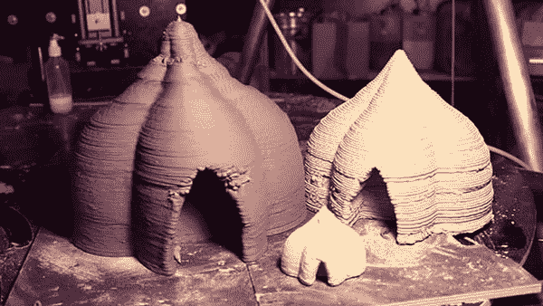
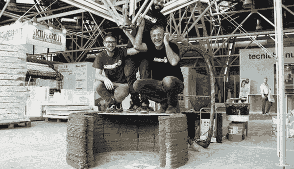
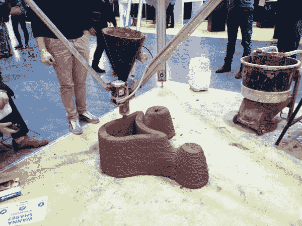

# WASP: 3D 打印经济适用房走出泥沼

> 原文：<https://thenewstack.io/wasp-3d-printing-affordable-mud-housing-for-the-developing-world/>

从最先进的 3D 打印机中射出泥浆来建造可居住的建筑，这似乎是一个终极悖论，但这是这家卓越公司背后的前提，它完全通过出售其商业打印机来资助这些早期实验。

发展中国家的经济适用房问题能用泥巴和机器解决吗？这个不太可能的解决方案是由世界先进储蓄项目( [WASP](http://www.wasproject.it/w/en/) )提出的，这是一家意大利公司，专注于[制造 3D 打印机](http://www.personalfab.it/en/)，专门生产陶瓷和瓷器。但对于 WASP 来说，这不仅仅是出售尖端机器:他们相信使用开源技术来创建可持续发展的解决方案，并使用人类已知的最古老的材料之一[:泥浆](https://en.wikipedia.org/wiki/Mudbrick#Ancient_world)。

## 为什么泥屋在几千年后仍有意义

WASP 进军由超本地材料制成的低成本房屋始于首席执行官马西莫·莫雷蒂(Massimo Moretti)看到一只 [potter wasp](https://en.wikipedia.org/wiki/Potter_wasp) 逐渐用泥土筑巢，意识到人类也可以做同样的事情，产生了灵感。

但是在这个高科技住宅的时代，我们为什么要用泥土建造房屋呢？尽管出现了智能家居和物联网，但这些对富人来说是奢侈品，对大多数人来说是不必要的，对他们来说住所仍然是基本的东西。此外，不管在哪里，全球房地产行业都尚未摆脱其资源密集型、低效率、浪费做法、昂贵的材料运输和高劳动力成本的名声。这些事实在发展中国家更加明显，在那里，许多普通人可能会用手头的任何材料建造临时建筑，如果他们买不起传统住房的话。

相比之下，土壤是一种丰富的免费材料，几乎随处可见，几千年来人类一直用它来建造令人难以置信的建筑。如果解决住房问题的一部分意味着用当地找到的材料建造房屋，那么没有比在潜在住宅现场找到的土壤更“当地”的了。

## 3D 打印如何让泥塑变得更容易

但是用泥土建造既费时又费力。有各种各样的方法，取决于最终产品是什么([土砖](https://en.wikipedia.org/wiki/Mudbrick)、[玉米棒](https://en.wikipedia.org/wiki/Cob_(material))、[土坯](https://en.wikipedia.org/wiki/Adobe)或[夯土](https://en.wikipedia.org/wiki/Rammed_earth))，每种方法都需要挖掘、筛选、混合、成型、养护数周等等。但 WASP 的 3D 泥浆打印机 BigDelta 将有助于减少生产时间和劳动力成本，从而在任何需要的地方建造具有成本效益的泥浆房屋。

到目前为止，该公司已经开发了一个 4 米(13 英尺)高的原型，最终将成为一个大型的便携式 12 米(39 英尺)高的 3D 打印机，能够用泥土打印全尺寸的房子。正如 Moretti 解释的那样，WASP 对泥浆的关注来自于有意识地避开水泥:

> 3D 打印是一种提供多种优势的技术。用传统水泥等旧的污染材料来实现它可能会导致指数级的退化:几十栋房子可能会在一天内建成，3D 打印的潜力可能会被用于投机目的。我们需要密切关注我们想要推进的研究类型。

在去年年底来自罗马 Maker Faire 的视频中，Moretti 展示了早期版本的 BigDelta(挤出机设计后来有所改变):

[https://www.youtube.com/embed/aQWSRpacNzY?feature=oembed](https://www.youtube.com/embed/aQWSRpacNzY?feature=oembed)

视频

该公司目前为其 BigDelta 机器使用开源的 Cura 软件和 [Marlin](https://github.com/MarlinFirmware/Marlin) 固件，现在还改进了旧的蠕动泵挤出机的设计，采用了基于“耳蜗概念”的[新型、更精确的挤出机，该挤出机具有旋转喷嘴](http://www.wasproject.it/w/en/new-extruder-wasp-can-truly-realize-house-dream/)此前，该团队开发全尺寸 12 米打印机的最大障碍是挤出机，通过管道向其输送预混合材料需要大量工作，并消耗大量能源。最后，他们回到了最初对 potter wasp 的观察，它在建造时为自己提供泥浆，因此将这种自然节能的过程仿生到他们的新挤出机设计中，现在可以提供连续供应，就像一个“受控操作水泥搅拌机”现在，使用这种新型自清洁、低能耗挤出机，组装和拆卸变得更加容易，并且它具有在所有速度水平下持续控制的优势，加上打印时材料的内聚混合。请看下面新推出的挤出机:

[https://www.youtube.com/embed/4fqDCXEMFPI?feature=oembed](https://www.youtube.com/embed/4fqDCXEMFPI?feature=oembed)

视频

## 用于加固的种子和杂草

除了开发他们认为是创新和革命性的新挤出机，该团队还在试验将杂草种子结合到他们的泥土基质中，以减少潜在的收缩，同时提供额外的结构稳定性。这个想法是让种子从泥土材料中吸收水分，然后，它们最终的根生长将是加强泥土结构的一种方式，本质上是“从内部武装房子”这是一个耐人寻味的想法，符合自然的趋势。到目前为止，该团队主要关注入侵物种，如百慕大草，但具体的种子将根据当地气候选择。

这一创新项目可能是使泥浆材料更易获得、建造更省时的答案。当然，这将需要 3D 打印专家、建筑师、规划师、科学家和地方政府之间更多的跨学科研究、合作和创新，但动力和需求肯定是存在的。在日益城市化的世界人口中，许多人生活在不安全的、非正式的棚户区中，利用自然材料和开源技术大规模创造真正可持续的栖息地的潜力是诱人的。在 [WASP](http://www.wasproject.it/w/en/) 了解更多信息。

<svg xmlns:xlink="http://www.w3.org/1999/xlink" viewBox="0 0 68 31" version="1.1"><title>Group</title> <desc>Created with Sketch.</desc></svg>