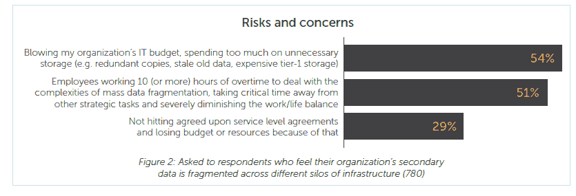
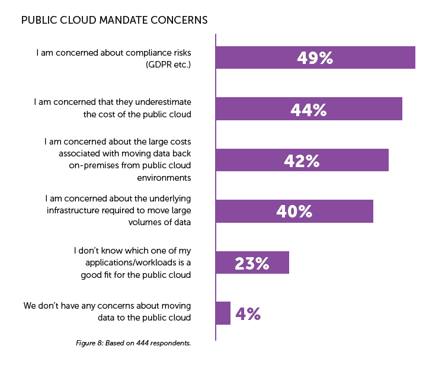
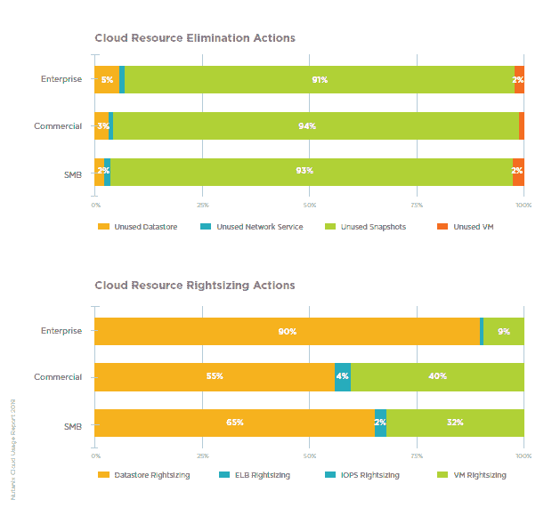
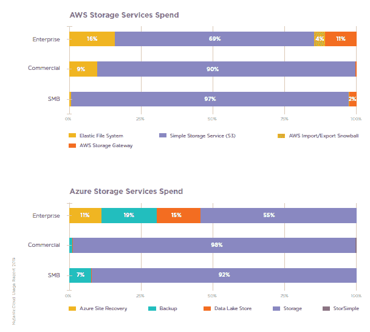
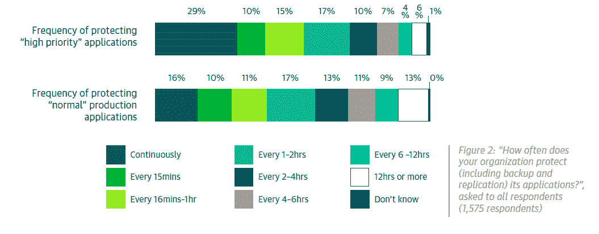

# 在公共云存储上浪费金钱

> 原文：<https://thenewstack.io/wasting-money-on-public-cloud-storage/>

去年年底，一项 [Cohesity](https://www.cohesity.com/) 调查[发现](/is-data-fragmentation-holding-your-project-back/)47%的 IT 主管担心在不必要的存储上浪费组织的 IT 预算。本周，该供应商的第二次 900 名受访者调查[云中的海量数据碎片](https://info.cohesity.com/Mass-Data-Fragmentation-in-the-Cloud-Global-Market-Study.html)表明，移动大量数据的成本是一个重大问题。仅看一下尚未完成迁移到公共云的任务的组织，42%的 IT 高管担心庞大的成本，担心与内部到公共云数据迁移相关的费用。

数据迁移、合理调整存储规模和消除冗余是关于节省公共云存储成本的讨论焦点。

近年来，由于多云变得越来越普遍以及数据的严重性，人们对迁移的担忧日益加剧。[数据重力](https://www.techrepublic.com/article/how-data-gravity-both-hurts-and-helps-cloud-adoption/)描述了数据存储在其创建位置的趋势，然后应用程序在附近的环境中运行以获得更好的延迟和吞吐量。如果不考虑安全性要求和成本，最好将数据存储在运行数据的同一个公共云中。然而，从企业数据中心迁移数据的成本非常高。正如 [Datamation](https://www.datamation.com/cloud-computing/top-8-cloud-migration-tools.html#ComparisonTable) 所指出的，云公司提供免费的数据迁移，但对于采用多云方法的公司来说，这可能不是最佳选择，因为这种方法不涉及大规模一次性迁移到新的云环境。

来源:“ [Cohesity 的二手数据市场研究](https://info.cohesity.com/Cohesity-Secondary-Data-Market-Study.html)”87%接受调查的 IT 高管表示，他们组织的二级数据支离破碎。这个群体担心在存储上花费太多。

除了迁移之外，作为应用程序日常操作的一部分，数据也经常被移动。利用存储在另一个云中(私有或公共)的数据的公共云应用程序面临基于带宽或传输数据量的收费。

来源:“Cohesity 的海量数据在云端碎片化。”此图表显示了 IT 团队对某个组织中 50%受访者的担忧，在该组织中，一名高级管理人员未完成向公共云迁移的授权。请注意，该问题并未询问安全性以及其他常见的公共云问题。

新的 Cohesity 研究还发现，受访者:1)平均保留在公共云环境中创建的相同数据的三个副本，2)平均利用三个独立的供应商解决方案或单点产品来管理所有公共云中的“辅助”存储和数据。辅助存储通常是非任务关键型静态辅助数据，存储在备份、归档、文件共享、对象存储、测试和开发系统、分析、数据集、私有云和公共云中。最佳实践表明，由于不需要经常访问，辅助数据应该存储在便宜的硬件上。存储生命周期管理系统根据年龄和重要性标记数据，然后软件决定数据应该存储在哪里，或者在必要时删除。这种方法也是大多数公司处理 GDPR 个人数据要求的方式。如果没有存储生命周期管理，个人最终会选择不同的使用情形应该使用什么类型的存储。

对公共云超支的担忧非常严重，许多[组织都在努力寻找](/control-cloud-costs-with-organizational-alignment-not-just-software/)最佳的成本优化方法。即使选择了最具成本效益的执行地点和计算类型，移动和存储数据的价格也让 IT 高管夜不能寐。供应商的解决方案是否提供了一种获得良好睡眠的简单方法还有待确定。

## 减少备份数量

虽然存储二级数据很便宜，但如果不丢弃旧备份，成本就会增加。Nutanix 和 Veeam Software 合作提供[软件](https://www.nutanix.com/press-releases/2019/nutanix-mine-with-veeam-simplifies-secondary-storage.html)，帮助公司减少所需的快照和其他备份的数量。为了帮助解释他们产品的需求，Nutanix 发布了 2019 年[云使用报告](https://www.nutanix.com/go/cloud-usage-report-2019)，Veeam 发布了 2019 年[云数据管理报告](https://go.veeam.com/cloud-data-management-report-2019)。从整体上看，这些研究为关于如何以及何时创建备份的决策提供了背景。

来源:《Nutanix 的 2019 年云使用报告》

Nutanix 报告提供了有关其 Xi Beam 客户的云使用情况的详细数据。我们认为这些数据不应该用来得出任何宽泛的结论，因为它只代表了 Nutanix 的 13，000 多名客户中的一小部分。也就是说，它说明了公司如何优化云资源的使用。下图显示了采取了多少措施来消除冗余资源，其中超过 92%是删除未使用的快照。这并不意味着减少快照存储节省了最多的资金，而是仅仅记录了云环境中观察到的事件。它还显示，年收入低于 10 亿美元的公司通常会采取措施来调整虚拟机的规模。这些操作是否自动化将对这些数据的相关性产生重大影响。

来源:《Nutanix 的云使用报告 2019》。定义不同类型的存储服务可能很困难，因此很难对 Azure 和 AWS 的客户消费模式进行准确的比较。

来源:Veeam《2019 云数据管理报告》。54%的“高优先级”应用程序至少每小时备份或复制一次，而“普通”应用程序通常有 37%的时间受到保护。

读者可能也会对有效云迁移的最佳实践感兴趣，该实践于今年早些时候发表在我们的网站上。

通过 Pixabay 的特征图像。

<svg xmlns:xlink="http://www.w3.org/1999/xlink" viewBox="0 0 68 31" version="1.1"><title>Group</title> <desc>Created with Sketch.</desc></svg>