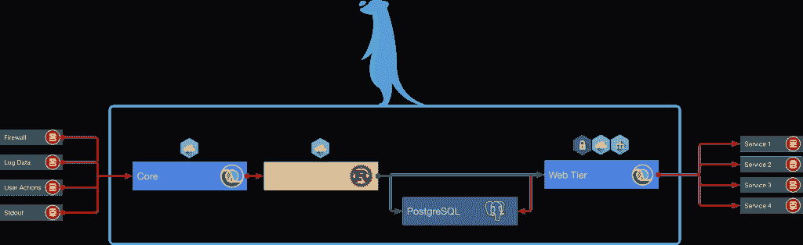
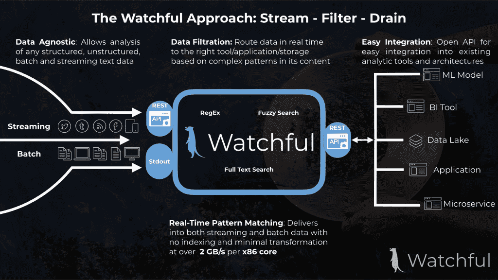

# Watchful.io 带来实时模式匹配

> 原文：<https://thenewstack.io/watchful-io-brings-real-time-pattern-matching/>

鉴于最近发生的大量数据泄露事件，尤其是在 Experian 和脸书发生的事件——尽管有些人对 T2 是否应该将脸书的事件称为泄露事件表示怀疑——了解你的数据在网上被用于何处变得至关重要。

这就是旧金山初创公司[的起源，这是一个大规模实时模式匹配的分布式平台。](https://watchful.io/)

联合创始人 Shayan Mohanty 表示，这个想法源于他自己的偏执——想知道他的任何信息何时被泄露到互联网上——他将这个想法变成了一个名为 [pasteye](https://github.com/shayanjm/pasteye) 的开源项目。

“你怎样才能快速获取数据，快速扫描模式？为你自己做这件事是相当琐碎的，你只需要按照你想要的那样建立你的模式，把它们保存在一个列表中，每次你得到新的内容时就运行它们，”他解释道。

“但是将它作为服务开放，存在一些重大的技术挑战。第一:你如何做实时正则表达式？如果你有一百万用户，每个用户有 10 到 20 个正则表达式，你如何保证每个人都能实时得到结果？”

正则表达式是可能指示例如电子邮件地址、比特币 ID、社会安全号或信用卡号的模式。但他指出，它不一定只是文本。它可以用于二元分析。你可以用 0 和 1 编译一个可执行文件。它看起来像我们所知的另一种病毒吗？

“如果作为一个组织，您有大量这样的正则表达式，或者如果您刚刚收到一个庞大、密集的数据流，但您不一定知道其中的所有内容，那么您需要标记某些内容，例如可能具有潜在恶意的@company.com。一张公司信用卡或者一把刚刚发行的钥匙。所有这些都是潜在违规的迹象，应该实时标记出来，”他说。

但它的用途不仅限于安全。例如，在生物信息学中，DNA 序列只是简单的文本— [G，C，A 和 T](https://en.wikipedia.org/wiki/GC-content) 。无论如何，在更大的基因组中寻找基因表达只是简单的文本扫描。

“因此，我们看到了拥有一种可扩展技术的许多好处，它将允许你在一个真正完善的环境中使用这些类型的工具，”他说。

【T2

**HPC 级别的性能**

警戒技术是 Clojure 和 Rust 内置的。该引擎内置在 Rust 中，它提供了对应用程序行为方式的控制，例如 CPU 如何工作和上下文切换。

其他一切都是在 Clojure 中构建的。由于构建在 JVM 上，这意味着几乎任何 Java 库都可以开箱即用。

主要的持久层是 Kafka 和 PostgreSQL，用作用户、过滤器和匹配的最终真实来源。它使用一种称为“更改-数据-捕获”的技术，通过将[预写日志](https://www.postgresql.org/docs/9.0/static/wal-intro.html)从 Postgres 复制到 Kafka 来保持引擎与最新的过滤器保持同步。用 Clojure 编写的“web”组件维护一个匹配的直写缓存，并为监视 API 和前端服务，而“core”组件基本上充当一个管道工——标记传输中的数据，记录时间戳，并最终将行写入 Postgres。

“因此，通过这种方式，我们可以使用最新和最棒的 Kafka 连接器库，总是可以使用最新的 API，但我们也有一个很好的开发环境，这是手头上高度优化的任务，”Mohanty 说。

此外，它还附带了“wrelay”，这是一种用 Rust 编写的类似 Netcat 的二进制文件，允许用户在不使用 RESTful API 的情况下将数据发送到一个警惕的集群中。

“例如，如果你想在不需要写代码的情况下通过 watchmark 传输文件内容，这是非常好的，”他说。

它与用于编排的 Kubernetes 打包在一起，并作为一个 tarball 交付给客户，因此通过一个单命令安装，您可以实现任意大的集群加速。

Mohanty 说，该公司的主要竞争对手是硬件供应商。在商用 x86 平台上，Watchful 能够搜索和扫描具有 FPGA(现场可编程门阵列)或 [GPGU](http://www.nvidia.com/object/what-is-gpu-computing.html) (通用图形处理单元)性能的应用程序，每个内核的吞吐量超过 2gb。它适用于结构化或非结构化数据。

“我们能够提供的吞吐量和性能通常属于高性能计算领域，”联合创始人[约翰·辛格尔顿](https://www.linkedin.com/in/john-singleton-28529430/)说，他补充说，该公司降低了准入门槛，针对非常大的数据集和模式负载提供高性能、大规模可扩展的匹配吞吐量，同时保持线性计算模型和实时结果。

警惕的开放 API 意味着它可以集成到任何语言的现有环境中。它可以作为云服务部署在混合环境甚至空中网络中。

## 较小的数据流

Mohanty 说，虽然目前还不能说出客户的名字，但一家拥有多个网络资产的大型控股公司正在使用 falliant 进行实时建模。它使用生产快速数据流上的标签来预测用户在不同表面上的行为。它为某些“里程碑”动作创建标志，然后记录所有与正则表达式匹配和不匹配的内容，并用于训练模型。

Mohanty 说，该公司的“灌篮”用例是 SIEM(安全信息和事件管理)预过滤。大公司通常会以高昂的成本将几乎所有数据集中到 SIEM 中。

“如果我们可以实时过滤掉所有低级别事件，或者专门突出显示高级别事件，而其他所有事件都被冷藏起来，那会怎么样？”他问。

其他使用案例包括日志分析、开源智能过滤和公共可用信息警报以及实时无索引搜索。

“我们正试图推广一种新的范式，称为“流-过滤-排放”(与“提取-转换-加载”相对)，其中数据被视为大型异构流，并通过过滤器来创建更小、更稀疏的数据流，”Mohanty 解释说。

然后，这些较小的数据流可以被“排出”到数据库、数据湖、微服务和 SIEMs 中。每个应用程序只消耗它所关心的流中的特定事件，而不需要陷入试图从噪声中辨别信号的困境。

“在这种模式下，我们希望任何‘行动’都在用户控制的排水端进行，但在未来，我们希望提供一些其他流程，如窗口功能/事件聚合，这将更容易实现复杂的分析，”他说。

“我们看到 SFD 范式在许多垂直行业变得相当重要，在这些行业中，异构数据格式会导致复杂的管理解决方案。这在工业物联网等细分市场中显而易见，在这些细分市场中，可能有许多不同类型的设备不断与一些应用程序进行通信，但具有不同的数据模式。”

专题图片:[比尔·史密斯](https://www.flickr.com/photos/byzantiumbooks/)的《[警惕](https://www.flickr.com/photos/byzantiumbooks/15432367223/in/photolist-pvGV7X-5mfAbZ-7tnhtK-87irBU-hg7tsZ-ceG8Ww-VTFQmc-9tVKpW-dYEiTp-JRxbPT-VVdok7-iDtuG-5AGb3i-Xjkh5J-EYCLCT-mjbVQx-23shib9-7uSSnK-pgu9hJ-EE6Vdq-rh3Vrt-34Sh4y-Da2C1H-9yz7Eb-6MrMVR-7J5EyU-7eCxVv-mN4JnY-8isZQ-D4cBA1-dQtLFP-VBjwYo-adf8z7-mUQoFh-7GeSvW-5T32Cy-4Y2AFz-4J2bVb-pKaZtV-nj69bg-cbKR25-UXGw5Z-7NZ1uG-mDWQWk-qL2jxR-ZbF2Qb-7pNkm8-nP4qkq-7Nkuk1-6NC1o4)，授权 [CC BY-SA 2.0。](https://creativecommons.org/licenses/by/2.0/)

<svg xmlns:xlink="http://www.w3.org/1999/xlink" viewBox="0 0 68 31" version="1.1"><title>Group</title> <desc>Created with Sketch.</desc></svg>