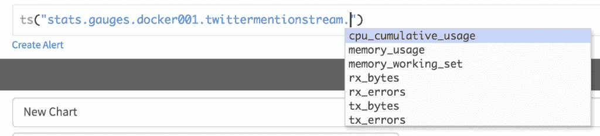
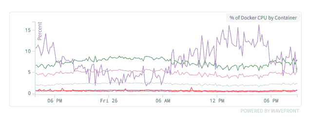
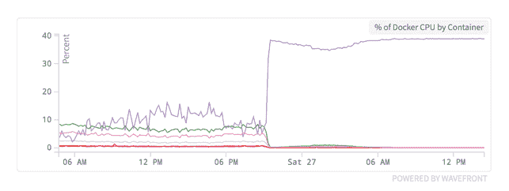
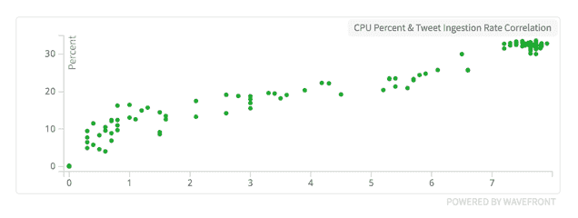

# 如何使用 cAdvisor 和 Wavefront 监控集装箱

> 原文：<https://thenewstack.io/wavefront-monitors-containers/>

[](http://www.wavefront.com)

 [埃文·皮斯

埃文·皮斯是一名专注于实时分析、微服务架构和大数据的工程师。他过去的工作重点是搜索、日志分析和电子商务。他毕业于锡拉丘兹大学，自 2008 年以来一直住在南加州。Evan 在 Wavefront 工作，是一名现场工程师，帮助公司为其系统提供运营和商业智能工具。](http://www.wavefront.com) [](http://www.wavefront.com)

据报道，仅去年一年，Docker 的采用量就翻了一番，因此对集装箱监控的需求越来越迫切也就不足为奇了。虽然容器有许多好处，可以帮助简化许多任务，但它们也引入了额外的粒度和相互依赖层。这就是为什么对运行中的容器有可见性是很重要的。

令人惊讶的是，直到最近，还没有直接的方法来监控 Docker 容器的资源度量。

[](https://github.com/google/cadvisor)

Docker 1.5 中引入的 [Docker Stats API](https://blog.docker.com/2015/02/docker-1-5-ipv6-support-read-only-containers-stats-named-dockerfiles-and-more/) 引入了从容器中传输资源指标的能力，例如 CPU 和内存使用情况。此外，还有许多其他解决容器监控的开源项目，包括 Google 的 cAdvisor 项目。工具 cAdvisor 是“一个正在运行的守护进程，它收集、聚集、处理和导出关于正在运行的容器的信息。具体来说，对于每个容器，它保存资源隔离参数、历史资源使用、完整的历史资源使用直方图和网络统计。该数据通过容器和机器范围导出，”根据项目的 [GitHub 页面](https://github.com/google/cadvisor)，

## 跑步教练

cAdvisor 最好的属性之一是它非常容易运行。因为它运行在一个容器中，你可以像任何其他 Docker 容器一样运行它，并得到可预测的和一致的结果。它还与几个开箱即用的“存储驱动程序”打包在一起。当存储驱动程序参数通过时，它会自动将资源指标导出到存储驱动程序。例如，下面的命令将在任何 Docker 主机上创建 cAdvisor 的实例，并将资源指标导出到 StatsD 服务器。

```
docker run  \
--volume=/:/rootfs:ro  \
--volume=/var/run:/var/run:rw  \
--volume=/sys:/sys:ro  \
--volume=/var/lib/docker/:/var/lib/docker:ro  \
--publish=8080:8080  \
--detach=true  \
--name=cadvisor  \
google/cadvisor:latest  \
-storage_driver=statsd  \
-storage_driver_host=your_statsd_host:8125  \
-storage_driver_db=docker001

```

## 在 Wavefront 中查看容器指标

最近，我们将几个用于演示和相关功能的服务整合到了新的服务器上。当我们执行这个任务时，我们决定使用 Docker 进行重新部署。通过将每个服务隔离在一个容器中，我们能够简化未来的部署和扩展流程。使用 cAdvisor，我们还能够隔离每个容器的资源指标。当您在同一个主机上运行多个容器时，这尤其有用——在本例中就是这样。

使用上面显示的命令，cAdvisor 立即开始向 StatsD 服务器发送指标。使用以下命名方案创建度量:

```
stats.gauges.&lt;storage_driver_db&gt;.&lt;container name&gt;.&lt;metric name&gt;

```

Storage_driver_db 是您的 docker 主机的任意名称，它被传递给 cAdvisor 的 run 命令。在这种情况下，我们使用 **docker001**



CAdvisor 还提供了存储指标，但是如果您已经在容器中装入了卷，那么监控起来就比较困难了。

## 比较容器资源使用情况

我们移动的服务之一是一个 [Twitter 流媒体应用](https://blogs.wavefront.com/2016/02/13/detecting-service-issues-from-twitter-with-wavefront/)。Twitter 流媒体应用程序(下图中的“twittermentionstream ”)只从少数几个支持账户上传推文。即使在正常的推特高峰时段，推文的总摄取率也不到每秒 0.2 条。尽管如此，它仍然是我们容器中 CPU 的最大用户:



该图表显示了每个容器使用的 CPU 的百分比。

迁移发生后不久，我们在应用程序中添加了几个 Twitter 账户。这使得推文的总速率增加到每秒 8 条推文以上，增加了 40 倍。毫不奇怪，推文摄取率增加 40 倍确实会对资源使用产生很大影响。



将 tweet 摄取率提高 40 倍后的容器 CPU 负载。

除了运行 cAdvisor 之外，获取这些信息不需要任何工具。如果您将应用程序隔离在容器中，您可以确切地看到您的更改对 CPU、内存和吞吐量的影响。这里我们只看 CPU，但是其他指标显示了类似的行为。

## 使用集装箱标准进行产能规划

假设我们想在流媒体应用程序中添加更多的 Twitter 账户。我们从之前的图表中得知，Twitter 流媒体应用以每秒 8 条推文的速度使用了近 40%的服务器 CPU。我们想测量 CPU 使用率和推文率之间有多大的相关性。



CPU 使用率和 tweet 摄取率之间的相关性。

该图表显示了推文摄取率和 CPU 使用率之间的线性相关性。我们可以使用这条线来预测在达到 100%的 CPU 使用率之前，这个服务器可以处理多少条 tweets。

在过去，探索数据关系意味着对统计数据和一点代码有一个坚实的掌握。在 Wavefront 中，只需点击两下(参见我们的[数据探索](https://www.wavefront.com/products/analytics)示例)。

## 结论

容器的采用是一个大趋势，我们看不到它会很快放缓。随着越来越多的人(和我们自己)询问如何更好地了解容器，我们将继续评估和记录发展和趋势。Google 的 cAdvisor 提供了一种非常快速、简单和有效的方法，将资源指标从容器中获取到 Wavefront 中。

Docker 是新堆栈的赞助商。

通过 Pixabay 的特征图像。

<svg xmlns:xlink="http://www.w3.org/1999/xlink" viewBox="0 0 68 31" version="1.1"><title>Group</title> <desc>Created with Sketch.</desc></svg>