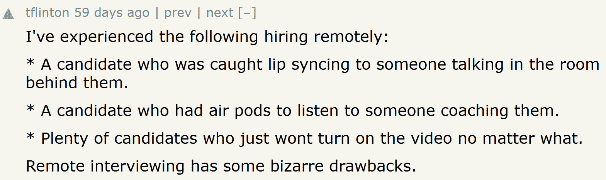

# 我们采访了一位程序员。有人来应聘这份工作

> 原文：<https://thenewstack.io/we-interviewed-a-coder-someone-else-showed-up-for-the-job/>

一个 70 人的 IT 部门正在进行视频面试。根据《纽约时报》二月的报道，这位求职者[无声地动着嘴唇——而镜头外的其他人为所有被回答的问题提供了声音。](https://www.nytimes.com/2022/02/17/business/jobs-hiring-fraud.html)

2019 年的一个[病毒视频](https://www.youtube.com/watch?v=47mfohGyeBg)甚至声称在视频上捕捉到了类似的特技。(还有招聘人员停止面试，面对他发现试图假唱的求职者的尴尬时刻)。

[https://www.youtube.com/embed/KvdnPNKrlXQ](https://www.youtube.com/embed/KvdnPNKrlXQ)

视频

但是更有趣的是当这个视频被分享到 Reddit 上时的反应。“是的，我们被它咬了几次，”一位评论者[发帖](https://old.reddit.com/r/WatchPeopleDieInside/comments/dhasf4/recruiter_catches_candidate_cheating_during_skype/f3mjyp8/)，补充道，“现在他们必须来接受采访。”

《纽约时报》甚至找到了一位招聘人员，她说她已经通过电话筛选了一位工程候选人——却发现到了视频面试的时候，其他人出现了。“我以为没人会注意到，”候选人后来告诉她，让招聘人员想知道这一切会如何进行。

"这个角色 100%是远程的，所以也许他认为这不会有什么不同。"

但是在网上搜索足够长的时间，你会发现更多的故事——这些变换身体的求职者不知何故得到了这份工作。

## 虚拟受访者

一月份在管理顾问艾莉森·格林的博客“问一个经理”上出现了一个有趣的故事。一位读者讲述了他们的丈夫在一家中型企业的 IT 团队中担任“领导”职位的故事，该公司的员工全部在异地工作。该团队最近面试并聘用了一名数据集成平台架构师——但是当候选人[出现在工作岗位](https://www.askamanager.org/2022/01/the-new-hire-who-showed-up-is-not-the-same-person-we-interviewed.html)时，他似乎变了。

他现在戴着眼镜。他的头发看起来不一样了。他无法回答自己在采访中回答的问题，而且“现在无法谈论这份工作的基本情况。”尽管在采访中他提到了他单身的事实，但他现在说他有妻子。和三个孩子。

这个故事展现了工作场所戏剧的魅力。他在面试时看起来很自信，口齿伶俐，但现在却显得胆怯而冷漠。他没有认出参加过多轮面试的女性中的任何一个——所以，很快，她就有了同样的怀疑。两人与人力资源部门进行了交谈，后者带来了公司的内部招聘人员和一位人力资源业务合作伙伴。谈话转移到了公司的法律团队(被描述为“对这种情况不太兴奋”)。

但是，当人力资源部最终接到决定命运的电话时，这位多疑的新员工脱口而出“我不干了！”然后挂断了——从那一刻起，再也联系不上了。

这显然是这些故事的常见结局。一位俄亥俄州的工程师甚至告诉《纽约时报》关于新员工工作的第一天；新员工被要求完成他们在技术面试中完成的同样的数据可视化练习。相反，新员工惊慌失措，跑出房间，并立即辞职。

因此，正如艾莉森·格林所说，当谈到让别人替你面试时，“互联网声称这是一件[事情](https://www.linkedin.com/pulse/how-spot-fake-candidates-video-interviews-nick-shah/)，特别是在 it 行业，很大程度上是因为虚拟面试的增加。”

(在她的博客文章中，格林将“一件事”与 LinkedIn 的一篇文章联系起来，这篇文章提供了视频面试中值得注意的可疑事情的提示。然而，它是由一家公司的创始人写的，该公司生产检测求职网站上虚假个人资料的软件，所以请记住潜在的商业动机。)

关于这种做法没有任何确切的数字，但有许多轶事证据在互联网上流传。

## 分享故事

格林的帖子吸引了 868 条评论，然后在 Reddit 上又有 90 多条评论。分享网址的 Reddit 用户甚至在[评论](https://old.reddit.com/r/technology/comments/tnfg1c/the_new_hire_who_showed_up_is_not_the_same_person/i218ubl/)中声称同样的事情也发生在他们的伴侣身上。他们还听说了另外两起新员工与面试者不同的事件。

“因此，在这种新发现的远程工作机会激增的情况下，这显然是更多人在尝试的事情，至少在 IT 行业是这样，”[用户写道](https://www.reddit.com/r/technology/comments/tnfg1c/the_new_hire_who_showed_up_is_not_the_same_person/)。

一位 Reddit 评论者甚至分享了一段关于一家招聘公司的回忆，这家公司在电话面试应聘者时，似乎是由 T2 提供答案的。

尽管对一些人来说，这种做法显然创造了一个全新的就业机会——尽管是暂时的。

但是格林的博客文章在黑客新闻上也获得了超过[1000 次的投票，并吸引了另外 600 条评论。在那个网站上，健康食品网站 Bubble 的首席技术官 Savraj Singh 写道，就在几个月前，一个朋友的公司经历了完全相同的情况。“幸运的是，有人有一张‘你被录用了！’的截图 Zoom 呼叫，以便他们可以快速确认他们的怀疑并采取行动。"](https://news.ycombinator.com/item?id=30150343)

云解决方案提供商 [Pure Storage](https://portworx.com/?utm_content=inline-mention) 的高级软件工程师 Brian Pan 分享了他在 2020 年进行的一次远程面试的故事，以及他如何在一次编码面试中注意到候选人的一些奇怪之处。

潘[发帖](https://news.ycombinator.com/item?id=30159641)称:“声音比行为热情得多，最终很明显，他试图随机地说出与人说话同步的话(可能是在做编码)，然后归咎于滞后。”

一位[评论者](https://news.ycombinator.com/item?id=30156778)分享了他们自己的一个同事的故事，他注意到一位求职者在一次远程面试中声称正在协作代码编辑网站 CodeBunk 上实时编程——但当“求职者只在东西写好之后才解释”时，他开始怀疑了

另一位评论者甚至记得采访一位忘记停止分享他们的屏幕的候选人——然后“我们不得不看着他搜索”——然后还听到他大声朗读搜索到的材料。

## 语言障碍

有时候，求职者并没有掩盖他们的专业技能，而仅仅是他们不会说流利的英语。在《黑客新闻》上发帖的还有软件工程师肖恩·加拉格尔，他回忆起曾在东南亚面试一名表现出泄密行为的求职者。

“每当我问他一个问题，他都会关掉相机，暂停 10-20 秒，回答问题，然后打开视频，”加拉格尔写道。

在咨询了远程人事公司后，“一项调查确定，该男子使用了一名翻译，真的不会说任何英语。”

这个评论引起了[几年前有过类似经历的人的回应](https://news.ycombinator.com/item?id=30152602)——但更明显的是:“有几次他们忘了取消静音，我们听到多个声音用英语和当地语言指导他们。”

总而言之，这些故事描绘了一幅令人不安的画面，描绘了科技招聘过程中最糟糕的情景。

一名失业程序员的推特帖子甚至声称，一名招聘人员给他们安排了一次[的面试，面试地点是他们刚刚被](https://twitter.com/firr/status/1456324664628846599)解雇的那家公司。(“请携带一份最新的简历…”)

唉，一份工作邀请没有被延长，Twitter 帖子总结道。

虽然，被拒绝的候选人报告说，“我得到了 8 块钱的零食。”

<svg xmlns:xlink="http://www.w3.org/1999/xlink" viewBox="0 0 68 31" version="1.1"><title>Group</title> <desc>Created with Sketch.</desc></svg>