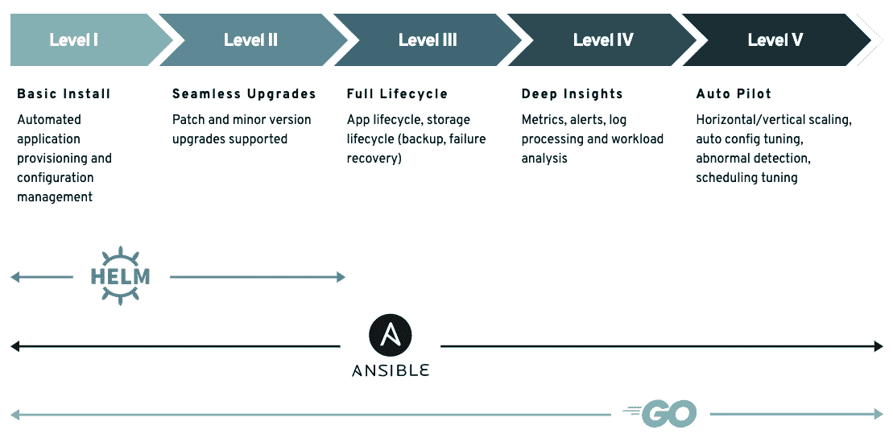

# 我们将 Helm 推到了极限，然后建立了一个 Kubernetes 操作器

> 原文：<https://thenewstack.io/we-pushed-helm-to-the-limit-then-built-a-kubernetes-operator/>

 [杰夫·卡彭特

杰夫在 DataStax 从事开发者关系工作。他从事过国防和酒店行业的大型系统研究，是《卡桑德拉:权威指南》的合著者。](https://www.linkedin.com/in/jeffreyscarpenter/) 

K8ssandra 是 Kubernetes 上的 Apache Cassandra 发行版，由多个开源组件构建而成。从一开始到最近的 [K8ssandra 1.3 版本](https://k8ssandra.io/blog/announcements/release/k8ssandra-1-3-release-supports-cassandra-4-0/)，K8ssandra 一直作为一个舵图集合进行安装和管理。虽然该项目利用 Kubernetes 操作符作为组件，包括 Cassandra(cass-操作符)和 Medusa(Medusa-操作符)，但还没有一个操作符将所有这些组件作为一个整体系统进行管理。

K8ssandra 团队最近敲定了一个我们争论了几个月的决定:为 K8ssandra 项目创建一个运营商。在本文中，我们展示了使用 Helm 的经验，我们为 K8ssandra 创建一个操作符的决定，以及我们希望这将为项目完成什么。

## 怎么开始的

 [约翰·桑达

John 是一名从事 K8ssandra 项目的 DataStax 工程师。他热衷于 Cassandra 和 Kubernetes，喜欢参与开源。在加入 DataStax 之前，John 是 Apache Cassandra 的顾问。](https://www.linkedin.com/in/john-sanda-a382671/) 

K8ssandra 的核心是 [cass-operator](https://github.com/k8ssandra/cass-operator) ，我们用它来部署 Cassandra 节点。围绕这一点，我们在 Kubernetes 中添加了一个用于有效操作 Cassandra 的组件生态系统，包括用于管理反熵修复(Reaper)和备份(Medusa)的 Cassandra 操作工具。我们包括用于指标收集和报告的 Prometheus-Grafana 堆栈。Stargate 是一个数据网关，通过 REST、GraphQL 和 document APIs 提供对 Cassandra 更灵活的访问。

一开始，我们使用 Helm 来帮助管理这些组件的安装和配置。这使我们能够快速启动项目并开始构建社区。最初对这个项目感兴趣的大部分人来自 Cassandra 社区的开发人员，他们不一定有很多 Kubernetes 的专业知识和经验。许多人发现掌握 Helm 这样的包管理工具和安装程序比掌握操作符和自定义资源定义(CRDs)更容易。这并不是说 Helm 是为“不太了解 Kubernetes 的人”设计的，因为 Kubernetes 生态系统的很大一部分都使用 Helm。

## 进展如何:随着舵的起伏

随着项目的发展，我们开始遇到 Helm 的一些限制。虽然正确安装 K8ssandra 集群非常简单，但是在升级和管理集群时，我们遇到了更多的问题。

### 编写复杂的逻辑

Helm 对控制流有很好的支持，有循环和 if 语句。然而，当你开始深入多个层次时，阅读和推理代码就变得更加困难，缩进就成了一个问题。特别是，我们发现同行评审舵图的变化变得相当困难。

### 重用和可扩展性

舵变量被限制在你声明它们的模板的范围内。例如，我们在 Cassandra 数据中心模板中定义了一个变量，我们想在 Stargate 模板中重用它，但这是不可能的。我们不得不在星际之门模板中重建同样的变量。这阻止了我们保持代码[干燥](https://en.wikipedia.org/wiki/Don%27t_repeat_yourself)，我们发现这是缺陷的来源。

同样，Helm 有一个很好的助手模板函数库，但是这个函数库并没有涵盖所有的用例，也没有定义你自己函数的接口。您可以定义自己的自定义模板，这允许大量的重用，但这些模板不能代替函数。

### 项目结构和继承

当我们试图实现伞形图表设计模式时，我们也遇到了困难，这是 Helm 的最佳实践。我们能够为卡珊德拉和普罗米修斯创建一个带有子图表的顶级 K8ssandra 头盔图表，但在试图为收割者和星际之门创建附加子图表时遇到了变量范围的问题。我们的意图是在一个地方定义认证设置，顶层的图表，这样它们不仅可以应用于卡珊德拉，也可以应用于星际之门和收割者。Helm 继承模型不支持将变量下推到子图表的概念。

### CRD 管理

Helm 可以创建 Kubernetes CRDs，但不能管理它们。我们知道这是头盔开发者为头盔 3 精心设计的选择。因为自定义资源的定义是集群范围的，所以如果多个 Helm 安装试图使用不同版本的 CRD，可能会造成混乱。然而，这给我们带来了一些困难。为了管理 Helm 中 Cassandra 数据中心等资源的更新，我们必须实现一个解决方案。我们实现了定制的 Kubernetes 作业，并将它们标记为升级前挂钩，这样 Helm 就可以在升级时执行它们。每个作业都是用 Go 编写的，并打包成一个映像。这本质上就像编写迷你控制器，并且在某个时候开始感觉像编写一个操作符。

### 突破点:多集群部署

虽然我们已经能够通过 1.3 版本解决这些 Helm 挑战，但我们路线图上的下一个主要功能是实现多集群 K8ssandra 部署(跨越多个 Kubernetes 集群的 K8ssandra/Cassandra 集群)。我们意识到，即使没有错综复杂的网络配置，这也将是我们使用 Helm 能够有效实现的一步。

## 设定新的方向

最后，我们意识到我们试图让 Helm 做得太多了。很容易出现这样的情况，你学会了如何使用锤子，所有东西看起来都像钉子，但你真正需要的是螺丝刀。

事实证明，我们与[运营商框架](https://operatorframework.io/)的创建者找到了一些共同点，他们为运营商定义了一个[能力模型](https://operatorframework.io/operator-capabilities/)，我们在这里强调一下:

如图所示，Helm 最适合前两个级别的操作员功能，侧重于简单的安装和升级。执行更复杂的操作，如故障处理和恢复、自动伸缩，以及更复杂的安装和升级，应该用编程语言来实现，如 Ansible 或 Go，而不是像 Helm 这样的模板语言。

### 构建一个操作符:K8ssandra 2.0

基于这一分析，团队决定是时候开始构建一个操作符了。我们称之为 K8ssandra 2.x 系列发行版。2.0 版本的优先事项是移植现有的功能，我们已经在掌舵图表，确保运营商有功能对等和增加多集群支持。我们仍然打算解决 1。x 发布流，但我们正试图将任何主要的新功能工作集中于运营商。

### 赫尔姆仍有一席之地

在工具方面，我们不认为 Helm 和 operators 是互斥的。这些是互补的方法，我们需要利用每种方法的优势。我们将继续使用 Helm 执行基本的安装操作，包括安装操作员和设置 Cassandra 和其他组件使用的管理员服务帐户。这些都是像 Helm 这样的包装经理最擅长的工作。

## 运营商设计和实施选择

在 K8ssandra 操作符的设计和实现中，我们做出了几个关键的选择。

### 标准设计

虽然我们为收割者操作者，美杜莎操作者和星门操作者有分开的仓库，我们确实计划把那些合并到 K8ssandra 操作者。K8ssandra 操作器将在单个 pod 中运行，但将由对应于每个 CRD 的多个控制器组成。我们将有多个 CRD 和多个控制器。因为 cass-operator 已经被独立使用，所以它将继续保持独立，并将成为 K8ssandra 运算符的一个依赖项。

虽然这目前不是微服务架构，但它是分离的和模块化的，因此如果需要，我们可以决定将来将控制器重新打包为单独的微服务。

### 使用运算符 SDK 在 Go 中实现

我们决定在 Go 中编写 K8ssandra 运算符，使用运算符 SDK。这对我们来说是一个简单的选择，因为我们已经从 cass-operator 那里熟悉了它。我们相信，使用像 Go 这样的完整编程语言将比使用 YAML 模板更有吸引力，并有助于吸引新的项目贡献者。用 Go 编码将使我们能够使用这种语言的全部武器。例如，Go 使得创建我们可以轻松重用的助手函数变得容易。

### K8ssandra 集群级状态

新的 K8ssandra 集群 CRD 有一个 status 字段，为您提供集群状态的概述，包括就绪、未就绪、正在初始化等。这个状态将总结所有组成星团的物体的健康状况:卡珊德拉星团，星门，收割者和任何其他作为它的一部分被部署的物体。这不是你能用头盔做的事。

### 更符合库伯内特的方式

我们为每个定制资源设计控制器的方法更加符合 Kubernetes 中管理资源的标准方式。例如，我们有一个特殊的启动序列，我们想强制执行:不启动星门，直到卡珊德拉初始化。没有头盔，就没有办法做到这一点。我们不得不在星门舱中添加一个初始化容器，它执行一个基本的检查，检查集群是否启动并运行。有了新的操作员设计，星门控制器正在检查卡珊德拉数据中心资源的状态变化。当它被触发运行它通过它的协调，它查询得到卡珊德拉数据中心的状态，一旦它准备好了，操作员创建星门部署。

### 测试覆盖率

这也将改进测试。有很多测试覆盖工具。例如，我们使用 SonarCloud。然而，我们不能将 SonarCloud 与 Helm 模板一起使用，所以我们现在没有一个好的方法来衡量我们在测试中的覆盖水平。你在 ide 中也得不到和静态语言一样的支持。

## 我们仍在研究的事情

当我们致力于开发操作符时，有几个领域我们还在继续探索和学习。

### 加速迭代开发

使用 Helm 模板确实有利于快速迭代，但是操作者的开发步骤更复杂。修改操作符代码后，我们必须重新构建操作符映像并部署它，然后部署操作符管理的定制资源，这样它将生成底层部署对象。然后我们可以验证部署。这个过程涉及更多的步骤，所以我们希望提高自动化程度。

### 多集群集成测试

测试多集群 K8ssandra 部署存在一些挑战。到目前为止，我们已经能够用 GitHub Actions 进行大部分的持续集成测试，使用免费的层运行器，但是我们发现这对于 multicluster 的资源来说是不够的。

我们正在寻找的一个集成测试工具是 [Kuttl](https://kuttl.dev/) 。使用 Kuttl，测试案例和预期结果都在 YAML 文件中描述，这意味着您不必是 Go 或 Kubernetes API 的专家也可以参与测试。我们相信，这可能会使开发人员更容易参与测试，并立即做出贡献，然后按照他们自己的速度，根据他们的意愿开始运行。

## 应该使用运算符吗？应该写运算符吗？

如果你已经读到这里，你可能想知道对你自己的项目的影响。如果您在 Kubernetes 中使用数据库或其他基础设施，那么使用操作员来尽可能自动化您的操作工作量无疑是有意义的。

如果您正在为一家数据基础设施供应商工作，或者正在为一个开源数据基础设施项目做贡献，那么您可能想知道如何知道什么时候应该投资建立一个运营商。我们在自己的过渡上花了很多心思，尤其是在时机和对用户的影响方面。最终，我们建议的规则是:如果您发现自己在处理多种情况，而您的工具对您不利，那么可能是时候考虑不同的解决方案了。

## 建设社区

我们现在看到对 K8ssandra 的贡献在增加，特别是在问题创建方面。现在，我们已经开始加快运营商发展的势头，拥有一个不断增长的用户社区来帮助我们认识到加快成熟过程所需的东西，这是一个巨大的红利。

我们也希望继续建立贡献代码的团队。如果你有兴趣在 Kubernetes 或建筑运营商上运行 Cassandra，我们很乐意让你成为 K8ssandra 项目的一部分。查看网站，在[论坛](https://forum.k8ssandra.io)或我们的 [Discord](https://discord.gg/qP5tAt6Uwt) 服务器上提出任何问题。

<svg xmlns:xlink="http://www.w3.org/1999/xlink" viewBox="0 0 68 31" version="1.1"><title>Group</title> <desc>Created with Sketch.</desc></svg>