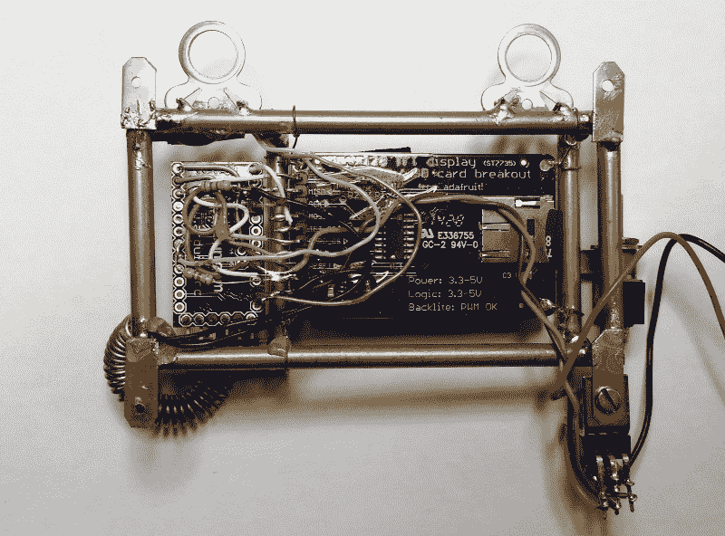
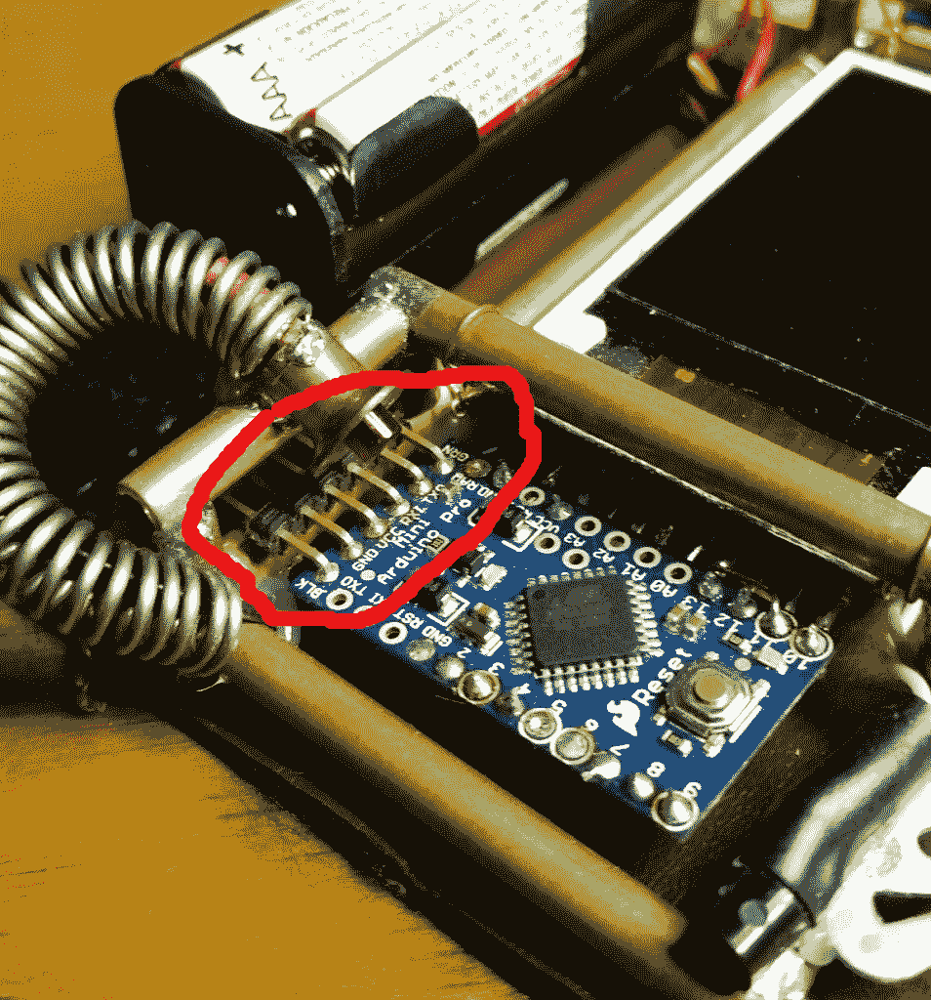
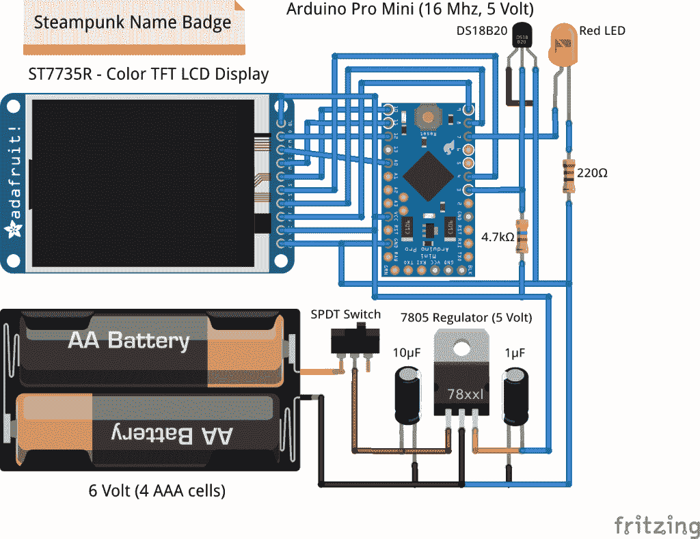

# 标志着可穿戴计算时代的蒸汽朋克风格的名字徽章

> 原文：<https://thenewstack.io/wearable-computing-electro-matic-conference-personality-identification-device/>

最近有很多关于“可穿戴计算”的讨论，这是物联网(IoT)的分支。我没有武断地谈论技术应该如何工作，而是决定实际建造一些有用的东西将是一次有价值的启蒙之旅。我也是蒸汽朋克的超级粉丝，我想还有什么比维多利亚时代风格结合现代微控制器和材料技术更好的方式来捕捉美学的本质呢？

因此，我进军可穿戴计算的一个尝试是:“电子会议个性识别设备”大多数人简单地称之为姓名牌。

我选择了姓名徽章，因为我参加了很多科技会议和活动，并在会上发言。打破与 8000 个陌生人的对话僵局可能有点令人生畏。一次性的“徽章”可能会抓住人们的好奇心，同时展示一些实用的可穿戴计算产品。此外，几乎每个人都喜欢蒸汽朋克。

说来也巧，圣诞节我收到了一个小小的[彩色液晶显示器](http://www.adafruit.com/products/358)。该项目将 LCD 与一个 [Arduino Pro Mini](https://www.sparkfun.com/products/11113) 、一个 [Dallas 数字温度传感器](https://www.sparkfun.com/products/245)、一个电池组和一个手工黄铜框架结合在一起。它显示 160 x 128 像素的彩色位图，带有我的 Dr. Torq 徽标，可以通过 Arduino IDE 从 Linux 笔记本上轻松编程。可编程/微控制器方法有助于在即将到来的 2.0 版和更高版本中探索“网络化”可穿戴计算。

欢迎在评论区分享任何想法或修改。

## 建筑和装饰

该徽章由 1.8 英寸彩色薄膜晶体管(TFT)显示屏和 Arduino Pro 微型微控制器组成。看一下徽章的背面，看看我是如何使用接头引脚将 Pro Mini(左侧)和 LCD 分线板(右侧)焊接在一起的。

徽章:反向视图

我使用来自 5 类电缆的 22 号线连接分立元件，如 Dallas DS20B18 温度传感器和电阻。所有电子元件的焊接都是用一个 25 瓦的小烙铁完成的。

在上图中，你还可以看到我是如何使用 3/16 英寸的黄铜薄壁管、一些黄铜扁材和常规旧松香芯焊料构建框架的。我从当地一家业余爱好商店买到了黄铜。用 100 瓦的焊枪焊接非常容易。未来的框架将在建造过程中使用夹具来固定这些部件。热焊料的表面张力倾向于移动管道和接头，保持零件正确排列是一个挑战。

在最右下角，你还可以看到我用 7805 线性稳压器和几个电解电容器制作的 [5 伏稳压器组件](https://www.sparkfun.com/products/107)。虽然显示器和 Pro Mini 都有板载调节器，但我包括了外部模块，所以我可以稍后添加一些小伺服系统。电池组的输入电压为 6 伏。

Pro Mini 和显示板通过 22 号铜线悬挂在框架中。我想过焊接一些安装标签，可能会在下一个版本中这样做，这样我就可以通过松开电路板将显示器切换到其他项目中。我还计划在 Pro Mini 侧使用 10 针母接头连接器，以插入 LCD 显示器上的公接头。这样我就可以把两者分开，而不用把所有东西都拆了。

你可能还会注意到 Pro Mini 底部的 6 针插头(见下文)，在那里你可以连接一根 [TTL 串行到 USB 适配器电缆](http://www.adafruit.com/product/70)。

串行接头引脚

确保黑色电线插入标有“黑色”的插头在标题上方，你可以看到我用来照亮 Pro Mini 的线圈和红色 LED。当然，线圈没有功能——它是蒸汽朋克行话中所谓的“点缀”。

## 编程；编排

编程很简单，常规的旧 Arduino 代码。我使用了来自 [Adafruit_GFX](https://github.com/adafruit/Adafruit-GFX-Library) 和 [Adafruit_ST7735](https://github.com/adafruit/Adafruit-ST7735-Library) 库的示例代码，然后添加了循环遍历几个位图、偶尔点亮红色 led 并读取/显示环境温度的代码行。

徽章:试验板视图

上图显示了显示器、Pro Mini 和其他组件的试验板布局。 [Fritzing 图形程序](http://fritzing.org/home/)可以快速设计试验板、原理图和 PCB 布局。它可以在网上免费获得，并有一堆库部件，所以你不必手工绘制所有的东西。

Fritzing 让你只需插入部分，连接电线，并重新安排清晰。该图中未显示 USB 至 TTL 串行接头。

## 丰富

后续版本将有许多改进，以增强蒸汽朋克的外观，并更容易修改徽章:

*   我需要把廉价的 AAA 电池换成一些永久的铜制电池。与现有的白色和红色相比，铜色和黑色更适合黄铜框架。

*   我会换出假皮革行李袋把手，用来盖住徽章的背面，上面有一块真皮，一个铰链和某种扣子。当你不得不解开将徽章固定在背衬上的三根电线时，在徽章的背面工作是一件痛苦的事情。我只是希望能够翻转一个小扣子，让背衬向下摆动，这样我就可以焊接新功能或暂时将显示器拿出来用于另一个项目。

*   我将使用微控制器侧的 10 引脚母接头连接到 LCD 分线板上的 10 引脚公接头。

*   2.0 版本肯定会有一个 Spark 内核或 Arduino Yún 微控制器。通过我的 Galaxy 5S Active 超级手机连接到徽章会有多酷？想象一下，当我在一个活动中四处走动时，从一些显示在徽章上的云服务进行无线固件更新或传输信息。这里有许多功能改进的机会。

## 包裹

这就是了。一个真实世界的“可穿戴计算”项目，它实际上做了一些有用的事情。嗯，至少我是这么认为的。以下是成功的物理原型的一些基本原则:

*   在你把烙铁接触到印刷电路板之前，从一个坚实的想法开始——也许画出草图，然后让它在你的大脑中酝酿一段时间。

*   不过，不要等太久才开始建造。在构建任何东西之前，试图解决每一个设计挑战和问题是愚蠢的。这引出了下一个建议:

*   让“最小可行产品”工作，然后添加各种惊人的功能。

*   一旦 1.0 版本可以运行并且可能是可靠的，列出一个改进列表，然后开始实现你的新愿景。您的第一次迭代可能已经发现了大量的不足之处。在 2.0 做一个更好的版本。你也可以选择从头开始。

知道该走哪条路的唯一方法是实际地对设计进行第一次检查。

<svg xmlns:xlink="http://www.w3.org/1999/xlink" viewBox="0 0 68 31" version="1.1"><title>Group</title> <desc>Created with Sketch.</desc></svg>