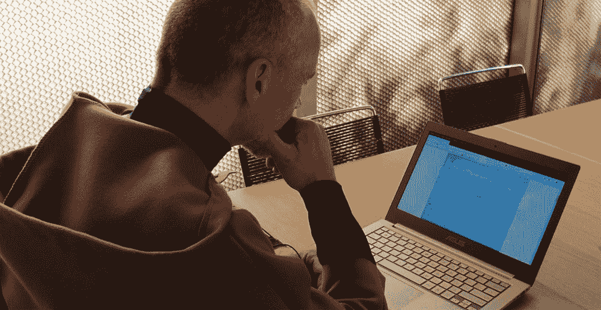

# 可穿戴沉默套装有助于创造“完美的冥想体验”

> 原文：<https://thenewstack.io/wearable-silence-suit-helps-create-the-perfect-meditation-experience/>

通过我们生成的任何数据，有可能更好地了解我们自己吗？这就是“量化自我”或“T2 生活日志”运动背后的理念，其中关于一个人日常活动的数据——我们走了多少步，我们摄入的卡路里，我们吸入的呼吸——都随着时间的推移被收集、跟踪和分析。如今，这是通过可穿戴设备实现的——这些设备可能全天收集健康数据，或者可能有更多预防目标，如[帮助正在康复的瘾君子避免复发](https://thenewstack.io/wearables-better-track-drug-use-addicts/)，或者更具互动性的设备[在跟踪你的编织过程中产生音乐](https://thenewstack.io/cyberknitics-translates-knitting-ethereal-electronic-music/)。

对于认知实验室的艺术家和设计师丹妮尔·罗伯茨来说，量化自我的概念包括测量一种不太活跃但却很具体的追求:冥想。罗伯茨与 Protospace、Vera de Pont 和[设计实验室 Twente](https://www.utwente.nl/en/news/!/2018/4/411357/high-tech-habit-makes-meditation-measurable) 合作，开发了[静音套装](http://meditationlab.nl/en/home-2/)，这是一种可穿戴设备，可以测量环境因素、人体功能和冥想练习质量之间的相关性。作为一名几十年的定期冥想者，罗伯茨的沉默诉讼的目的是帮助冥想者获得对他们冥想实践背后的更好细节的洞察力和意识，并将这些知识融入到进一步深化他们的实践中。

## 数据跟踪习惯

这款静默套装由天然羊毛和粘胶纤维/莫代尔混合面料制成，有点像僧侣的习惯，它有 11 个传感器，可以测量与“适当”冥想练习相关的各种参数。例如，有一个加速度计测量姿势，因为一个静止的，直立的姿势对加深冥想过程至关重要。这套衣服还有一个导电的拉伸传感器，可以测量胸部和腹部的呼吸，因为“跟随呼吸”的练习是冥想期间注意力的重要支柱，可以让你的大脑放松，不要太分心。这套衣服还有一个压力传感器，可以显示冥想者在冥想姿势中重叠手指时施加的力；当压力太大时，这意味着这个人太紧张，或者当手指变得松弛时，这是这个人要睡着的迹象。

所有部件都是现成的，固件是用 Arduino 编写的，这意味着沉默套装可以成为一个套件，好奇 DIY 的冥想者可以进行实验。“我们特意选择了这些组件。我们希望通过开源让其他人也能使用这套衣服和软件，”罗伯茨说。

罗伯茨还在试验用这套衣服改变使用者的环境，以改善冥想体验。例如，研究表明，不同的光线可以引发不同的精神状态:蓝色的光线让人更加警觉；温暖的白光带来放松；凉爽的白光有助于聚焦。为此，这套衣服可以连接到一个无线，便携式和可充电的 LED 灯，可以动态响应冥想者的数据。

至于在引擎盖下运行的算法:“机器学习使用决策树，”罗伯茨解释说。“它考虑了传感器值(环境和生理)、冥想前后的问卷。他们询问使用者的精神状态、冥想类型、姿势，冥想后的形式还询问注意力的质量、障碍和主观体验。所有问题都经过加权，得出“冥想质量”分数。随着实时传感器数据的到来，该算法试图预测所有三种情况下的最终冥想质量分数，并将根据最佳预测改变光线。”

该项目的另一个创新特征是数据服务器，这是一个软件平台，允许该套装的用户存储和分析定性和定量的冥想数据，这允许系统随着时间的推移熟悉冥想者。该平台还允许用户进一步调整他们的体验，将信息标记到会话中，或查看之前记录的会话的图表，并比较会话，以收集关于个人实践演变的见解。“使用物联网技术，数据服务器自动调整环境因素，以创造完美的冥想体验，”罗伯茨解释说。

现在，有些人可能对创造“完美的冥想体验”持怀疑态度——毕竟，有这样的事情吗？但是正如 Roberts 指出的:“几千年来，人们使用了许多技术来影响和优化他们的冥想练习，从熏香到枕头到咒语。我想探索当代技术如何有助于更深层次的冥想。最终目标是让通往洞察力和同情心的道路变得更加平坦，并为尽可能多的人减轻痛苦。”

在未来，罗伯茨希望围绕沉默诉讼开发一个开源、量化的调解社区，以及提供“冥想表演”，其中诉讼的使用与观众可以看到的可视化相结合。最终目标将是鼓励远程编辑，世界各地的个人可以一起远程冥想，罗伯茨指出:“这个想法是获得每个人在同一时间冥想的数字表示，并将其合并成一个新的数字实体，并通过环境显示该实体。”

图片:冥想实验室和原型空间。

<svg xmlns:xlink="http://www.w3.org/1999/xlink" viewBox="0 0 68 31" version="1.1"><title>Group</title> <desc>Created with Sketch.</desc></svg>