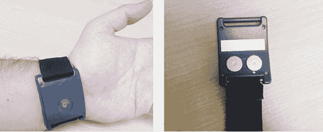
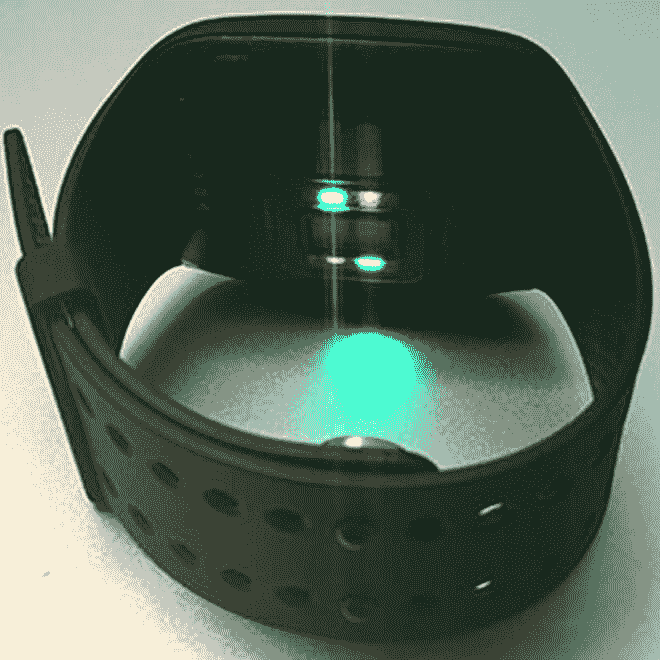

# 可穿戴设备可以更有效地追踪瘾君子的吸毒情况

> 原文：<https://thenewstack.io/wearables-better-track-drug-use-addicts/>

像改变情绪的 Thync、健康监测 FitBit 和谷歌眼镜这样的可穿戴设备已经成为流行文化词汇的一部分。但是，有一天，一个可穿戴的小玩意会有助于扭转全球药物成瘾的流行吗？这种流行正在遥远的地方发生，如[南非](http://www.massgeneralcenterforglobalhealth.org/stories-from-the-field/whoonga-an-epidemic-emerges/)、[俄国](http://www.reuters.com/article/us-russia-heroin-idUSTRE70O22X20110125)和[中国](http://www.bloombergview.com/articles/2015-05-25/china-s-growing-meth-addiction)，以及在北美的家中，那里有一场日益严重的危机[特别是阿片类药物的使用。](http://www.rawstory.com/2015/11/how-the-explosion-in-prescription-painkillers-has-created-more-heroin-users/)

对于许多上瘾者来说，复发是一种真实而严重的危险，即使在长期戒断之后也是如此，因为上瘾的根本原因仍然没有得到很好的理解。人们可能很容易相信这就像“对毒品说不”一样简单，但事实上，成瘾是一种复杂的状况，由无数潜在的生物、心理和社会因素组成，往往需要结合适时的医疗干预、科学合理的理解和长期治疗才能成功解决。

现在，一项研究表明，可穿戴设备可能是帮助戒毒者保持清洁的一种方式。位于伍斯特的马萨诸塞大学医学院的一个团队正在试行一个项目，该项目使用生物传感腕带来监控参与该中心康复计划的一小组正在康复的瘾君子的健康数据，以帮助确定预测复发的潜在指标。

发表在*医学系统杂志*上的这项最新研究建立在去年发表在*医学毒理学杂志*上的一项早期实验的基础上，在该实验中，参与者被给予一种来自马萨诸塞州公司 [Empatica](https://www.empatica.com/e4-wristband) 的 E4 腕带。该设备监测心跳、运动、皮肤温度和皮肤电导，每个变量每秒钟被连续测量 30 次。还可以通过 GPS 跟踪佩戴者的位置，最多可以在设备上存储四天的数据，并通过蓝牙传输到智能手机或电脑，从而进行实时数据分析。

Affectiva Q 传感器的前视图和后视图，最初用于团队的先前研究。图片:《医疗系统杂志》

## 补充标准方法

这个想法是利用这种生物特征数据来补充药物治疗项目已经在使用的传统方法，以跟踪患者的进展，其中包括检测药物使用的尿检，以及患者自我报告的任何复发事件。除了更好地评估各种治疗方法的有效性之外，这种新的数据层不仅可以帮助医生更准确地判断非法药物使用事件何时发生，还可以帮助他们检测其他两种标准方法可能遗漏的复发事件。

这些装置被戴在 15 名因娱乐性使用可卡因和吗啡而被送进急诊室的病人的手腕上。出院后，患者继续佩戴腕带 30 天，监测与使用不同药物相关的独特生理“信号”。

这种正在进行的数据收集现在使医生能够更深入地了解在吸毒之前、期间和之后的渴望时刻发生的微小生理变化。此外，没有两个上瘾者是相同的:第一次使用者的生理反应不同于更有经验的使用者的生理反应，从这种不同的光谱中收集的数据也将有助于更有效地进一步个性化治疗。

较新的移情 E4 腕带。照片:斯蒂芬妮·卡雷罗。

## 激励患者

人们可能会认为上瘾者可能会回避这种亲密的监视，但令人惊讶的是，研究人员写道，这项研究的参与者实际上非常合作，即使在复发后也保持他们的腕带。除了医生受益于使用尖端技术进行药物康复治疗之外，首席研究员 Stephanie Carreiro 指出，自我认识可以增强权能，因为当患者获得自己的健康数据时，他们总体上更有动力保持康复，这些数据可以通过应用程序在个人智能手机上实时监控。

“使用更先进的设备的吸引力在于，我们可以实时连续监测(患者)。尿液或血液测试无法做到这一点，”卡雷罗告诉《布朗医学杂志》。卡雷罗说，可穿戴技术越来越普遍，这有助于弥合不熟悉的医疗监测程序和日常生活之间的差距:“患者也非常投入。它消除了一些患者对正常医疗干预的陌生感和犹豫，使其恢复到正常水平。”

研究人员的目标是将这项技术发展到这样一个地步，即可穿戴生物传感器将能够可靠地预测何时复发，将生理和 GPS 数据插入一个算法，该算法将评估情况，并立即向医生或家庭成员发送通知，使他们能够毫不延迟地进行干预。对许多人来说，这种技术的引入不仅代表了一种更有科学依据的方法来治疗急需的毒瘾，还可能最终意味着生与死的区别。

更多尽在 [IEEE 谱](http://spectrum.ieee.org/the-human-os/biomedical/diagnostics/fitbit-for-addicts-could-predict-relapse2)；在这里阅读研究。

图片:[移情](https://www.empatica.com/e4-wristband)；[医疗系统杂志](http://link.springer.com/article/10.1007%2Fs10916-015-0337-9)。

<svg xmlns:xlink="http://www.w3.org/1999/xlink" viewBox="0 0 68 31" version="1.1"><title>Group</title> <desc>Created with Sketch.</desc></svg>