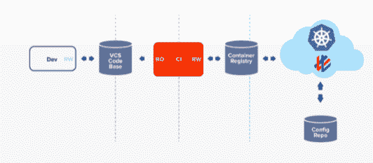

# Weave GitOps Core 集成了 Git 和 Kubernetes

> 原文：<https://thenewstack.io/weave-gitops-core-integrates-git-with-kubernetes/>

连续交付软件提供商 [Weaveworks](https://www.weave.works/) 发布了 Weave GitOps Core，这是一个软件包，旨在帮助 DevOps 团队简化从 Kubernetes 集群上的 Git 存储库部署应用程序和更新的连续交付(CD)过程。

作为一个开源替代方案， [Weave GitOps Core](https://www.weave.works/product/gitops-core/) 有助于简化和自动化在该公司所说的“任何 Kubernetes 集群”上部署代码的过程这涉及一个双命令行过程，无需手动配置群集设置。除此之外，Weave GitOps Core 还为集群预先配置了监控和可观察性工具，以便它们在部署过程中继续不间断地运行。

Weaveworks 的产品营销总监 Jordy Mon Companys 告诉新的堆栈，一旦安装了 Weave GitOps Core，就会设置与目标环境的协调循环，因为存储了运营商的集群配置，可以立即作为开发人员的定制平台。

“这样的自动化正在等待 Git 中的变化，以将它们立即部署到目标环境中，”他说。“从开发的角度来看，没有太大的变化:开发人员专注于将代码推送到他们的 repos，运行测试和 CI，如果这些事情已经就绪，Weave GitOps Core 将接受工作负载中的任何变化，并更新特定的名称空间。Weave GitOps Core 在开发人员工作的地方与他们会面(Git ),并完全掌控 Kubernetes 的部署。”

对 GitOps 的 CI/CD 过程进行更严格的安全性和全面控制是 Weaveworks 打算在开源版本中提供的一个附加特性。以前，DevOps 团队一直在努力“将构建版本推送到他们的 Kubernetes 集群中，或者让他们的 CI 服务器为他们做这件事，”Companys 说。

“在这两种方法中，都要求 CD 管道被授予访问权限，并携带访问群集所需的凭据，”他指出。“不考虑这种方法涉及的安全风险，这种工作流程只是单向的。人们永远不会知道是否有人手动访问和更改了目标环境中的任何内容。”

公司表示，这种所谓的基础设施“漂移”的后续原因非常频繁，也是另一个安全问题在某种程度上，使用旧的方法，您被迫疯狂地向您的环境运送和推送，如果失败，则找出不匹配的地方。GitOps Core 旨在通过基于拉动的方法彻底改变这种模式——没有管道，而是独立于 CI 管道的持续运行的 GitOps 自动化，”他说。

公司补充说，这个独立的过程与 CI 过程是分开的，防止对群集的任何手动、临时访问。

“自动化存在于 Kubernetes 中，它模拟不同的团队——通过适当的 RBAC 一次性配置——并将每个工作负载交付给它对应的目标环境，”他说。

Weave GitOps Core 自动化了确保公司所描述的“Git 和 Kubernetes 之间的协调循环”的过程公司解释说，通过这种方式，由于 Weave GitOps 核心和集群保持同步，Weave GitOps 核心的用户界面(UI)提供了对支持 GitOps 的集群的扩展可见性。“因此，无论我们的客户想要在他们的集群中运行 Prometheus、 [Grafana](https://grafana.com/) 或 [Linkerd](https://linkerd.io/) ，他们都可以轻松地从 Weave GitOps 核心中安装这些组件作为集群组件，”他说。" Weave GitOps 核心致力于保持等式两边的永久同步."

<svg xmlns:xlink="http://www.w3.org/1999/xlink" viewBox="0 0 68 31" version="1.1"><title>Group</title> <desc>Created with Sketch.</desc></svg>