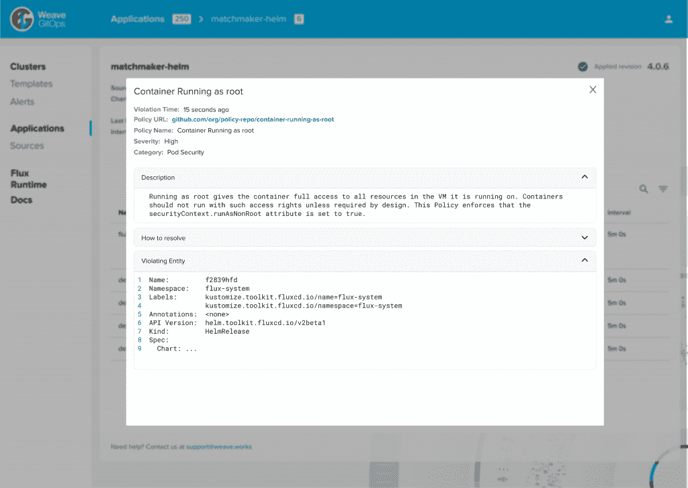

# 编织 GitOps 可信交付:通往 Kubernetes 理智之路？

> 原文：<https://thenewstack.io/weave-gitops-trusted-delivery-a-road-to-kubernetes-sanity/>

没有人会说管理 Kubernetes 环境很容易，但是随着这些分布式和容器化的环境变得越来越普遍，我们在可行性方面看到了一些进展。虽然让 Kubernetes 变得不那么笨重和复杂的方法并没有像大多数用户希望的那样迅速出现，但它的采用正变得越来越简单或越来越不疯狂，这取决于你如何看待它。

我们还可以假设，GitOps 将很有可能成为现在和未来支持云原生部署的 CI/CD 的底层框架，因为它提供了急需的自动化、安全性和其他流行属性。Kubernetes 和 GitOps 支持 Kubernetes 上的应用程序开发、部署和管理，这有助于解释出现了许多支持这两者的工具和框架。作为 Kubernetes 的 CI/CD 的领先 GitOps 提供商，其创始人兼首席执行官 [Alexis Richardson](https://uk.linkedin.com/in/richardsonalexis) 因发明了术语 GitOps 而闻名，weaver works 最新发布的 Weave GitOps 强调了 weaver works 所谓的 Kubernetes 部署的“可信交付”,将策略作为代码作为实现该目标的主要流程。

事实上，[企业管理协会(EMA)](https://www.enterprisemanagement.com/) 的分析师 [Torsten Volk](https://www.linkedin.com/in/torstenvolk) 告诉新的堆栈，策略驱动的应用部署和管理处于或接近 2022 年 DevOps 痛点的顶端。“临时配置更改仍然很常见，它们是不一致的应用程序性能和应用程序宕机的头号根本原因，”Volk 说。只有完全策略驱动的部署和运营自动化才能防止这些问题，但通常不会给开发运维团队留下足够的灵活性

除此之外，基于开源 Flux 的 Weave GitOps 背后的想法是在 GitOps 中扩展自动化。例如，SRE 不应该做的一个例子是配置数百个 YAML 文件来回滚 GitHub 上的一个集群部署。相反，一个合适的 GitOps 平台应该能够自动化这个过程。

Weaveworks 的首席运营官 Steve George 告诉 New Stack，如果团队要快速前进，可信交付是很重要的——他们不能继续做他们习惯做的所有这些人工检查工作。

## 政策即代码的误称

**

WGE 违规细节:Weave GitOps UI 中的一个视图，显示策略问题的具体细节，并显示策略的 GitOps 位置。

Weave GitOps 版本具有策略即代码功能，Weaveworks 在最近购买了 [Magalix](https://www.magalix.com/) 的[之后已经实现了该功能，该功能提供了帮助 DevOps 团队在其软件开发生命周期中编纂安全性和合规性的工具。Weave GitOps 建立在开放策略代理(OPA)的基础上，利用了 Magalix 的一百多种安全、弹性和编码标准策略库。一切都是从不可变的 Git 存储和实现的，所以一旦部署了应用程序和集群，所有的策略都扩展到开发周期(左移)和集群本身。](https://thenewstack.io/weaveworks-adds-policy-as-code-to-secure-kubernetes-apps/)

Volk 说，不变性是将 Kubernetes 应用程序一致可靠地部署到企业数据中心、公共云或边缘的不同基础设施的关键。“只有彻底的声明性方法才能确保跨环境的持续合规性和可靠性，因为它最大限度地减少了配置不一致和人为错误的可能性，”Volk 说。“这使得 Weave GitOps 的价值主张如此激动人心。”

但是，开发运维团队的策略即代码支持不应被视为仅限于在整个 CI/CD 流程中遵守合规性和安全性。“我们认为政策即代码的方式不是阻止人们做事情，而是帮助人们做工作——这是关于工作流自动化和帮助团队更快地前进，给他们提供支持，”乔治说。

因此，策略即代码应该有助于在开发周期中实现自动化，并在开发人员发出第一个提交请求之前为他们提供支持。乔治将其描述为“发展护栏”

“当你对我说‘政策’这个词的时候，听起来好像审计部门会拿着一个剪贴板来检查我是否做对了事情，”乔治说。“策略即代码通常被视为一种安全措施，虽然它确实有利于安全，但这并不都是积极的。”

George 举了一个例子，一家制造行业的软件公司已经开始转向使用微服务和 Kubernetes 集群。主要问题是，许多长期从事企业 Java 工作的开发人员正在努力支持微服务的部署，学习 Kubernetes 健康检查的正确标签，并为这些环境创建微服务。“因此，对他们来说，我认为这种受信任的应用程序策略正在做的事情之一是，当开发人员在一端推动代码时，你可以设置标准来提醒开发人员说，‘你没有做好这件事，我正在阻止你做坏事，但你可以去修复它。’"

在某些情况下，开发人员可以获得修复。“你实际上可以告诉他们，你没有进行这项健康检查。我已经给了你一个拉取请求，只要按一下按钮，它就会为你解决这个问题，”乔治说。“这一切都与自动化有关。”

这并不意味着使用策略作为审计代码并确保在整个 CI/CD 中保持对策略的遵守不重要。正如 Weaveworks 技术营销经理 Steve Waterworth 在最近的一次[网络研讨会](https://vimeo.com/693902375/cb326aa9cc?mkt_tok=MjQ5LVlEVC0wMjUAAAGDem1_Uq4gBuquccXfngC2pwlhL4nGXApe2cn9olFzUGMGbzzFIaF4Na-f5kLNY9pYwvlBU4DwEFm29GUv7AIIVMC8QZlSjqVul-eWFfRVuQ)上指出的那样，大多数组织对他们想要在 Kubernetes 内部注释和标记资源的方式都有标准。“我们可以说 Weave GitOps 现在通过使用策略作为代码来验证编码标准是否得到遵守，使审计变得更加容易”。

## 关键特征

新版 Weave GitOps 的主要功能还包括:

*   持续的安全性和合规性:通过将策略即代码集成到 GitOps 管道中。配置和安全策略保存在 Git 的版本控制中，在这里可以通过自动管道进行更改、审查和反馈，该管道可以验证、部署和监控每个更新和更改。
*   部署护栏:保证最高级别的治理和合规性，同时保持最高的部署频率。部署可以自动通过飞行前检查，减少开发团队需要记住的步骤。
*   自定义策略应用:允许用户根据环境、工作负载、地理位置或其他标准决定在何处以及如何应用策略。
*   多层保护:作为代码引擎的 GitOps 策略在整个软件生命周期中保护系统——在代码提交、部署和运行时。Weave GitOps 允许每个叶集群运行自己的引擎，确保在网络中断时持续进行策略评估。
*   持续合规性监控:任何环境中跨应用程序和集群的任何策略违规都会在中央管理控制台上引发警报。

<svg xmlns:xlink="http://www.w3.org/1999/xlink" viewBox="0 0 68 31" version="1.1"><title>Group</title> <desc>Created with Sketch.</desc></svg>**