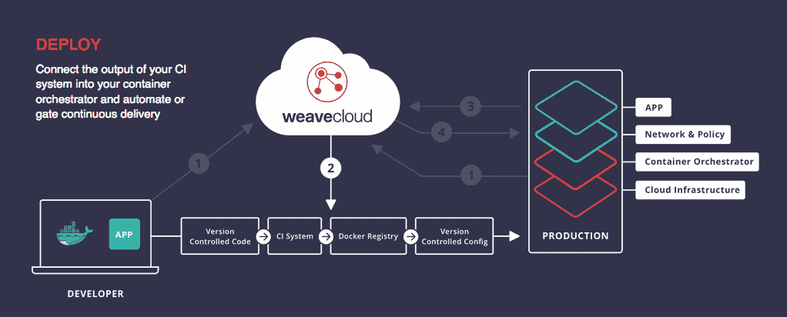

# Weaveworks 将网络、Prometheus 监控整合到云环境中——本地服务 Weave Cloud

> 原文：<https://thenewstack.io/weaveworks-knits-networking-prometheus-monitoring-cloud-native-service-weave-cloud/>

Weaveworks 将其流行的容器网络工具 [Weave Net](https://www.weave.works/products/weave-net/) 与其基于 Prometheus 的监控工具 [Weave Cortex](https://www.weave.works/news/weaveworks-introduces-monitoring-as-a-service/) 进行了整合，以产生一个软件即服务组合，称为 [Weave Cloud](https://cloud.weave.works/signup) 。

它上周在 KubeCon 推出了这项服务，在那里它还推出了一个故障诊断仪表板编织[范围](https://www.weave.works/introducing-weave-scope-1-0-now-with-weave-net-views/)。

“我们发现云原生的许多技术，无论是 Kubernetes、Prometheus 还是 OpenTracing，都相当新。开发人员不一定想在使用新工具之前了解它的一切。因此，对他们来说，说‘我们将开始为您运行这个项目’可能会很有吸引力。…我们提供这项服务是为了方便您的日常工作，”Weaveworks 首席执行官 [Alexis Richardson](https://twitter.com/monadic) 说道。

他说，随着越来越多的人开始使用这些工具，尤其是经验不足的人，他们会要求这些工具易于使用。

该公司宣传 Weave Cloud 的这些优势:

*   支持复杂的查询，帮助 DevOps 团队解决容器化应用程序中的问题。Weave Cloud 不需要编码来从基础设施收集基线指标，用户只需几行代码就可以从他们的应用程序中导出定制指标。
*   提供使用 Weave Net 构建的容器网络的可视化、监控和管理，同时还支持隔离服务和容器以及防火墙流量，以减少攻击面。
*   自动化繁琐且容易出错的步骤，从一组新的容器映像到在 Kubernetes 中运行的正确部署的服务。平台团队定义一个描述服务应该如何运行的策略，Weave Cloud 自动生成正确的 Kubernetes 配置文件，将它们签入源代码控制，并(可选地)将它们部署到 Kubernetes。

“如果你问一个开发者，‘容器化的云原生应用让你感到困扰的是什么’，他们会说，‘嗯，我不知道从哪里开始。但一旦我启动并运行了基本的 Docker 或 Kubernetes 集群，我就不知道下一步该做什么了。我们给他们答案。在一个产品中，我们给了他们需要的东西:监控、管理、安全、防火墙、持续部署，”他说。

对于云原生空间，[云原生计算基金会](https://www.cncf.io/)——理查森担任其技术监督委员会主席——正在构建人们将用来构建应用程序的新兴同类最佳工具。CNCF 选择了 [Prometheus 作为其继 Kubernetes 之后的第二个托管项目](https://thenewstack.io/cloud-native-computing-foundation-prometheus-second-hosted-project/)，然后增加了 [OpenTracing](https://thenewstack.io/opentracing-aims-clearer-view-processes-distributed-systems/) ，最近又增加了 [Fluentd](https://www.cncf.io/blog/2016/11/09/fluentd-joins-cloud-native-computing-foundation) 作为其日志项目。

Richardson 说，Weaveworks 填补了构建云原生工具的开源项目之间的空白。 [Weaveworks](https://thenewstack.io/connecting-containers-weaveworks/) 于 2014 年凭借 Weave Net 进入集装箱管理领域。4 月，它增加了建立 micro-SDN ( [软件定义网络](https://thenewstack.io/defining-software-defined-networking-part-1/))的能力和同时向大量容器多播信息的[能力。](https://thenewstack.io/weaveworks-makes-easier-deploy-kubernetes-1-2/)

“我们认为监控和可见性是你在云原生环境中所做的每一件事情的基础，”理查森说，他补充说，它正在构建“基于监控的平台”，他认为这是未来的趋势。

他说，因为 Weaveworks 在内部使用 Prometheus，所以它发现了一些限制，例如可以存储的数据量有限和高可用性。例如，它没有内置的快照功能。设置高可用性的普罗米修斯监控“有点像艺术形式”

通过与 Prometheus 社区的交流，它在新的数据模型上与 Cortex 一起稳步前进。

“它接受数据队列，这是时间序列数据库 Prometheus 的后端，并在此刻将其写入亚马逊 S3，格式与传统的 Prometheus 存储略有不同，以给你一个大得多的存储空间，”他说。“从本质上讲，S3 能容纳多少数据，你就能存储多少数据，这在你运行大规模应用程序而又不知道自己需要多少存储空间时非常有吸引力。”

目前，对于 HA，您可以并行运行多个 Prometheus 实例。如果有间隙，您必须确定哪一个从另一个中丢失了数据。

“弄清楚这一点本身就是一个练习，”他说，并解释说，Weaveworks 提出了一个不同的模型，可以成为云服务的一部分，一些客户(不一定是所有人)会发现这很有帮助。

至于突然出现的新监控公司，理查森指出了三个不同点:

“我们实际上不是在为您运行容器编制器。这是其他人都想做的，”他说。它旨在为那些只想自己运行 Docker 或 Kubernetes 的人提供附加服务和填补空白。“我们会给你你没有的东西；我们不会给你现有产品的新版本。”

第二:是跨平台的。

“我们不在乎是 Docker 还是 Kubernetes 或者两者都是。我们与 Rancher 和 Hashicorp 等公司有共同之处，但大多数人都在说，你必须在一匹或另一匹马身上下注，我认为这在市场上造成了一点混乱。我们想对客户说，‘你需要考虑的是应用，而不是基础设施。’让这变得容易的一部分是我们将与主要的开源编排平台合作，”他说。

第三:将监控融入一切。他解释说:大多数监控工具是你单独获得并插入自己的东西，然后你必须集成到你自己的系统中。

“我们相信，通过将我们自己集成到流程编排、持续部署、网络和安全中，我们可以为客户增加更多价值。”

[英特尔的 Matthew Brender 讨论遥测技术和英特尔 Snap 工具](https://thenewstack.simplecast.com/episodes/intels-matthew-brender-discusses-telemetry-and-the-intel-snap-tool)

云本地计算基金会和 Docker 是新堆栈的赞助商。

特征图片:[乔尔·库珀](https://www.flickr.com/photos/origamijoel/)的《[3d weave——变奏](https://www.flickr.com/photos/origamijoel/257823547/in/photolist-oMpXz-4veWuB-7vSJGs-5Pt8Gy-4SZUMC-9nU2JJ-74r8pv-8dv22t-qTkNe-7vSs5u-GaAo2-6bAHVx-fQhQb9-xQRJC-6ZFEhG-7fL3F4-3hbmg-oJedTV-asNixR-fUStqd-aDPFHU-4pQfCg-7fPnzj-5Pt8CJ-fqwUM-8CdPxz-8CdQvX-Ywzop-7YgKrg-8CdQRR-6Sp4jm-Tk5Bf-atghRf-HWyxC-7YkLy7-4R5uBH-MLmPL-5pZZ4s-aDPFK3-8ZQJqh-7cybfQ-8Z19LV-hZuqyr-aDKPhF-nCe6RH-bro3Nf-8FDqka-c2BMuf-eMEvmf-8iWadn)》，授权于 **[CC BY-SA 2.0](https://creativecommons.org/licenses/by/2.0/)** 。

<svg xmlns:xlink="http://www.w3.org/1999/xlink" viewBox="0 0 68 31" version="1.1"><title>Group</title> <desc>Created with Sketch.</desc></svg>