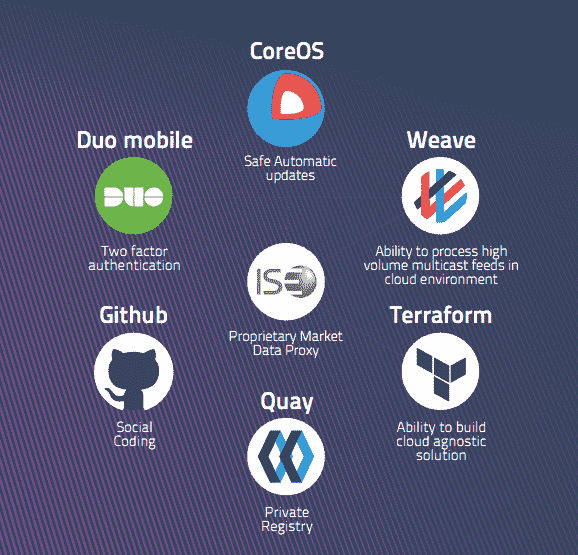

# Weaveworks 向 Kubernetes 提供网络多播服务

> 原文：<https://thenewstack.io/weaveworks-makes-easier-deploy-kubernetes-1-2/>

Weaveworks 是 [Weave Net](https://www.weave.works/products/weave-net/) 容器网络接口的制造商，它已经更新了软件，以支持[最近推出的](https://thenewstack.io/kubernetes-1-2-offers-rolling-updates-persistent-volumes/) Kubernetes 1.2 容器编排工具。

通过使用本地 Weave Net 网络插件， [Kubernetes](https://thenewstack.io/google-officially-launches-kubernetes-1-0-promises-to-give-you-evolution/) 用户现在拥有了几项新功能，包括建立微型 SDN ( [软件定义网络](https://thenewstack.io/defining-software-defined-networking-part-1/))的能力和同时向大量容器多播信息的能力。

Weaveworks 是许多试图用管理软件将容器管理扩展到网络层的公司之一，据分析家称，这将有助于容器进入生产。

Gartner 分析师 Andrew Lerner 在一份关于容器网络技术的报告中写道:“容器部署通常由希望基础设施不可见的应用程序和架构团队驱动，他们希望在开发时不必了解底层物理基础设施的限制。”。“这些团队希望他们的应用程序在整个开发阶段都以同样的方式工作。默认情况下，容器可以在笔记本电脑上运行，不需要改变底层网络。

在这个领域，Weave Net 与 CoreOS 的法兰绒、Calico 项目、Docker 的 SocketPlane 和 OpenStack 的 OVN 展开了竞争。

Weaveworks 声称提供了唯一可以完全模拟第二层网络的容器网络软件，包括以太网用来寻址网络上所有节点的多播包复制。在多播中，来自单个源的数据可以同时发送到多个源，这对于与多个端点通信和共享数据非常有用。

“当用作 Kubernetes 的网络层时，Weave Net 现在允许在 Kubernetes 集群上运行的容器发送和接收组播源，”Weaveworks 的首席运营官 [Mathew Lodge](https://twitter.com/mathewlodge) 解释道。据公司称，[一位该技术的早期用户能够以 800 Mbps 的速度传输，足以同时传输 28 部高清电影。](https://www.weave.works/docker-container-networking-multicast-fast/)

凭借这一新功能，Weaveworks 正在将 Kubernetes 的潜在市场扩展到依赖多播网络的金融服务应用程序。

“金融服务应用程序通常使用多播网络来分发关键信息，如市场数据馈送。例子包括纽约证券交易所和纳斯达克市场数据，以及许多专有的银行交易应用程序，”洛奇说。

例如，国际证券交易所(ISE)“Anywhere Exchange”使用 Weave Net 将多播市场数据传送到 ISE 交易所的冗余副本，在 AWS 的容器中和自己的数据中心运行。

国际证券交易所 ISE 如何将 Weaveworks 与其他技术一起使用。

在金融服务之外，多播也经常用于企业消息中间件和内容分发

由于“微型 SDN”功能，新版本还为 Kubernetes 集群带来了更大的网络灵活性。Lodge 解释说，“Weave Net 实现了一个‘微 SDN’，为容器化的应用提供一个简单的网络，提供全服务发现，不需要任何配置或编码，没有外部依赖性。其独特的互联网式方法，即由相互协作的独立编织路由器组成的网络，避免了对数据库或集群存储的任何集中依赖，并使其成为生产容器网络的最佳解决方案，在这种网络中，停机和网络分区是不可避免的事实。”

对于混合云用户，Weave Net 1.5 创建了一个简单的扁平虚拟容器网络，没有集中式数据库，因此，它可以用于构建混合云容器部署，其中应用程序跨私有数据中心和公共云。

Weaveworks 还使 Weave Net 在主机故障和重启后出现问题时能够更快地重启，这是改善容器集群恢复时间和弹性的重要部分。

CoreOS、Docker 和 Weaveworks 是新堆栈的赞助商。

<svg xmlns:xlink="http://www.w3.org/1999/xlink" viewBox="0 0 68 31" version="1.1"><title>Group</title> <desc>Created with Sketch.</desc></svg>