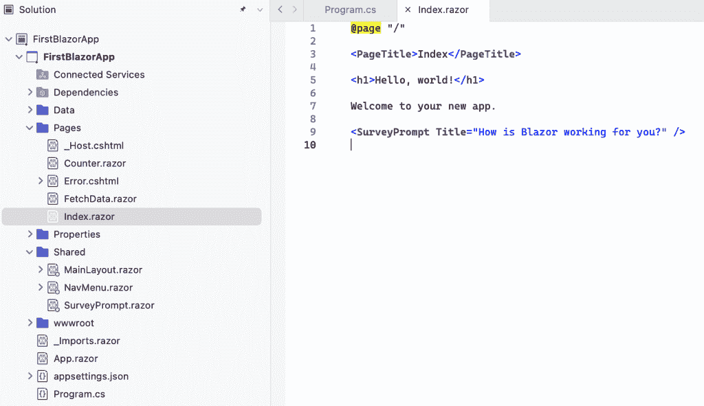
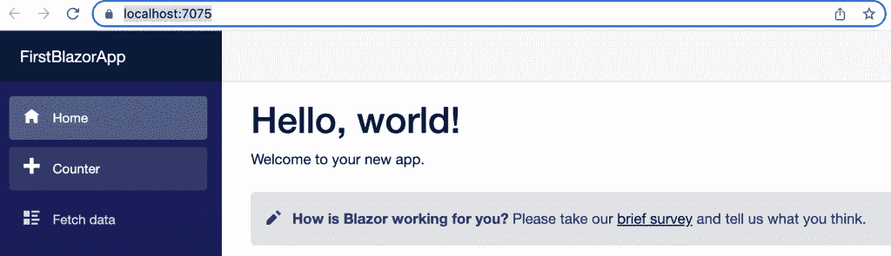
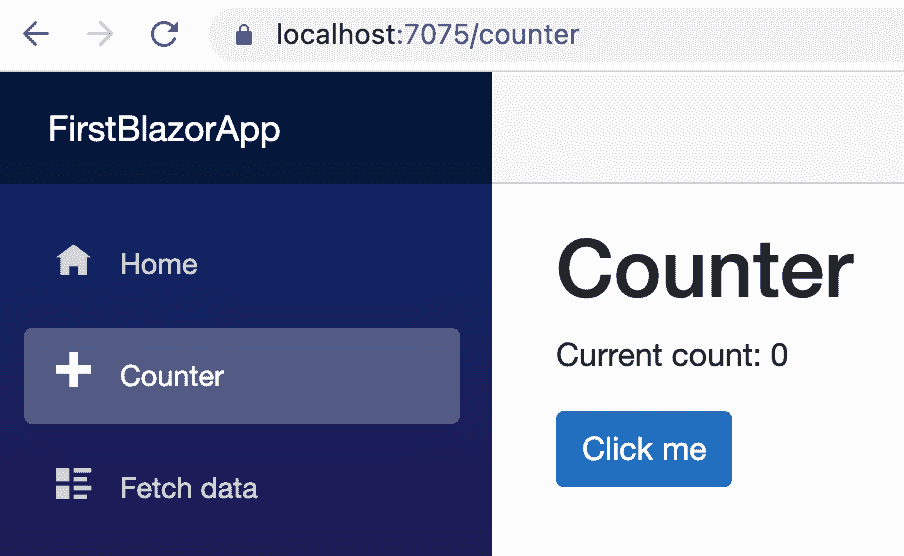

# 没有 JavaScript 的 Web 应用程序开发，使用 Microsoft Blazor

> 原文：<https://thenewstack.io/web-app-development-sans-javascript-with-microsoft-blazor/>

Blazor 是微软的一个框架，它鼓励开发者“利用。NET 和 C#来构建全栈的 web 应用，而不用编写一行 JavaScript。”

好吧，你让我在“没有写一行 javascript。”明智的开发人员可能很想知道这是否只是一头栽进了 React 的洪流中。这两个堆栈之间的比较可能对微软不利，因为他们在现代网络技术方面没有很好的记录。但由于 Blazor 可以使用 WebAssembly (Wasm)在浏览器中运行，它应该会有一个有趣的未来，所以我想我会顺便看看它是如何工作的。在这篇文章中，我将确保 Blazor 遵循 web 应用程序开发的标准预期。

那么，作为一名经验丰富的 web 栈开发人员，我期望看到什么呢？

*   强大的 Visual Studio 集成。毕竟，这是世界上最耀眼的明星。净冰天。
*   HTML 的某种干净的模板方法。
*   使用 Bootstrap 的能力或类似的可视化组件的模块化特性。
*   编辑和查看结果之间相对轻松的循环。这种形式的热重载是你在 web 开发中花费大部分时间做的事情。

首先，我浏览了入门视频(共有 11 个)。这是一个穿着闪亮紫色外套的男人提供的“镍之旅”，但他很快就陷进去了。首先他安装了一个版本的。NET，让我有点不确定我的高数版本是好是坏。

```
TheNewStack>  dotnet  --version
7.0.200

```

我从未在命令行中使用过 **dotnet** 命令，但这似乎是一种用模板启动新项目的熟悉方式:

```
TheNewStack>  dotnet new
The  'dotnet new'  command creates  a  .NET project based on  a  template.
Common templates are:
Template Name Short Name    Language    Tags

---

[ASP.NET](http://asp.net/) Core Web App  webapp,razor  [C#]        Web/MVC/Razor Pages
Blazor Server App blazorserver  [C#]        Web/Blazor
Class Library classlib      [C#],F#,VB  Common/Library
Console App console [C#],F#,VB  Common/Console

```

对于演示来说，它看起来有些不同，但是已经提到了 Blazor 项目模板，这是令人放心的。

此外，我用的是苹果 Mac 电脑，有人礼貌地告诉我应该可以正常工作。

```
>dotnet new blazorserver  -o  FirstBlazorApp

```

结果是一个 csproj 文件。然后我们被指引在 VS Studio 2019(我有 2022)中打开这个。

在里面，我看到了一个 *Index.razor* 文件:



这是一个令人愉快的 HTML，有一些明显的修改。(所以从技术上讲，Razor 是服务器端标记语言，是做模板的部分——因此有后缀。)

在一些证书管理之后，应用程序运行并指引我到我的 **localhost:7075 上一个简单的演示前端。**



如果您熟悉 Rails 或 [Sinatra](https://thenewstack.io/ruby-devs-try-sinatra-before-moving-up-to-ruby-on-rails/) ，您将会认识到 *Index.razor* 中的@page 指令是处理 HTTP 请求的**路由**——在本例中，是请求站点根的请求。

Visual Studio 帮助我看到 SurveyPrompt 和 PageTitle 显然是 HTML 闯入者，但这正是我们所需要的。事实上，正如穿紫色夹克的人所指出的，在共享目录中已经有一个 *SurveyPrompt.razor* 文件。因此，我们有了一个很好的**组件架构**(或者像 Rails 中的**部分**)，很明显，父组件将参数标题传递到组合中:

```
<div class="alert alert-secondary mt-4">
    ...
        <strong>@Title</strong>
        ...
        and tell us what you think.
</div>

@code  {
    // Demonstrates how a parent component can supply parameters
    [Parameter]
    public  string?  Title  {  get;  set;  }
}

```

这已经回答了我在开始时提出的模板问题。当你把代码和 HTML 结合在一起时，每一部分都必须做出一点妥协——但这似乎在情理之中。你可以用 C#编写代码，并且很容易地在 HTML 中来回传递值。在上面的例子中，底层代码部分与 HTML 完全分离。

我无法在我的 Mac / Visual Studio / Chrome 系统上热重装，尽管 Purple 先生显然可以用他的老版本 VS、Edge 或者 IIS Express 连接热重装。对我来说，如果我尝试做一些小的改变，新的一页就开始了。如果可以的话，我稍后会回到这个问题上。否则，我的混合设置可以开箱即用——十年前我不会在微软身上下注。

看起来 razor 文件可以作为一个组件或者一个页面使用。当紫色人将计数器组件添加到索引页面时(很像 SurveyPrompt)， *Counter.razor* 位于页面目录中。并出现在站点的布局中:



所以人们会认为它有某种“/反”路线。的确如此:

```
@page  "/counter"

<PageTitle>Counter</PageTitle>

<h1>Counter</h1>

<p  role="status">Current count:  @currentCount</p>

<button class="btn btn-primary"  @onclick="IncrementCount">Click  me</button>

@code  {
    private int currentCount  =  0;

    private void IncrementCount()
    {
        currentCount++;
    }
}

```

实际上，你可以用@page 指令在任何页面上随意添加路线。再深入一点，我们可以看到路由是如何在 *App.razor* 文件:
的布局中推动页面的

```
<Router AppAssembly="@typeof(App).Assembly">
    <Found Context="routeData">
        <RouteView RouteData="@routeData"  DefaultLayout="@typeof(MainLayout)"  />
        <FocusOnNavigate RouteData="@routeData"  Selector="h1"  />
    </Found>
    <NotFound>
        <PageTitle>Not found</PageTitle>
        <LayoutView Layout="@typeof(MainLayout)">
            <p  role="alert">Sorry,  there's  nothing at this address.</p>
        </LayoutView>
    </NotFound>
</Router>

```

在路由器管道之间，引用当前程序集和 404 页面未找到警告，是“MainLayout”参数。是的， *MainLayout.razor* 是另一个共享组件:

```
@inherits LayoutComponentBase

<PageTitle>FirstBlazorApp</PageTitle>

<div class="page">
    <div class="sidebar">
        <NavMenu  />
    </div>

    <main>
        <div class="top-row px-4">
            <a  href="https://docs.microsoft.com/aspnet/"  target="_blank">About</a>
        </div>

        <article class="content px-4">
            @Body
        </article>
    </main>
</div>

```

这表明某种类型的模块化 CSS 被愉快地包含在内了，这看起来显然很愚蠢。

所以我们有 Visual Studio 集成、组件、页面和布局。我想说我们基本上是好的。视频中的紫衣男子说的是实话。

在下一篇文章中，我将更深入地研究 Blazor，看看它超越基本 web 开发的本质。

<svg xmlns:xlink="http://www.w3.org/1999/xlink" viewBox="0 0 68 31" version="1.1"><title>Group</title> <desc>Created with Sketch.</desc></svg>