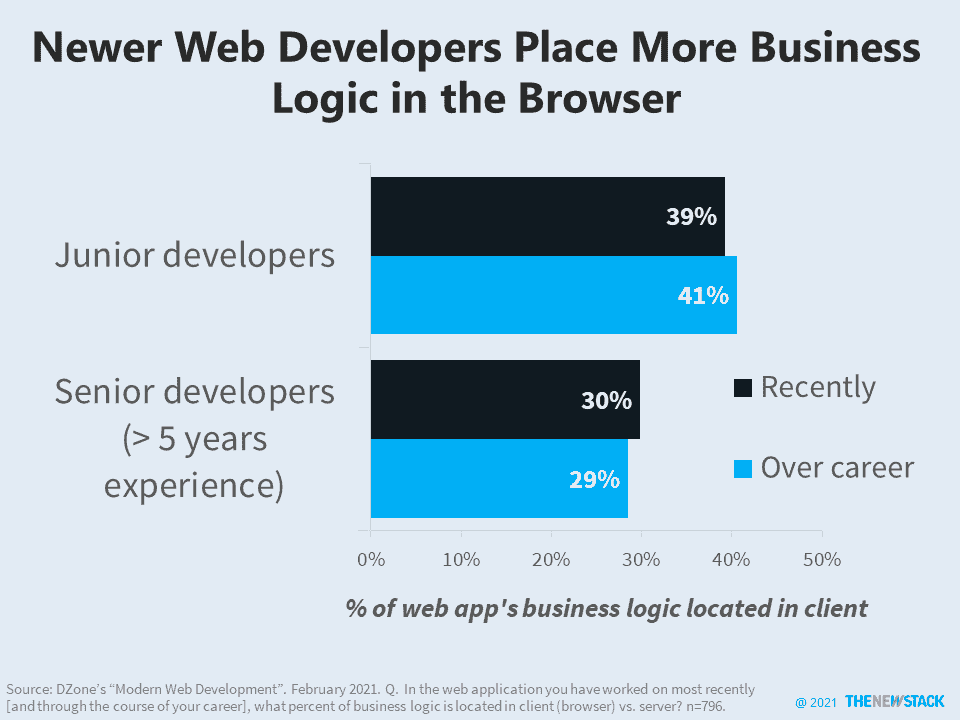

# Web 开发人员没有将更多的业务逻辑转移到客户端

> 原文：<https://thenewstack.io/web-developers-not-moving-more-business-logic-to-the-client/>

客户端编程的进步，无数的应用程序能够在浏览器中编译和运行，这就是为什么初级开发人员说他们最新的 web 应用程序中 39%的业务逻辑位于客户端而不是服务器端。相比之下，根据 2021 年 2 月为 DZone 的[“现代网络开发”](https://dzone.com/trendreports/modern-web-development)趋势报告进行的一项调查，只有 30%拥有五年以上经验的开发人员这么说。

尽管围绕“无头内容管理”有了一些动作，比如 [Jamstack](https://thenewstack.io/survey-jamstack-users-look-beyond-performance-gains-next-js/) 甚至 [WebAssembly](https://thenewstack.io/what-is-webassembly/) ，但是从统计上看，开发人员放置新代码的位置并没有显著变化。遗留 web 应用程序的巨大基数意味着这些统计数据在未来几年可能会以蜗牛的速度移动。

“业务逻辑”通常是描述为组织提供独特价值的应用程序逻辑的简写。业务逻辑是置于一组核心基础设施和抽象之上的东西。不管这个基础设施被称为浏览器、服务器、虚拟机还是容器。如果这样考虑的话，一些策略师建议除了业务逻辑之外的一切都应该“外包”给基础设施提供商、供应商或开源社区。归根结底，开发人员应该对应用程序中大约 40%的业务价值(也就是业务逻辑)负责吗？

计算密集型任务通常不在浏览器中完成。来源:DZone 的“现代 Web 开发”

<svg xmlns:xlink="http://www.w3.org/1999/xlink" viewBox="0 0 68 31" version="1.1"><title>Group</title> <desc>Created with Sketch.</desc></svg>