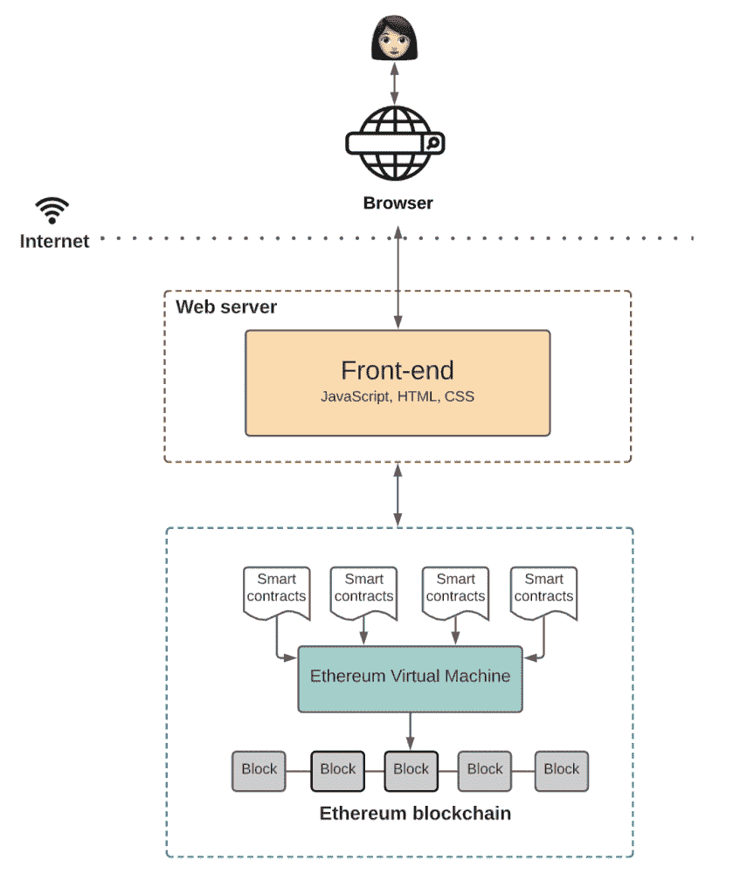
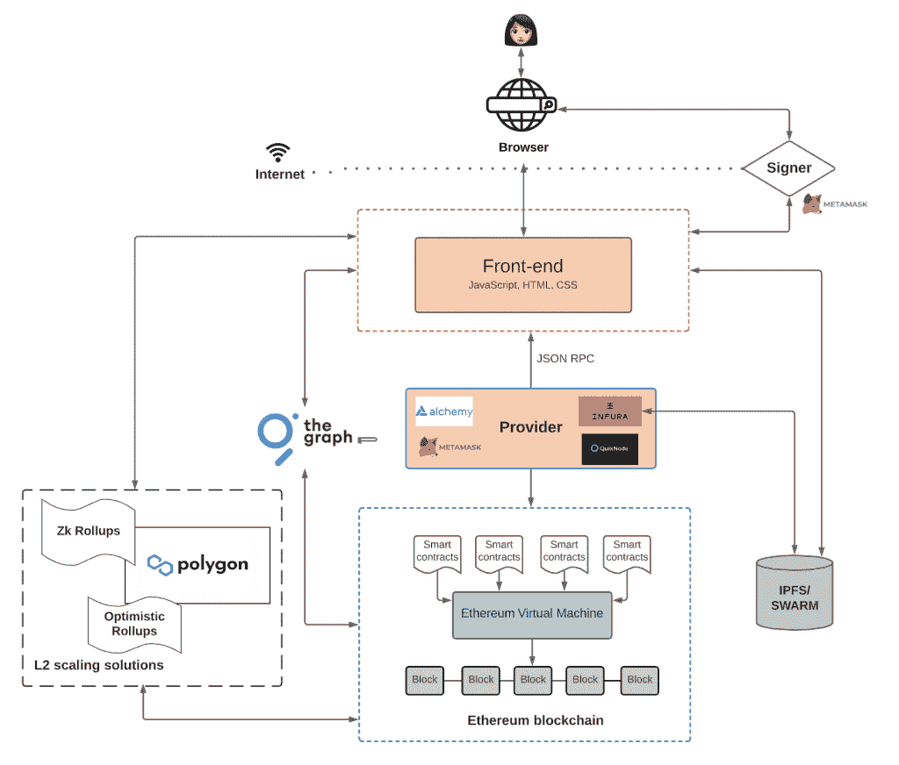

# Web3 架构及其与传统 Web 应用的比较

> 原文：<https://thenewstack.io/web3-architecture-and-how-it-compares-to-traditional-web-apps/>

 [理查德·麦克马努斯

理查德是 New Stack 的高级编辑，每周撰写一篇关于网络和应用程序发展趋势的专栏文章。此前，他在 2003 年创立了读写网，并将其打造为全球最具影响力的科技新闻和分析网站之一。在 Twitter @ricmac 上关注他。](https://twitter.com/ricmac) 

风险投资家克里斯·迪克森(Chris Dixon)上周在 Twitter 上发了一条关于“为什么 Web 3 很重要”的帖子[引发了一场辩论安德森·霍洛维茨律师事务所(Andreessen Horowitz)的合伙人迪克森坚信“下一波计算机创新将由密码驱动。”他对“Web3”(一个更常见的术语，称为“Web 3”)的定义围绕着区块链和加密货币技术，a16z 在这个市场投入了大量资金。](https://twitter.com/cdixon/status/1442201621266534402)

根据 Dixon 的说法，Web3 是“由建设者和用户拥有的互联网，由令牌精心安排。”他将这个新时代定位为 Web 2.0 (2005-2020)的一种解毒剂，Web 2.0 被脸书、谷歌和亚马逊等集中式平台所主导。在 Web3 中，[他说](https://twitter.com/cdixon/status/1442201637779480578)，“所有权和控制权是分散的。”

Dixon 没有详细说明从网络架构的角度来看 Web3 会是什么样子——除了说它将全部建立在区块链上，他相当奇怪地将它定义为“任何人都可以访问但没有人拥有的特殊计算机”大多数人认为区块链更像是一个数据库，而不是一台计算机。维基百科有一个很好的、实际的描述:“区块链是一个不断增长的记录列表，称为块，使用加密技术链接在一起。”迪克森后来澄清说，他指的是“像以太坊一样的可编程区块链”，他说这是“运行代码并保持状态的虚拟计算机”

即使我们承认一些区块链是计算机，事实是在这个时候它们不是非常高效的计算机——以太坊因其处理(交易)缓慢和无法扩展而臭名昭著。但除此之外，Web3 架构的其余部分是什么？更重要的是，开发者将如何在其上构建应用？

## Web3 应用架构

[Preethi Kasireddy](https://www.linkedin.com/in/preethi-kasireddy-41383528/) ，2013-15 年在 a16z 工作，2016-17 年在比特币基地担任工程师，最近在[发表了一篇博文](https://www.preethikasireddy.com/post/the-architecture-of-a-web-3-0-application)，解释了“Web 3.0 应用的架构”她也关注以太坊区块链，这是过去几年中所谓的“dapps”([分散应用](https://ethereum.org/en/dapps/))的主要平台。

根据 Kasireddy 的说法，dapp 的后端编程与传统的 web 应用程序完全不同。在 Web3 中，她写道，“你可以编写智能契约来定义你的应用程序的逻辑，并将它们部署到去中心化的状态机上[即以太坊区块链]。”在这种模式下，不再需要网络服务器和传统数据库——因为一切都在区块链或其周围完成。

她在帖子的后面提到“智能合同是用高级语言编写的，比如 Solidity 或 Vyper。”Solidity 部分受到 ECMAScript 语法的启发，因此它与 JavaScript 有一些相似之处(但在其他方面[非常不同](https://vomtom.at/whats-the-difference-between-javascript-solidity-and-ethereum/))。

至于前端，“除了一些例外，基本保持不变，”卡西雷迪写道。她在下图中展示了简化的 Web 3 应用程序架构:

到目前为止，一切顺利。但是后来她陷入了区块链的一些麻烦之中。首先，dapps 很难扩展，因为你的应用程序用得越多，在以太坊上运行的成本就越高。以太坊上的每一笔交易都需要支付一笔费用，称为“汽油”，这笔费用(像加密货币中的所有东西一样)受极端价格波动的影响。

“签名”交易也很复杂，这是保证区块链安全的加密过程。你需要一个像[元掩码](https://metamask.io/)这样的工具来处理这个问题。

但是等等，还有更多(并发症)。Kasireddy 写道，存储解决方案是必需的，因为“任何在以太坊上开发应用程序的人都知道，在区块链上存储所有东西会变得非常昂贵，非常快。”所以你需要的是“一个分散的离线存储解决方案，就像 IPFS 或 Swarm 一样。”[星际文件系统](https://ipfs.io/) (IPFS)，是一个名副其实的协议和分散数据存储系统，它利用了点对点(p2p)网络架构，正如[最近关于新堆栈的文章](https://thenewstack.io/interplanetary-file-system-could-pave-the-way-for-a-distributed-permanent-web/)中所解释的。

好的，我们似乎在给之前简单的 Web 3 架构添加额外的部分。Kasireddy 在她的帖子中讨论了更多这样的补充，但长话短说，这是我们最终得到的图表:

这是一个比传统 web 应用程序复杂得多的架构。也许这解释了为什么到目前为止，主流 dapps 如此之少——它们是如此难以构建！

现在，我想指出的是，一些 Web3 开发者很清楚这些问题，他们正在努力解决这些问题。Nader Dabit 是一个我很钦佩的开发者，他公开了他所谓的 Web3 的缺点。去年八月我采访了达比特，当时他是亚马逊网络服务(AWS)的高级开发人员，现在他在一家名为 Edge Node 的 Web3 公司工作。在最近的一篇 Twitter 帖子中，[他承认](https://twitter.com/dabit3/status/1444091067532447750)“仍然有许多东西无法用现有的[Web3]解决方案来构建，因此不得不逐步去中心化，或者暂时或无限期地使用集中式解决方案。”

## Web3 的问题是… Dapps

与传统的 web 应用程序相比，dapps 不仅难以构建，而且用户体验也很差。

我花了一年时间用我在 2018 年运营的独立博客报道区块链技术，名为 Blocksplain(它已经不在线了)。该出版物特别关注 dapps，而不是 crypto 的推测方面。所以那一年，我测试了很多 dapps。几乎在所有情况下，这些应用程序都很难使用，速度慢，而且不太可靠。有一次，在测试区块链的 Twitter 替代品时，由于 MetaMask 的问题，我无意中把自己锁在了账户之外。我一直没找到重新登录的方法。我结束了 2018 年，对区块链完全没有兴趣，并准备转向更丰富的领域(事实证明，我回到了 web 开发，这曾经是——现在仍然是——正在经历复兴)。

当然，区块链技术自 2018 年以来一直在发展，但即使如此，我也没有意识到 2021 年有任何突破性的主流 dapps。此外，正如 André Staltz [指出的那样](https://twitter.com/andrestaltz/status/1442579313291792385)，目前似乎还没有 dapps 主要是“与金钱无关的事情”的例子顺便说一句，Staltz 对分散式应用程序了如指掌——他是一个*非区块链*分散式社交网络的创始人，该网络名为 [Manyverse](https://www.manyver.se/) ，我在今年早些时候[写了这篇文章](https://thenewstack.io/scuttlebutt-decentralize-and-escape-the-social-media-rat-race/)。

我并不是说 dapps 没有前途，也不是说 Kasireddy 概述的 Web3 架构注定要失败。但事实是，区块链面临着相当大的挑战——尤其是在它们之上开发应用程序的时候。架构太复杂，存在明显的技术限制(正如 Dabit 所指出的)，以太坊这样的平台既慢又贵(更不用说[环境影响](https://www.ft.com/content/1aecb2db-8f61-427c-a413-3b929291c8ac))，而且还没有证据表明主流用户甚至想要区块链应用。

## 未信服的

Chris Dixon 在他的 Twitter 帖子中阐述的愿景非常诱人——谁不想“拥有互联网的一部分”，正如他所说的那样。我也不愿意押注像迪克森这样聪明的人，我在报道 Web 2.0 时代时就对他很熟悉(他甚至出现在我的公司 ReadWriteWeb 于 2011 年举办的一次会议上)。随着时间的推移，他对 Web3 的看法可能会被证明是正确的。

但截至 2021 年，我并不信服。从 web 架构和性能的角度来看，传统的“集中式”web 应用程序远远优于 dapps(或其他分散式应用程序)。dapps 架构需要进行相当大的技术改进，才能与传统的网络应用相媲美。

*又见:**[web 3 真的去中心化了吗？一看炼金术和 BitClout](https://thenewstack.io/web3-isnt-fully-decentralized-a-look-at-alchemy-bitclout/)***

<svg xmlns:xlink="http://www.w3.org/1999/xlink" viewBox="0 0 68 31" version="1.1"><title>Group</title> <desc>Created with Sketch.</desc></svg>