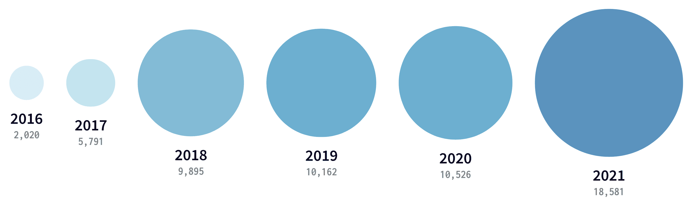
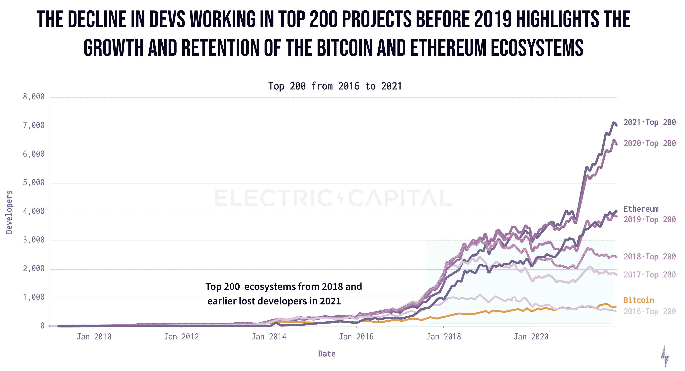
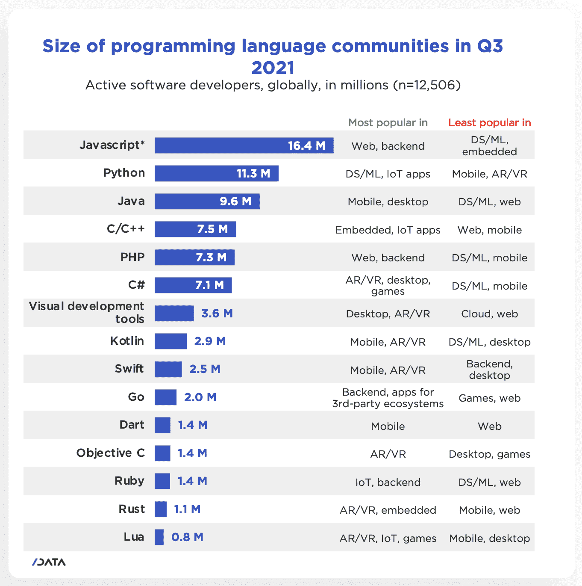
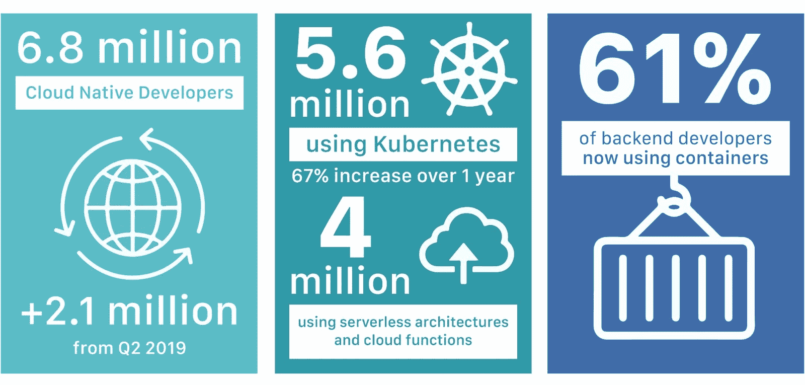

# Web3 开发者生态系统很小，但在 2021 年有很大的发展

> 原文：<https://thenewstack.io/web3-developer-ecosystem/>

根据加密风险投资公司[电力资本](https://www.electriccapital.com/)的一份报告(可从 GitHub 上的[下载](https://github.com/electric-capital/developer-reports/blob/master/dev_report_2021.pdf))显示，在 Web3 生态系统中至少有 18，000 名活跃的开发者。这是每月至少一次将代码提交到开源 crypto 和 Web3 项目中的开发人员数量。Web3 开发人员的总数可能会更高，因为该报告没有计算专有项目的工作量。但这很好地反映了开发者对 Web3 的兴趣。

 [理查德·麦克马努斯

Richard 是 New Stack 的高级编辑，每周撰写一篇关于 web 和应用程序开发趋势的专栏文章。此前，他在 2003 年创立了读写网，并将其发展成为世界上最有影响力的博客之一。在 Twitter @ricmac 上关注他。](https://twitter.com/ricmac) 

每月有超过 4000 名(22%)活跃的开源开发者在以太坊上工作，其次是 680 多名在比特币区块链上开发的人。Polkadot、Cosmos 和 Solana 是区块链 Web3 开发项目的前五名。

许多新的开发者也蜂拥进入这个领域。2021 年，34，000 名新开发人员为开源加密项目做出了贡献，这是自 2018 年以来新进入者人数最多的一年。事实上，目前从事 Web3 项目的开发人员中有 60%是从 2021 年开始的。超过 20%的 noob 开发者加入了以太坊生态系统。

在[与 Unchained Podcast 的](https://unchainedpodcast.com/65-of-active-developers-joined-web3-in-2021/) [Laura Shin](https://twitter.com/laurashin) 的采访中，Electric Capital 的分析师 [Maria Shen](https://twitter.com/MariaShen) 指出，几个区块链有重要的闭源方面:Solana(区块链五大开发者之一)是其中之一，还有 Avalanche、Terra 和 Flow。

随着时间的推移，Web3 开发人员的增长；来源:电力资本

## 与其他开发者市场的相似之处

这些 Web3 趋势与更广泛的开发者开源社区有相似之处。除了以太坊和比特币，2018 年排名前 200 的加密项目基本上都失去了开发人员。这可能是因为那些项目已经成熟，不需要那么多工作(也可能是因为那些项目中的一些已经失败)。例如，这种趋势与云原生生态系统没有什么不同——在云原生生态系统中，一旦交付 1.0，项目就可以摆脱开发人员。

同样值得注意的是，2018 年和 2021 年加密领域开发参与度的跃升发生在加密估值峰值之后。这类似于大约从 2013 年开始，在大量风险投资进入雪花、GitLab 和 Sentry 等公司后，开发人员涌入云原生生态系统。

随着 2021 年加密货币估值的增加，加密市场的风险资本数量也显著增加。风投资助的 Web3 风险企业可能有很长的路要走，但对于那些只依赖硬币价格的初创公司来说，情况可能就不一样了。加密货币的不稳定性使得这些公司更容易受到开发者跳槽的影响——无论他们的 Web3 平台是否开源。

2021/22 年 Web3 开发者市场的另一个关键因素是 NFTs 变得非常受欢迎，这是基于与它相关的互联网迷因文化对[主流文化](https://www.rollingstone.com/culture/culture-news/bayc-bored-ape-yacht-club-nft-interview-1250461/)越来越大的吸引力。这无疑吸引了开发人员，尽管值得注意的是，编码对 NFT 的成功并不像对全功能“去中心化应用”(d app)那样至关重要。正如沈指出的，“如果你看一下的集合，[……]它的很多部分都在部署一个[智能]合约，这实际上是大部分代码。因此，编写的代码量有时非常少。”

## 与其他程序员相比，Web3 开发人员

但是，我们不要高兴得太早——相对而言，18，000 名活跃开发人员只是沧海一粟。正如 Electric Capital 在其报告中指出的，“Web3 开发人员的增长已经打破了记录，但仍然只占全球软件工程师的一小部分，而且还在迅速增长。”

事实上，与整个网络开发者市场相比，18，000 这个数字是很小的。根据总部位于伦敦的开发者研究公司 SlashData 的数据，2021 年第三季度有超过 2680 万的“活跃软件开发者”。仅 JavaScript 就有 1640 万开发者，Python 紧随其后，有 1130 万开发者。Java 是另一种非常受欢迎的编程语言，据 SlashData 统计，有 960 万开发人员。鉴于其最近的增长轨迹，JavaScript 可能每周增加 18，000 名新开发人员。

即使与云原生生态系统相比，Web3 仍然非常小。根据云本地计算基金会(CNCF)的数据，有[680 万](https://www.cncf.io/blog/2021/12/20/new-slashdata-report-5-6-million-developers-use-kubernetes-an-increase-of-67-over-one-year/)云本地开发者。

## 现在还早

Web3 倡导者的一个保留意见是，我们正处于这个互联网时代的早期阶段。虽然这部分解释了 Web3 开发者数量少的原因，但另一个因素是更广泛的 Web 开发者社区中的许多人对区块链技术持高度怀疑态度。

最近一个高调表示对 Web3 持保留态度的开发者是加密即时通讯服务 Signal 的创始人莫邪·马林斯派克。在一篇吸引了超过 28000 个赞和 10000 次转发的博文[中，马林斯派克写下了他创建 Web3 应用的实验。他的结论是:“我不认为这是一条将我们从集中式平台中解放出来的轨道”(也就是 Web 2.0)。"](https://moxie.org/2022/01/07/web3-first-impressions.html)

尽管目前开发人员持怀疑态度，但显然对区块链的潜在应用有很大兴趣。例如，网络公司的亿万富翁和投资者马克·库班认为 NFTs 可以改变图书发行。在一条推文中，他写道，通过以 NFT 的名义发行一本书，与该 NFT 相关的智能合同将允许“向作者、出版商、教师、学校等支付版税。”

就像所有与区块链有关的事情一样，分散图书发行在理论上听起来不错，但在现实中，当前的技术基础设施可能无法应对挑战。但是对于 Web3 的拥护者来说，这就是 Web 应用程序新框架的美妙之处——这是一个蓝天领域，如果开发者能够让它工作，它可能会给所有相关人员带来巨大的经济回报。

*作者注:感谢[劳伦斯·赫克特](https://thenewstack.io/author/lawrence-hecht/)，他帮助研究并为本文提供见解。*

<svg xmlns:xlink="http://www.w3.org/1999/xlink" viewBox="0 0 68 31" version="1.1"><title>Group</title> <desc>Created with Sketch.</desc></svg>