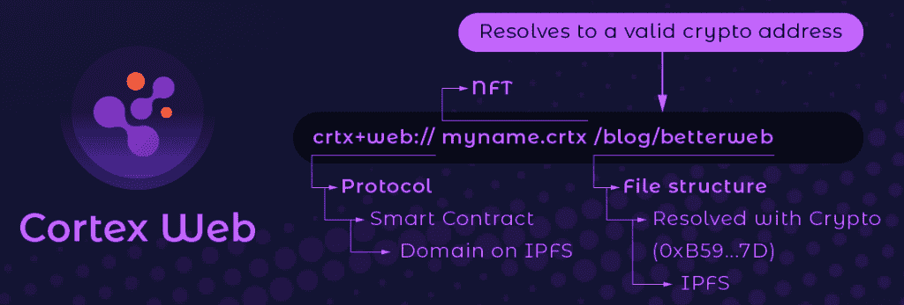

# 面向出版的 web 3:Cortex 应用推出内容网络

> 原文：<https://thenewstack.io/web3-for-publishing-cortex-app-launches-a-content-network/>

分散的应用程序开发人员很大程度上依赖于集中的服务，如发布内容的概念和媒介，无论是文档，营销材料，还是关于 Web3 生态系统的想法。这有一些好处，因为大多数读者都熟悉这些集中的内容中心，而设立账户和发布内容的门槛非常低。然而，一些 Web3 原生发布工具开始出现，利用基于钱包的身份管理、访问控制的 NFTs 和文件存储的 IPFS。

这些工具中有一个不仅对 Web3 开发者，而且对任何想利用 Web3 进行发布的人都有希望，那就是 [Cortex App](https://www.crtx.app/) 。dApp 的早期演示显示用户在笔记本式结构中创建私人笔记，使用 Markdown 进行文本格式化。notes 的文件存储使用 IPFS，并计划在未来使用其他存储选项。角色允许笔记创建者指定发布的内容是否对外界可见，或者是否需要令牌才能访问。这让我想起了博客的早期，在活字印刷和 WordPress 使博客变得简单之前，使用样式表和手工制作的 HTML 页面。

## Cortex 网络分散了内容发布

Cortex App 背后的团队刚刚宣布了[Cortex Network](https://medium.com/cortex-app/after-over-a-year-of-building-the-cortex-app-team-is-launching-a-new-web3-content-network-the-293681179ccd)，旨在为社交发布和博客带来一种去中心化的方法，支持 HTML 页面、图像、音乐和视频等内容类型；以及文档和项目管理。Cortex 网络有两个主要角色:用户和发布者。用户拥有一个. hmn 域身份，这是一个在面区块链上生成并存储在钱包中的 NFT。出版商在更新内容并使其可用方面扮演着各种角色，无论是个人还是出版物的一部分。

在接受 New Stack 采访时，Cortex App 联合创始人[伦纳德·基什](https://www.linkedin.com/in/leonardkish/)解释道。“通过使用出版商模式，你不需要成为密码专家就能使用 Cortex，”他说。“出版商可以接受传统的支付方式，并为人们处理加密方面的问题。我们也让声称 NFT 域名像。hmn 非常简单——只需发一条推文。未来的更新将允许甚至非加密的人声称一个 NFT 域名开始。”

我试着要我自己的。hmn NFT 域。虽然这很容易，只需要我发一条推文，但这一过程是否奏效还远未可知，因为没有对推文的回复或确认。他们已经更新了 hmn.domains 网站，使其更加直观。可以[认领自己的](https://www.hmn.domains/)。hmn 域名。

## 扩展 Web3 内容发布

创建 Web3-native 发布工具的挑战之一是可伸缩性。如果每次更新都被写入区块链，这可能意味着大量的提交。例如，想象一下，Twitter 上的每条推文都需要得到一致同意。Kish 这样解释 Cortex 的可扩展性:“Cortex 使用共享和内容端查找密钥生成，并通过 IPFS 与分散存储相结合。这使得每个内容创建者、消费者和发布者只处理他们需要的信息。此外，HDIndex 和 HDData 允许批量创建并行化和合并，因此即使发布也可以水平扩展。发布者的单个链上更新可以包括非常大量的单独提交(本地更新。)"

这触及了 Cortex App 发布内容的核心。HDIndex 是一种基于 [Merkle 树](https://en.wikipedia.org/wiki/Merkle_tree)的加密数据结构，它定义了本地状态并允许快速数据查找。它还允许内容版本化，类似于 Git 管理版本历史的方式。HDData 是一个键值存储，用于在 IPFS 查找内容。这些密钥源自 HDName，这是一个人类可读的名称空间，允许 Web3 URLs 指向分散发布后端中的内容。

## Cortex 网络中的出版商

发布者角色的行为类似于利益相关证明区块链中的挖掘者，基于令牌锁定来验证事务。发布者似乎也执行类似于网站或应用程序发布者的功能，他们决定内容发布的频率以及哪些用户可以发布到出版物。“出版商可以完全控制他们决定在他们的 feed 中发布什么，”Kish 说。“他们为自己的 feed 策划和聚合内容。创建者将内容发送给一个或多个发布者，发布者决定是否将内容发布到他们的订阅源。这可以基于与出版商的关系，或者对于公共内容，无论主题是什么。”

Cortex 团队目前正在寻找有兴趣成为出版商的项目。与拥有验证器的项目类似，作为一个发布者，您需要标记令牌(在本例中为 crtx ),这允许您成为 Cortex 生态系统中的发布者，并拥有一个用于发布的. CRTX 域。个人可以建立自己的 publisher，但我怀疑会有一些 publisher 项目出现。

对于 Cortex 的用户和出版商模式，我最感兴趣的是，它感觉很像 RSS 的工作方式。作为用户，我可以选择发布与我的身份相关的内容。然后，出版商可以将来自多个用户的内容合并到集合这些内容的出版物中。通过支持用户内容上下文中的令牌化，用户角色最终保持了对谁可以访问的控制——这解决了 RSS 有时会出现的一些大规模盗版问题。分散发布模式防止个人用户被平台或不同意用户发布内容的政府屏蔽。

大部分功能将在今年夏天推出，所以我很有兴趣看看人们通过 Cortex App 分享了什么，以及出版商是如何使用它的。

<svg xmlns:xlink="http://www.w3.org/1999/xlink" viewBox="0 0 68 31" version="1.1"><title>Group</title> <desc>Created with Sketch.</desc></svg>