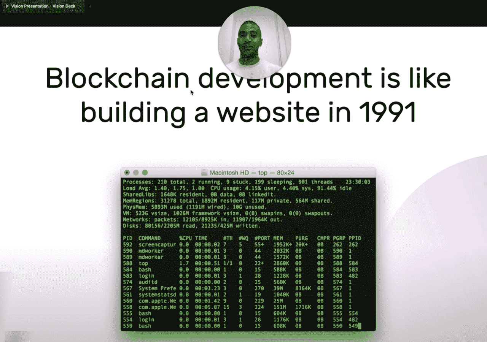
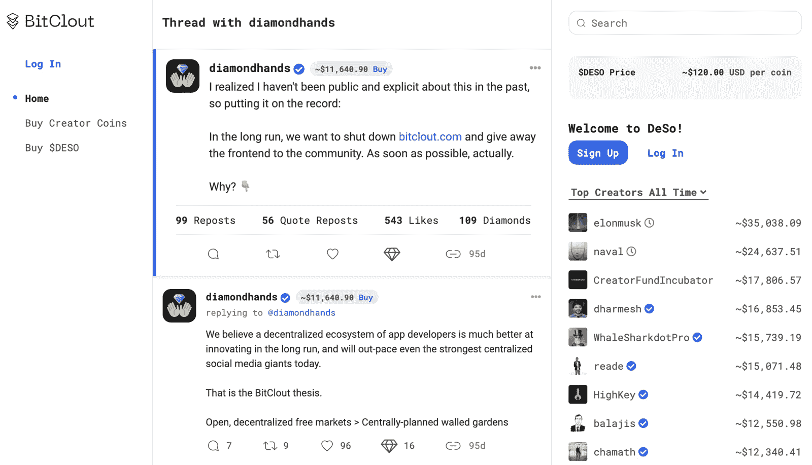

# Web3 真的去中心化了吗？看炼金术和比特图

> 原文：<https://thenewstack.io/web3-isnt-fully-decentralized-a-look-at-alchemy-bitclout/>

 [理查德·麦克马努斯

理查德是 New Stack 的高级编辑，每周撰写一篇关于网络和应用程序发展趋势的专栏文章。此前，他在 2003 年创立了读写网，并将其打造为全球最具影响力的科技新闻和分析网站之一。在 Twitter @ricmac 上关注他。](https://twitter.com/ricmac) 

关于以区块链为中心的 Web3 架构是否有效的争论继续在社交媒体上激烈进行。与此同时，您是否知道当前许多“dapps”(分布式应用程序)都依赖于*集中式* web 基础设施？没错，尽管所有关于 Web3 是 Web 的去中心化版本的夸夸其谈，在那里你[可以](https://twitter.com/cdixon/status/1442201638895177729)“拥有互联网的一部分”，但大部分基础设施与 Web 2.0 完全相同——服务器归企业所有。

Alchemy 是一家由风投资助的区块链公司，自称为“区块链的 AWS”根据四月底的一份 CoinDesk 报告,“炼金术为大多数 DeFi[分散金融]和几乎所有的 NFT 大平台提供了动力”Alchemy 联合创始人兼首席执行官 Nikil Viswanathan [在同一时间告诉 TechCrunch](https://techcrunch.com/2021/04/28/alchemy-raises-80m-at-a-505m-valuation-to-be-the-aws-for-blockchain/) 他们的目标是“为区块链建立一个开发者平台层”这个平台主要集中在以太坊区块链，那里发生了大部分的 dapp 行动。

Alchemy 首席执行官兼联合创始人 nikil Viswanathan[解释了](https://www.youtube.com/watch?v=HFs5XA2Xmac)web 3 开发的困难。

虽然 Alchemy 提供了各种不同的服务，但其核心价值在于为您管理以太坊区块链——就像 AWS 为您管理 web 服务器一样。如果你是一名 dapp 开发者，使用像 Alchemy 这样的公司——或者像 [Infura](https://infura.io/) 和 [Truffle](https://www.trufflesuite.com/) 这样的竞争对手——意味着你不必在自己的服务器上建立一个新的以太坊节点。这是一项非常有用的服务，因为区块链技术很复杂。如果你是一个崭露头角的 dapp 开发者，为什么你不想把基础设施工作外包出去呢？Web 应用程序开发人员一直在这样做，不仅是 AWS 这样的云平台，还有基于这些平台的[无服务器解决方案](https://thenewstack.io/theres-a-service-for-that-amazon-web-services-and-serverless-computing/)。

然而，目前还不明显的是，Alchemy 目前依赖于传统的网络服务器——以及它拥有的其他基础设施——来为客户提供一些服务。换句话说，区块链开发者正在通过(你猜对了)一个集中的平台运行他们分散的应用程序。

## 近距离观察 Web3 去中心化

写上述推文的人有错。像 Alchemy 这样的 Web3 平台根本不是“用户控制的”。事实上，这与 Web 2.0 中的情况相同，构建平台的公司最终控制着平台。Alchemy 的平台是由 Alchemy 控制的，因为至少它的一部分是集中的。换句话说，如果你在 Alchemy 上构建你的 dapp，而平台崩溃了(就像脸书上周做的那样)，那么你的 dapp 也会崩溃。

尚不清楚炼金术的哪些部分是集中的。但是如果你足够努力的话，还是有一些提示的。去年八月，在推特上与以太坊的创建者 Vitalik Buterin 的讨论中，Viswanathan 解释说 Alchemy 的数据验证系统依赖于“一个集中的管道去分散区块链数据”他说，另一种选择是等待“分散管道”的“数年”维斯瓦纳坦继续说道:“在与 60 位客户交谈后，我们清楚地听到，实际上这种(集中管道)正是他们想要的。”

需要明确的是，Alchemy 并不否认它本质上是一个集中式平台——尽管在其主页上并没有提到它。在一个著名的加密节目“震中播客”的采访中，维斯瓦纳坦不得不回避关于炼金术在 DeFi 和 NFT 生态系统中享有优势的问题。如果炼金术土倒下了，一个震中的主持人把它放在维斯瓦纳坦，那不也把所有那些建立在炼金术土之上的德菲和 NFT 应用程序都打倒了吗？

维斯瓦纳坦承认这种情况会发生，但他补充说，建立一个完全去中心化的炼金术会花费太长时间。用他的话来说，该公司选择首先构建“集中版本，因为它更容易构建，我们能够在其上提供更好的工具和更好的开发人员体验，而不是花两年多的时间来构建分散版本。”

所以你有了它，从马嘴:炼金术，在它目前的表现形式中，是一种集中的服务。

## BitClout 和“渐进式分权”

现在让我们来看一个区块链服务，它在 Alchemy 平台层之上运行。BitClout 将自己标榜为“秘密社交网络”它建立在一个名为 [DeSo](https://www.deso.org/) 的区块链上，该公司将其比作比特币而不是以太坊(根据 BitClout 的说法，后者“不是为了处理运行竞争性社交媒体应用程序的存储和索引要求而设计的”)。

然而，尽管人们都在谈论“去中心化社交媒体”，BitClout 还是没有完全去中心化。BitClout 在其文档中称“BitClout 项目仍有部分是集中或半集中的，比如 identity.bitclout.com 和 images.bitclout.com，我们计划逐步淘汰它们。”它想出了一个奇特的术语来描述这一点:“渐进式分权”

与 Alchemy 不同，BitClout 提供了对其应用程序中集中的内容进行彻底分解的功能。它包括验证(如上面的 Alchemy 示例)、图像和视频、电子邮件和电话号码(“出于隐私原因，不存储在链上”)、档案删除和身份识别。

除了那些仍然集中的后端方面，它的网站 bitclout.com 是在由……BitClout 管理的服务器上运行的。BitClout 的创造者有一个名为“钻石手”的名字，直到最近，他都是匿名的(就像比特币的中本聪)。所以没人知道谁在运行 bitclout.com 服务器！然而，上个月他终于[透露了](https://www.fastcompany.com/90678085/nader-al-naji-creator-bitcloutfuture-social-media-cryptocurrency)自己的身份[纳德·阿尔-纳吉](https://www.linkedin.com/in/nader-al-naji-86b14a3a/)，前谷歌软件工程师。

Bitclout.com，一种基于区块链的推特替代品。

早在 7 月，当他还是匿名的时候，Al-Naji [声称](https://bitclout.com/posts/1a6eaab0facaae6f586c8ef4f776445aad6441e840edf07d10311dd5d72a75de)“从长远来看，我们希望关闭 bitclout.com，把前端交给社区。”他的意思是，BitClout 将允许第三方应用程序尝试在其平台上获得牵引力，以便最终关闭 bitclout.com。

谁知道这个承诺是否会实现——密码社区充满了关于未来去中心化和从公司中解放出来的宏大叙事。但这是所有关于去中心化的 Web3 讨论中的核心问题:都是关于未来解决方案的承诺和挥舞。

## 让我们缓和一下网络 3 的言辞

正如 Alchemy 和 BitClout 所显示的那样，他们的服务对传统集中式网络服务器的依赖程度至少不亚于对区块链的依赖程度。从技术角度来看，这并没有什么错——事实上，使用集中式服务是一个好主意，因为它们要高效得多。但这确实削弱了所有关于 Web3 去中心化的高尚言论。

正如区块链世界的一切一样，言辞并不总是与当今现实世界可用的技术相匹配。

<svg xmlns:xlink="http://www.w3.org/1999/xlink" viewBox="0 0 68 31" version="1.1"><title>Group</title> <desc>Created with Sketch.</desc></svg>