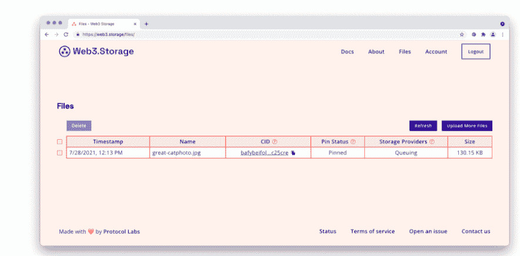
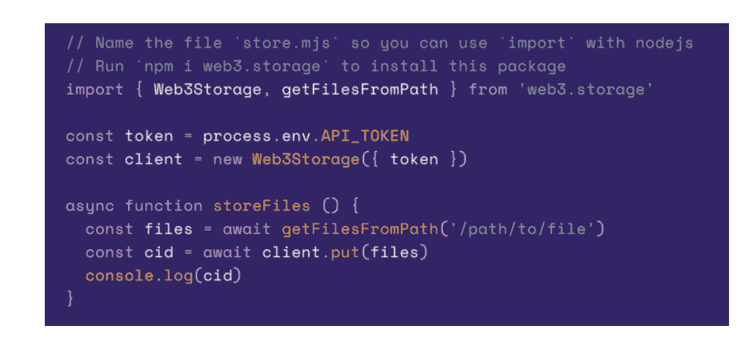

# Web3。存储:Filecoin 上免费的分散存储

> 原文：<https://thenewstack.io/web3-storage-free-decentralized-storage-on-filecoin/>

协议实验室已经启动了 Web3。存储为开发人员和其他用户提供分散存储的替代方案。它建立在 Filecoin 之上，Filecoin 是一个基于区块链的开源支付系统，可以为希望租用未使用硬盘空间的用户提供记账服务。

据互联网技术支持提供商称，加密货币 Filecoin 存储平台将无限期免费，作为一种简单而“无障碍”的方式来上传存储提供商提供的冗余存储容量上的数据，以换取加密货币 Filecoin 块奖励。

[Protocol Labs](https://protocol.ai/) 的产品经理和业务开发 [Jonathan Victor](https://www.linkedin.com/in/jonathan-victor-69a44255) 告诉新堆栈，Protocol Labs 的 Filecoin 项目主要是为寻求简单易用的点对点平台来共享应用程序和代码的开发人员准备的。

“在过去的一年里，我们看到许多人哀叹集中式技术平台的问题。Victor 说:“这种不透明性很大程度上是基于 web 架构的需要，因为当今的应用程序必须将数据托管在集中式服务器上。点对点技术可能会令人难以置信地兴奋，因为它们为如何构建应用程序提供了一种替代方案，进而为如何发展互联网提供了一种替代方案。分散技术允许开发人员构建与他们的数据分离的应用程序:使开发人员能够构建开放的应用程序，数据可以存储在开放的网络上。"

Web3 背后的理念。存储也有助于降低开发人员在分散平台上开发应用程序的门槛。Web3 没有强迫新开发人员学习运行对等基础设施的复杂性。维克多说:“存储使他们能够使用一个简单的 JavaScript 库，让开发人员可以通过 [IPFS](https://ipfs.io/) [ [星际文件系统](https://thenewstack.io/interplanetary-file-system-could-pave-the-way-for-a-distributed-permanent-web/) ]获得数据，并在 Filecoin 上保存数据。由于这些协议本质上是开放的，如果开发人员愿意，他们可以在未来轻松增加他们的基础架构选择(无论他们是选择在未来使用锁定提供程序，还是托管他们自己的基础架构)

根据 Victor 的说法，优势包括:

*   开发人员能够构建“对其数据赋予更大权力”的应用程序
*   可以构建具有互操作性的应用程序，以使“可以轻松地在应用程序之间移植的用户，以及可以在服务提供商之间移植应用程序的开发人员”受益
*   应用程序恢复能力，因此“数据可以存在于任何地方，应用程序无需担心单个提供商宕机和数据丢失。”
*   通过 IPFS 作为内容的不可变引用的存储。
*   通过使用公共 IPFS 网关或 IPFS 上的个人节点改进数据检索。
*   改进了查询功能，允许用户通过该服务查询 IPFS 或 Filecoin 上存储的任何内容的状态。

“可验证性网站 3。存储产品在对等网络中尤为重要，以确保内容不会丢失。“Filecoin 独特地拥有加密证据，保证网络不会丢失用户的数据，”维克托说随着 Filecoin 协议升级到包含更多服务，如智能合约，它还提供了一种升级途径。"

在 Web3 之前。Victor 说，Storage 的推出，开发者要么必须学习如何自己管理相关的基础设施，要么与许多托管提供商合作提供服务。Victor 说:“许多 pin 码提供商仅提供冗余 pin 码作为弹性因素，这可能会导致人们担心如果单个提供商消失会发生什么。”“虽然许多锁定提供商都计划集成 Filecoin 产品，但我们的目标是为开发人员提供一种途径来实现当今可证明的存储，而无需他们自己开发。”

<svg xmlns:xlink="http://www.w3.org/1999/xlink" viewBox="0 0 68 31" version="1.1"><title>Group</title> <desc>Created with Sketch.</desc></svg>