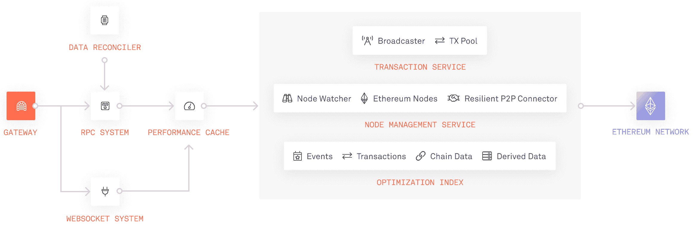

# Web3 工具和引爆点:与 Infura 联合创始人的对话

> 原文：<https://thenewstack.io/web3-tools-and-tipping-points-a-chat-with-infura-co-founder/>

Infura 是一个区块链开发平台，是 Web3 生态系统中领先的工具提供商 Consensys 所拥有的一系列产品的一部分。使用云计算术语，Infura 可以被认为是“区块链即服务”，因为它抽象出了处理区块链网络的困难。通过使用 Infura，或者像 Alchemy 一样的竞争产品,开发者不需要在他们自己的服务器上建立一个新的以太坊(或者类似的)节点。

为了了解更多关于 Web 2.0 开发者如何适应像 Infura 这样的 Web3 服务，我采访了[，例如 Galano](https://www.linkedin.com/in/egalano/) ，他在 2016 年共同创立了该公司，现在是 Consensys 产品团队的关键成员。我们还谈到了 NFTs 和区块链应用在过去几年中的增长，以及它们未来的发展潜力。

## Infura 到底是什么？

为了将 Infura 与 web 2.0 服务进行比较，Galano 说它类似于 Web 主机——除了 Web 主机实际上保存用户数据，Infura 更像是这些数据的网关。“当你连接到 Web3 时，你需要连接到一个公共数据集，并从中提取、读取和交互，”Galano 解释说，他指的是区块链和 IPFS 等分散存储解决方案的数据。因此，Infura 充当了开发人员和分散数据源之间的服务层。

与许多 Web 2.0 公司一样，Infura 通过 API 提供对数据的访问。它的 API 允许开发者“通过 HTTPS 和 WebSocket 连接到以太坊和 IPFS”，中间有各种事务，“节点管理”和优化服务。

资料来源:Infura

Consensys 套件中的其他六个产品之一是 [Truffle](https://trufflesuite.com/) ，这是一套 Web3 开发者可以用来构建应用的工具。如果 Infura 类似于 web 主机，那么 Truffle(根据 Galano 的说法)就是“开发者用来创建应用程序的工具”他补充说，“一旦他们创建了应用程序，Infura 就像一个持续运行的服务，最初由开发团队用来部署他们的应用程序，然后供用户与应用程序交互。”

## 超越以太坊

Galano 将 Infura 总结为“以太坊基础设施的服务提供商”，并补充说“我们认为我们的产品范围是简化从 Web2 到 Web3 的开发者体验的任何东西。”它的部分职责是引导开发人员找到合适的数据类型。例如，如果开发人员正在创建一个 NFT，Infura 可能会将他们连接到 [Palm NFT](https://palm.io/) ，这是一个隶属于 Consensys 的以太坊“侧链”，针对 NFTs 进行了优化。另一方面，如果开发人员正在构建一个分散金融(DeFi)应用程序，Infura 将帮助他们访问适当的交易数据——无论是历史数据还是实时信息，或者两者的混合。

目前，Infura 仅支持以太坊和各种替代 EVM(以太坊虚拟机)网络，如 Palm NFT。然而，Galano 表示，它最终将支持开发者需要的任何网络。他说，现在的 Web3 开发者正在寻找具有特定用途的区块链网络。“现在，人们要求像索拉纳，雪崩，币安网络，”他说。

然而，没有消息表明何时将支持非 EVM 网络。“目前，我们正在与几家网络进行讨论，并将根据用户需求优先提供支持，”Galano 说。“索拉纳肯定在我们的观察名单上，但目前没有具体的时间表。”

## Web3 应用前景

2018 年初，我开始认真研究区块链科技，当时我推出了一个关于这个主题的独立博客。在那个时候，crypto 看起来非常早期——无论是在基础设施方面还是在应用程序方面。唉，我很快发现没有人想在 2018 年阅读区块链应用程序，所以我的独立博客最终失败了。但是现在，在 2022 年，这个生态系统——去年[命名为“网络 3”](https://thenewstack.io/its-a-web3-world-now-how-the-hype-compares-to-web-2-0/)——似乎更加成熟。

由于像 Infura 这样的公司已经建立了有用的开发者平台，它在基础设施方面肯定更加成熟。然而，在应用方面，我们仍在寻找突破性的主流产品。例如，没有 Twitter 的 Web3 版本的迹象。因此，我向 Galano 询问了他对 2018 年以来 Web3 应用格局如何演变的看法。

他回答说，NFTs 在我写 crypto blog 的时候是从 CryptoKitties 开始的，现在已经成熟得多了。

“已经有更多的尝试来探索如何在功能上使用 NFT，”他说，“与那时相比，现在有更多令人信服的用例。”

他提到了 NFTs 作为数字所有权的票证或证书的实验。“我们 Infura 收到了很多来自大型 Web2 公司的入站请求，”他继续说道。“我无法说出具体的名字，但我知道哪些人不是处于探索阶段，而是处于从开发到部署的积极阶段。他们致力于将(主要)NFT 整合到他们的产品中。”

## NFTs 和 Web3 引爆点

的确， [NFTs 已经成为主流行业 Web3 开发的一个有前途的方面](https://thenewstack.io/can-nft-technology-expand-beyond-digital-apes-and-punks/)。我特别注意到音乐产业跳上了 NFT 炒作的列车。NFTs 作为一种粉丝参与工具，甚至是一个音乐家和她的粉丝之间的权利管理机制——这显然是一个值得探索的领域。

然后 Galano 提出了一个很好的观点，让我认为 NFTs 最终会完全成为主流并不是一个疯狂的想法。

“因为这是一项如此前沿的技术，”他说，“我总是觉得它不是由技术价值决定的，而是涉及到更多的社会方面。会发生一些事情，一些余烬会点燃一把火——出于这样或那样的原因，我绝对不明白，为什么一些东西会起飞，并开始成为一个被大量利用的产品。比如，是什么真正让 Twitter 成为一个社交平台？”

这是我不认为密码评论家真正欣赏的作品。互联网技术不会因为技术原因而变得流行；更确切地说，是文化环境中的某种东西让一个产品超过了临界点。即使现在，我仍然不知道如何解释 Twitter，尽管我的家人或朋友很少使用它，但它不知何故成为了主流！我们在技术和媒体行业使用它，但 Twitter 的文化影响已经远远超出了这些社区。

同样的不可知力量可能会推动 NFTs 和区块链应用成为主流。当然，没有人知道这将如何发展。但是如果你是一个开发者，并且愿意尝试 Web3，那么你就值得去看看 Infura 平台。

<svg xmlns:xlink="http://www.w3.org/1999/xlink" viewBox="0 0 68 31" version="1.1"><title>Group</title> <desc>Created with Sketch.</desc></svg>