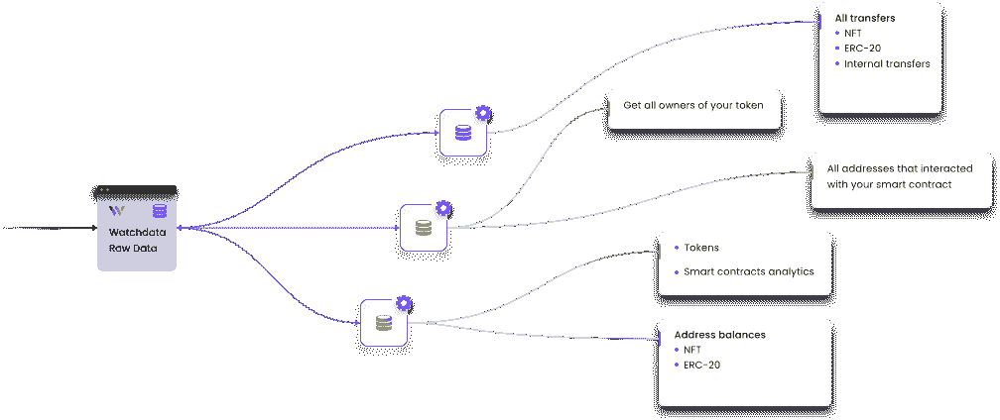

# Web3: WatchData API 提供了区块链的单一视图

> 原文：<https://thenewstack.io/web3-watchdata-api-provides-a-single-view-into-blockchains/>

区块链的数量在持续增长，每个区块链上的事务数量也在持续增长，这增加了查询事务数据的复杂性。许多数据仍然是非结构化的，除了存储在链上的数据之外，还可能指向其他链外数据。

试图解决这种复杂性的最新解决方案之一是来自 [TheWatch](https://www.thewatch.io/) 的 WatchData [Powered API](https://www.watchdata.io/structured-data) 。

TheWatch 将 WatchData 定义为一个 API，供 Web3 开发者无缝访问区块链。WatchData 目前支持以太坊、比特币、币安智能链和创区块链，最近通过其 Powered API 增加了对多边形的支持。这个新的 API 公开了一组工具，这些工具也与任何基于以太坊虚拟机的区块链兼容。

与直接查询区块链相比，使用 Powered API 的优势之一是 WatchData 承担了将区块链数据格式化为结构化格式的重任。他们还有一个数据验证过程，确保您查询的数据在与它交互时是准确的。WatchData 还为数据分析增加了一层弹性，这对于单个开发人员来说可能不太实际，因为他们运行多个节点，并且内置了冗余层，以确保他们不会遗漏关键事务。

## 与 WatchData 支持的 API 交互

在接受新堆栈采访时，TheWatch 的首席执行官 Svyatoslav Dorofeev 解释了与 WatchData Powered API 交互的一些选项。“我们相信开发者应该能够使用他们最喜欢的编程语言和框架，我们希望他们在使用我们的平台时感到舒适，”他说。开发者可以使用 REST API (TRON API)和 JSON-RPC(比特币 API、以太坊 API、币安智能链 API、多边形 API)。很快，WatchData 将获得 webhooks、Notifications API、get query 等交互方式。

当我问 Dorofeev 关于从 Powered API 连接到多个 EVM 兼容的区块链的过程时，他强调了这种简单性，他说，“你所要做的就是为一个区块链创建一个 API 密钥，然后你可以将它用于 Powered API。这真的很简单，让开发人员轻松了许多。”

## Powered API 用例

WatchData 强调了它们所公开的数据的许多用例。对于分散的应用程序开发人员来说，WatchData 支持的每个区块链的所有区块链数据都是可用的，这为各种各样的用例提供了灵活性。不需要实时数据的分析是一个常见的用例，历史数据可以帮助制定决策。对于 NFT 应用程序，WatchData 提供了一些数据，如特定时刻所有令牌持有者的快照，或发现哪些钱包与智能合约进行了交互，以及跟踪任何 ERC 20 标准令牌的能力。

您可以查看所有可能的用例，并在 [API 文档](https://docs.watchdata.io/)中了解更多关于 WatchData Powered API 的信息。如果您有向用户提供虚拟资产的用例，Watch 还提供了监控加密货币交易的附加解决方案。

<svg xmlns:xlink="http://www.w3.org/1999/xlink" viewBox="0 0 68 31" version="1.1"><title>Group</title> <desc>Created with Sketch.</desc></svg>