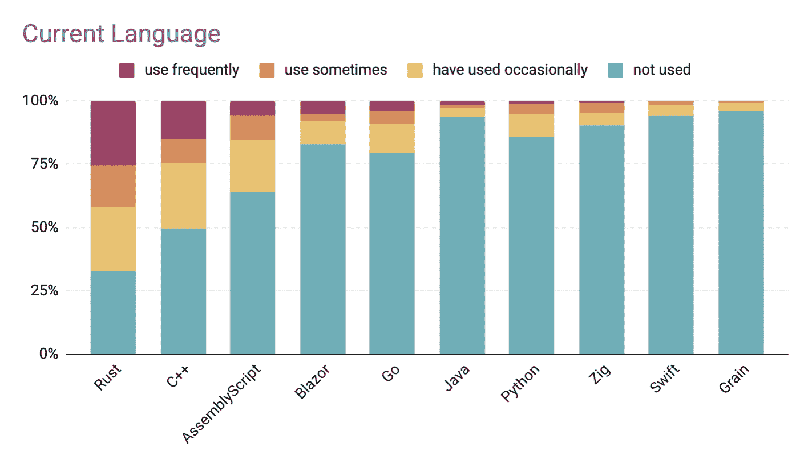
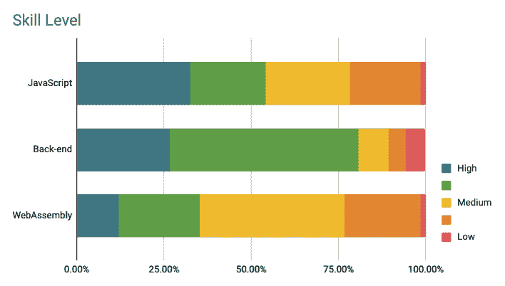

# WebAssembly 开发人员渴望 Rust 和 AssemblyScript(但不去)

> 原文：<https://thenewstack.io/webassembly-developers-lust-for-rust-and-assemblyscript-but-not-go/>

WebAssembly (WASM) 吸引了所有人的注意力，因为它允许开发人员用他们选择的高级语言编写代码，并且是[平台不可知的](https://thenewstack.io/why-webassembly-modules-could-be-the-new-de-facto-unit-of-compute/)。最近发布的[web assembly 2021 的状态](https://blog.scottlogic.com/2021/06/21/state-of-wasm.html)表明 Rust 是一个遥远的选择，但是下一代 WASM 开发将会使用哪些其他语言呢？

根据 WebAssembly Weekly 时事通讯及其更广泛的社区对 249 人的调查，69%的 WASM 开发者有使用 Rust 进行 web assembly 开发的经验。51%的被调查者使用 C++或 [Emscripten](https://emscripten.org/) 的一些组合，其次是 35%的人使用 [AssemblyScript](https://www.assemblyscript.org/) ，这是一种为 WASM 开发的语言，可以编译一种类型脚本的变体。大约一半的调查对象有两年以上使用 WASM 的经验。

展望未来，Rust 做得更好——60%的人希望在 WASM 开发中大量使用它，另外 18%的人计划在未来的某种程度上使用它。AssemblyScript 超过了其他语言，56%的受访者对此有一些计划。AssemblyScript 之所以有趣，是因为赞助该项目的大人物，包括 [Fastly](https://www.fastly.com/) 和 [Shopify](https://www.shopify.com/) 以及类似于附近的[、](https://near.org/) [ChainSafe](https://chainsafe.io/) 和 [The Graph](https://thegraph.com/) 这样的团体，它们参与了一些最著名的分散式协议。

对其他语言的吸收没有这么强烈。例如，20%的人使用过 Go 或 TinyGo，而 67%的人没有将这种语言纳入他们的未来计划。并没有出现太强烈的反对去，只是更熟悉其他语言。几个月前，我们发布了 [*Rust vs. Go:为什么他们在一起更好*](https://thenewstack.io/rust-vs-go-why-theyre-better-together/) ，解释了其中的权衡。最近推出的 Krustlets 是一个积极的迹象，表明更多的 Go 开发者将把应用程序集成到 WASM 生态系统中。

只有 26%的开发者认为 WASM 确实需要提高它所支持的语言的广度，以便在未来取得成功。正如 Scott Logic 的 Colin Eberhardt 在报告中解释的那样，重点不是增加新的语言来编译 WASM，而是改善现有语言的开发者体验。两倍多的人(56%)表示确实需要更好的调试支持，这是阿明·罗纳彻[、](https://thenewstack.io/author/armin-ronacher/ "Posts by Armin Ronacher")、[哨兵](https://sentry.io/welcome/?utm_content=inline-mention)工程总监[向我们的读者解释的](https://thenewstack.io/the-pain-of-debugging-webassembly/)。

如果开发人员的体验得到改善，那么当前这批 Rust 开发人员也很有可能会看到他们的聚会崩溃。当这种情况发生时，他们会发现开发人员更了解后端而不是前端，这可能会给能够使用 [Blazor](https://dotnet.microsoft.com/apps/aspnet/web-apps/blazor) 编译的 C#开发人员带来新的生机。同样的情况也可能发生在其他“遗留”语言上，这些语言拥有大型的现有应用程序生态系统，可以重新打包到虚拟机、容器和其他模块中。

目前，我们知道 73%的受访者目前使用 WASM 进行 web 开发，这几乎是第二大用例的两倍。WebAssembly 有 27%用于游戏开发，24%用于无服务器，21%用于容器。只有 8%的人将它用于区块链或密码学，这表明以太坊和 Dapp 的路线图远远领先于大量开发者，而这些开发者还在思考如何编写智能合同。

来源:[web assembly 2021 的状态](https://blog.scottlogic.com/2021/06/21/state-of-wasm.html)。只有 20%的人用过 Go 或者 [TinyGo](https://tinygo.org/) ，17%的人用过 C#或者它的编译器 [Blazor](https://dotnet.microsoft.com/apps/aspnet/web-apps/blazor) ，这是 C#原生的，有其他语言经验的就更少了。根据调查中的实际措辞，该图表的 C++标签应为“c++/Emscripten”；Blazor 应该读作“Blazor/c#”；而 Go 应该读作“Go / TinyGo”。

来源:供应商有机会向希望使用 WASM 运行工作负载但不想学习后端技能的开发人员提供服务。例如，24%的人认为他们的前端能力可以最好地描述为能够使用现代框架(如 React、Vue)处理代码库。WebAssembly 2021 的状态。

<svg xmlns:xlink="http://www.w3.org/1999/xlink" viewBox="0 0 68 31" version="1.1"><title>Group</title> <desc>Created with Sketch.</desc></svg>