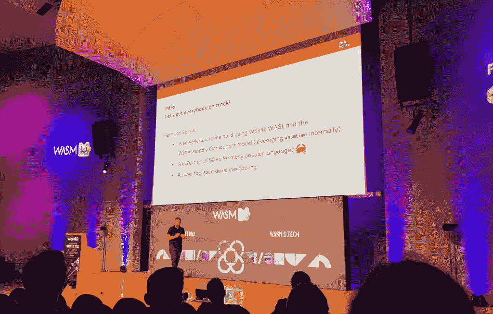
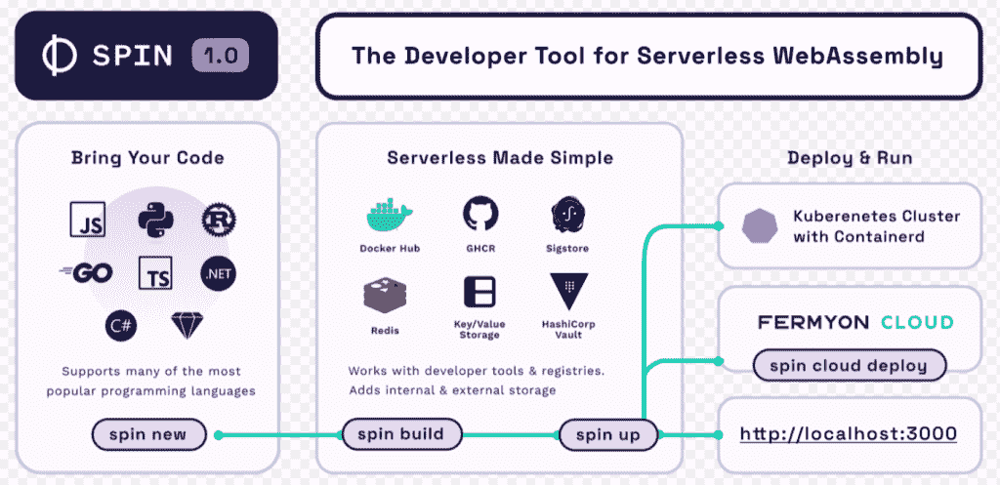

# WebAssembly 提供商加速填补无服务器空白

> 原文：<https://thenewstack.io/webassembly-providers-speed-ahead-to-fill-serverless-gaps/>

可以有把握地说，绝大多数开发人员和运营团队成员并不过度关注无服务器的底层机制。换句话说，只要它是安全可靠的，在引擎盖下运行的东西就没什么意思。重要的是特征。

与此同时，无服务器还没有兑现其早先的承诺，即允许以支持应用程序所需的最少操作来部署和管理应用程序。为此， [WebAssembly](https://thenewstack.io/is-webassembly-really-the-future/) (WASM)供应商[正在加速前进](https://thenewstack.io/serverless-webassembly-for-browser-developers/)以填补这些无服务器应用的不足。

他们还希望增加功能并填补其产品的空白，因为 WASM 早期的宣传是提供一种更安全、更简单的开发和部署应用程序的方法，其计算性能优于过去任何广泛采用的技术。

WASM 提供商需要并试图提供适当的 SDK 来填补其产品的空白，以便开发人员可以简单地使用他们选择的语言，而不是 JavaScript 和难以使用的 Rust，运营部门可以放心，应用程序可以安全地同时部署在多个目标和设备上，只需很少或不需要 WASM 模块和端点的配置。

事实上，WASM“在任何地方运行”的能力不仅适用于你所在的处理器和操作系统，还适用于“多种其他二进制文件……能够在其他语言中运行，”Fastly CTO [Tyler McMullen](https://twitter.com/tbmcmullen?lang=fr) 在他的演讲“一次编写，随处运行的回归”中说道

然而，尽管 WASM 现在被广泛应用于浏览器应用程序中，它仍然是一项正在进行的工作。工作正在进行中，以充分受益于其设计为直接在 CPU 上运行的运行时结构，以便提供更直接的方式来运行分布在容器或不同设备和环境上的相同应用程序和代码。

在巴塞罗纳举行的 WASM I/O 大会的第一天，关于 Fermyon 的开源 Spin 1.0 的发布、VMware 的 [WASM 工人服务器](https://workers.wasmlabs.dev/)项目以及其他讨论都特别提到了无服务器交付竞赛。

## 兜一圈

Spin 1.0 的主要新特性是，除了 Rust 之外，它还开发了适应多种语言的能力。它由 Fermyon 创建和维护，专门面向开发人员，旨在弥补 WebAssembly 在无服务器方面的一些不足。

Fermyon 将 Spin 1.0(一种功能即服务)描述为第一个稳定发布的开源开发工具，用于使用 WebAssembly 构建无服务器应用程序。Fermyon 说，该工具和框架指导用户通过 WebAssembly 创建、构建、分发和运行无服务器应用程序。这包括用户能够使用 starter 模板从单个界面(或本地)构建、分发和运行应用程序。

除了 Rust 之外，Fermyon 还表示，它正在建立对 JavaScript、TypeScript、Python 或 C#的支持，并与 HashiCorp Vault 集成，用于管理运行时配置。它也是为使用流行的注册服务分发应用程序而设计的，允许用户在 Kubernetes 上运行应用程序，

“可配置性是构建在不同环境下运行的分布式应用的关键，Spin 也不例外，”德国 Thinktecture AG 的云原生顾问[托尔斯滕·汉斯](https://de.linkedin.com/in/thorstenhans)在他的演讲[中说，“Spin it！借助 Fermyon Spin 开始您的 Wasm 之旅。”](https://wasmio.tech/sessions/spin-it-jumpstart-your-wasm-journey-with-fermyon-spin/)

## WASM 工人团结起来！

与 Fermyon 的 Spin 不同，VMware 的 [WASM 工人服务器](https://github.com/vmware-labs/wasm-workers-server)开源项目旨在提供一种非常快速和轻松的途径来开始使用 WASM 进行无服务器应用程序开发和部署。

在他们的演讲[“使用 WASM 工人服务器开发无服务器应用”中，](https://wasmio.tech/sessions/develop-serverless-apps-with-wasm-workers-server/) VMware 首席技术官办公室的 VMware 员工工程师[安吉尔·德·米格尔](https://wasmio.tech/speakers/angel-de-miguel/)和[拉斐尔·费尔南德斯·洛佩兹](https://www.linkedin.com/in/rafaelfernandezlopez?originalSubdomain=es)描述了用户如何在几分钟内开始使用。当然，VMware 和 Fermyon 并不是 WASM FaaS 和其他开源 WebAssembly 替代产品的唯一提供商。Cosmonic 的[是 wasmCloud](https://wasmcloud.com/) 、[亚轨道扩展引擎](https://suborbital.dev/)和许多其他独立的和内部的 WASM 项目。

最终，我们的想法是让开发者在无服务器环境下一切都变得简单和无缝。

“我们希望让尽可能多的开发者使用 WebAssembly，这样他们就只需要担心开发应用程序，而不是支持这些应用程序所需的底层基础设施，”德·米格尔说。

## 超越无服务器的生活

[无服务器](https://thenewstack.io/serverless/)对于那些寻求创建和运行应用程序，而基础设施管理相对较少的组织来说，各种使用情形对计算的需求持续增长。对于寻求提供软件应用程序、服务或两者兼有的初创公司来说，这是一个好消息，因为它们不需要在本地服务器上进行大量投资，也不需要通过云供应商来配置或管理自己的基础设施。

在预构建的[软件即服务(SaaS)平台](https://thenewstack.io/private-saas-a-new-paradigm/)上添加 API 或服务只需一步之遥，无服务器替代方案就可以让组织开始提供自己的业务服务或应用程序，而只需最少的开销和更少的维护管理任务。

然而，WebAssembly 当然不仅仅是无服务器的。事实上，认为 WASM 可能会取代无服务器的想法是没有抓住要点的。WASM 可以被认为是一种不同的思维模式，不仅考虑其计算结构，而且特别是在一般部署方面。当然，您可以使用 WASM 来运行无服务器应用程序，但它远不止于此，因为它是一种以高度分布式的方式部署应用程序的方式。

因此，最终有一天，你可能会转向 SaaS 或云提供商，寻求一个在底层运行 WASM 的无服务器应用。您还可以直接使用 WASM 来跨分布式环境(不仅包括 Kubernetes 集群，还包括跨边缘设备)分发以多种语言同时运行的应用程序。

同时，单就无服务器而言，除了 VMware、Fermyon 和 Cosmonic 之外，云供应商和 SaaS 提供商也很有可能会效仿。“他们显然都在期待 WASM 能够运行他们的无服务器应用，”[字节码联盟](https://bytecodealliance.org/)技术标准委员会[主任](https://www.linkedin.com/in/baileyhayes)Bailey Hayes 在会议间隙说道。“它比其他任何东西都好，”考虑到它非常小和简单的通勤结构，“它的冷启动能力非常好，还有许多其他功能。

<svg xmlns:xlink="http://www.w3.org/1999/xlink" viewBox="0 0 68 31" version="1.1"><title>Group</title> <desc>Created with Sketch.</desc></svg>