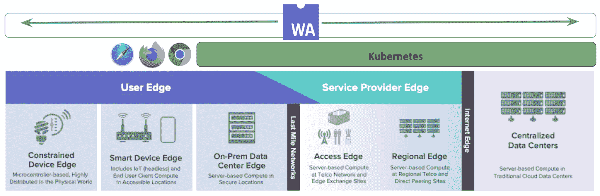

# WebAssembly:云本地分布式计算的未来

> 原文：<https://thenewstack.io/webassembly-the-future-of-cloud-native-distributed-computing/>

 [利亚姆·兰德尔

利亚姆·兰德尔是一位连续创业者和风险投资家，在过去的 25 年里，他在企业 IT 创业生态系统的各个层面都工作过。他构建和运营了大型网络，开发和维护了大型 1 亿多 ARR 电子商务解决方案，包括设计和实施全球网络安全监控传感器网格。Randall 是第一家 Kubernetes 公司 Critical Stack(2016 年被 Capital One Bank 收购)的创始人，其目标是实现安全容器编排的自动化安全性和合规性。Randall 目前正在投资和加速新的开源核心云本地创业公司的增长，如 Cosmonic (CNCF wasmCloud)和 Stacklet (CNCF 云托管公司)。](https://www.linkedin.com/in/hectaman/) 

WebAssembly 已经成为 2021 年增长最快的云本地趋势之一。有了像 [wasmCloud](https://wasmcloud.com) (今年夏天由 [Cosmonic](https://cosmonic.com) 捐赠的[云原生计算基金会](https://cncf.io/?utm_content=inline-mention)沙盒项目)这样的分布式应用运行时，我们看到 WebAssembly 出现在服务器和边缘，嵌入到像 [Envoy](https://www.envoyproxy.io/) 这样的平台中，作为可扩展的平台和直接的云原生编排目标，通过像 [Krustlet](https://krustlet.dev/) 这样的项目，最近被纳入 CNCF 沙盒。

[https://www.youtube.com/embed/-DVcchn4T_Y](https://www.youtube.com/embed/-DVcchn4T_Y)

视频

阻碍分布式应用程序开发、部署和维护的挑战已经产生了一种新的范式，其中 WebAssembly 在云原生分布式计算的未来中扮演着重要角色。

WebAssembly 是一个小型的便携式虚拟机，可以在现代 web 浏览器、服务器和各种硬件上运行。这个开放的 WC3 标准快速而高效，是一个被各种编程语言支持的编译目标，包括 Rust、C / C++、Typescript、Go 等等。

缩写为 Wasm，这种 web 开放标准重视功能驱动的安全性，这意味着所有应用程序都在默认拒绝的沙箱中启动，并且必须被授予对功能的显式访问权限。它最初是在 Mozilla skunkworks 中孵化的，现在由[字节码联盟](https://bytecodealliance.org/)管理，作为网页浏览器、独立和云原生 Wasm 中 JavaScript 的补充。Wasm 已经超越了浏览器，并在整个云原生生态系统中日益流行。

凭借其自身的能力，WebAssembly 为现代开发环境带来了新的功能和额外的安全特性——包括浏览器和云原生环境。然而，现代云原生开发人员面临着新的挑战，如 CPU 多样性、多操作环境、安全性、分布式应用架构和可扩展性，这些挑战超越了部署到单个公共云提供商的范围。

为了理解现代分布式计算环境，我们必须考虑公共云中日益增长的多样性，我们看到新的 ARM CPUs 挑战 x86 芯片组的历史主导地位，在成本和性能上展开竞争。

传统的企业系统通常针对特定的开发环境编译软件，包括 CPU 和操作系统，如 Linux-32 位、MacOS-ARM64 或 Windows-64 位。越过公共云向边缘看，我们发现在一组不同的 CPU 架构上有更多样化的执行环境。

这包括我们选择不运行或不能运行 Linux 的地方，比如微型设备、网络浏览器内或苹果的 IOS 上。WebAssembly 为开发人员提供了一个可移植的垫片，同时针对操作系统和芯片组的不同组合，实现了一次编写，随处运行的承诺。

Linux Foundation Edge 工作组很有帮助地构建了一个连续体——一个我们可以用作起点的世界观。

这种世界观有助于我们构建现代分布式计算的复杂性。有许多不同的设备类型，具有各种各样的系统架构和功能，但这些类别实际上低估了复杂性。

如果我们稍微注释一下这个视图，将一些额外的上下文与生态系统中既有又常见的一些平台包括在内，我们会得到一个我们需要考虑的更完整和复杂的世界观。

在公共云和服务提供商上，我们可以找到 Kubernetes，有常规大小和微型大小。我们发现在容器中的 Kubernetes 之上托管的应用程序，它们是按照特定的 OS 和 CPU 架构构建和分发的。我们应该在我们的生态系统中包括开发者环境，包括移动设备意味着我们需要支持手机、浏览器、智能电视和所有其他物联网(IoT)。

即使是非常小的东西——功能也很小。虽然 Kubernetes 和 Linux 主导着公共云，并越来越接近边缘，但我们可以选择或不能部署它们的计算有一个下限。

当然，保护这一大堆组合变得异常复杂，分布式云原生边缘的安全性有不同的细微差别和方法。WebAssembly 的功能驱动安全方法将安全边界从流程(我们在当今流行的容器驱动格式中可以找到它)移动到 WebAssembly 安全沙箱。虽然在技术上存在差异，但是 WebAssembly 与当今的企业环境兼容，并且可以与它们结合使用。

## 分布式计算挑战

在上一个技术时代，部署一直由公共云中集中托管的微服务和 SaaS 应用程序主导。有令人信服的理由相信，下一个技术时代将由分布式应用程序主导。系统架构的多样性，应用架构的多样性，分布式安全，离线使用，部署到边缘的机器学习，都在持续推动分布式计算的兴起。

到 2030 年，连接到互联网的设备的数量和令人难以置信的多样性将继续飙升，预计将达到 500 亿台连接设备，企业集成任务因十几种流行且不兼容的 CPU 架构而变得更加复杂。每一种都有自己相对独特的运行生命周期，来自几十个主要制造商。

WebAssembly 非常适合在这种复杂的环境中运行——Wasm 运行时甚至可以进行优化，以使应用程序适应特定的环境。例如，Bytecote Alliance 的 [Wasmtime](https://github.com/bytecodealliance/wasmtime) 针对服务器端执行进行了大量优化，而 [Wasm-micro-runtime](https://github.com/bytecodealliance/wasm-micro-runtime) (WAMR)针对较小的嵌入式设备进行了优化。

分布和连接的系统的巨大集合将在非常不同的应用架构中互连。n 层应用、模型-视图-控制器、发布/订阅、微服务等等。

在家庭、现代企业，甚至在我们社会的日常交互中，现代应用程序越来越多地是点对点的，而不是客户端-服务器的。对等意味着兼容、复杂的逻辑和微服务将需要部署在整个多样化的生态系统中。

Wasm 在这方面也很出色——其近乎本机的性能使其成为独立、嵌入式或其他类型集成的理想选择。可移植性和一次编写随处运行的方法为开发人员提供了部署应用程序的新功能。

这些广泛分布的应用程序的安全性是一个广泛的话题，然而，WebAssembly 的本机安全性设计是对运行在连续体中任何地方的分布式项目的一个受欢迎的补充。

WebAssembly 本身就起到了沙箱的作用；当您想将代码应用于各种复杂系统时，这很有帮助。WebAssembly 还接受了功能驱动的安全性的现代趋势，其中应用程序不再被授予其父代的权限，而是在默认拒绝的沙箱中执行。

很容易相信，当我们将数十亿设备连接到互联网时，我们可以简单地将所有功能卸载到远程 API 和服务，这些可能是哑端点，连接回智能核心或智能边缘。

虽然 edge 将继续将功能移近用户，以最大限度地降低性能影响，但有许多令人信服的理由相信，设备将保持连接，并且在离线或间歇性连接期间仍能提供一定程度的功能。出于各种原因，真正复杂的逻辑需要存在于终端设备之上和之内:

1.  延迟和确定性问题意味着一些设备需要在本地做出反应，并且没有任何延迟，例如无人驾驶汽车需要立即做出反应。
2.  视频、广播、音频、设备遥测等各种数据频谱中的大量边缘数据集必须首先在数据驻留的设备上进行处理。我们将继续看到机器学习(ML)模型提取元数据，并将其运回公共云进行进一步分析。
3.  对隐私和安全的日益关注将使逻辑保持在边缘或设备本身上——一些数据，如您家中的原始麦克风或摄像头馈送，在未经预处理的情况下不应被运送到本地环境之外。
4.  需要有限的或有意的自治—一些设备需要能够在缺乏连接的远程环境中运行。远海的船只，远处的漫游者，或者无人驾驶飞机。即使是联网的智能设备，在间歇性连接的情况下，也应该保持一定程度的功能。
5.  GDPR 和 CCPA 等国日益加剧的监管担忧是未来的开端。在不久的将来，大型技术将受到进一步的监管，这将影响我们分布式软件系统设计的位置和方式。

这意味着，到 2030 年，预计将有 500 亿台联网设备增加我们的工作负载，这些设备可能很小，可能很便宜，但它们将越来越智能和复杂。由于上述原因，WebAssemblies 编写一次，到处运行，安全模型和可移植性肯定会使它成为未来基础设施的重要组成部分。

<svg xmlns:xlink="http://www.w3.org/1999/xlink" viewBox="0 0 68 31" version="1.1"><title>Group</title> <desc>Created with Sketch.</desc></svg>