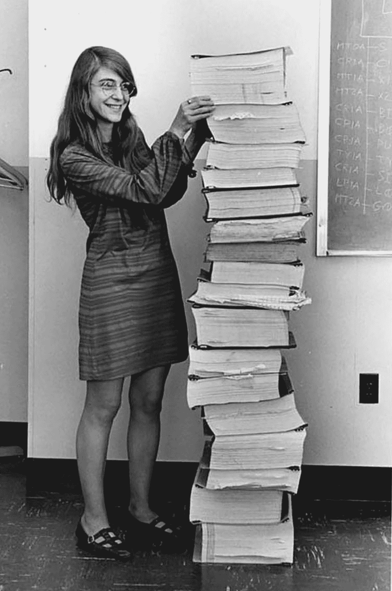
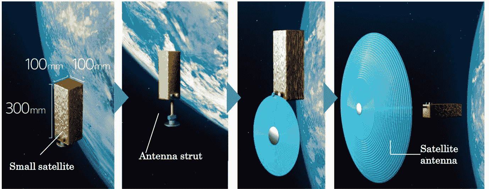

# WebReduce:地球上的程序员，太空中的人类

> 原文：<https://thenewstack.io/webreduce-programmers-on-earth-humans-in-space/>

2000 年，美国国家航空航天局工程师罗恩·加勒特第一次听说了一个名为谷歌的新搜索引擎——在新闻组 comp.lang.lisp 中。在最近的一次播客中，他记得在他的网景浏览器中打开了谷歌——却在页面底部发现了一条致命的消息:“我们正在招聘。”

"我匆匆写了一份简历，15 分钟后，我的电话响了。"

据报道，加勒特成为了谷歌在 T2 的第 104 名员工。他的[个人网站](https://flownet.com/ron/resume.html)还记得他在 AdWords 首次发布时担任首席工程师的工作。但它也凸显了当今高科技部门和太空探索之间正在进行的交叉授粉。

并提醒我们，当人类探索太空时，将是计算机程序员帮助我们到达那里。

本月，加勒特访问了亚当·戈登·贝尔的核心播客，讲述了[调试基于 Lisp 的飞行控制软件](https://thenewstack.io/nasa-programmer-remembers-debugging-lisp-in-deep-space/)中的一个小故障，这个小故障只在“生产中”被发现——在数百万英里外的一艘飞船上。

但是早在 1968 年，先驱程序员玛格丽特·哈米尔顿也不得不在外太空调试代码。在阿波罗 8 号任务中，绕月飞行的宇航员后来无意中选择了一个发射前程序——错误地[覆盖了控制器可擦除存储器](https://thenewstack.io/nasa-programming-legend-margaret-hamilton-gives-rare-interview/)中的数据。

汉密尔顿的错误更严重，因为阿波罗 8 号是载人任务。在最近的一次采访中，汉密尔顿回忆起他们工作的沉重责任笼罩着每一次任务。“如果不成功一个人的生命就危在旦夕，如果不结束。这一直是我最关心的问题，可能很多人也是如此。”

这可能是最终的压力——委托人类生成的代码来保护遥远的宇航员的生命。以至于在 1983 年，两位年轻的科幻作家甚至合作写了一篇质疑载人航天未来的故事。

在 [*《红星，冬季轨道*](https://en.wikipedia.org/wiki/Red_Star,_Winter_Orbit) 中，威廉·吉布森和布鲁斯·斯特林描述了一名年迈的宇航员在一个载人研究设施逗留了几十年，这个设施很久以前就被改造成了轨道上的“苏联太空胜利博物馆”，最终面临退役。(“科洛列夫上校在挽具中慢慢扭动，梦见冬天和重力，”故事开始……)

就在最近[的 1996 年](http://www.ai.mit.edu/courses/6.834J-f01/Williams-remote-agent-aij98.pdf)，研究人员还在争论“太空的未来在信息技术中。我们必须在太空、行星、飞机和宇宙飞船上建立一种虚拟的存在。

无人太空技术继续带来大量的科学测量数据。本周，美国宇航局公布了哈勃太空望远镜 30 年来的观测结果(在一篇题为“哈勃常数局部值的全面测量”的论文中))或者，正如*新地图集*网站[解释](https://newatlas.com/space/hubble-constant-most-precise-universe-expansion/)的那样，“这项新研究对宇宙膨胀的速度进行了迄今为止最精确的测量”——同时也为未来的研究指明了方向。

上周，新的堆栈着眼于该研究的下一代，价值 90 亿美元的詹姆斯·韦伯太空望远镜，称其为“单一最伟大的站点可靠性工程课程”(有 344 个不同的单点故障——全部部署在 100 万英里之外)。

然而在 2022 年，人类仍在无畏地继续探索太空…

尽管他在半个多世纪前扮演过一个星际飞船船长，但上周 91 岁的威廉·夏特纳想起了当现实生活中有机会探索太空时，他竟然拒绝了。

但只是开始。

“当时我正在考虑，”沙特纳告诉《尼亚加拉瀑布评论》。“关于刺激……”这一直是他一生的主题。经过多次内部辩论后，他决定乘坐杰夫·贝索斯的蓝色起源新谢泼德 4 号火箭进行这次旅行，去年 10 月，他以 90 岁的高龄成为最年长的太空飞人。

夏特纳记得，当他最终真正到达太空时，他第一次望向地球时哭了，“为我看到的美丽事物而悲伤——与浩瀚的太空相比，我看到的尘埃颗粒……”

“与宇宙的宏伟相比，我们所依附的一切都是微不足道的……那是一个非常深刻的时代。我显然说过，“我不想忘记我的感受。”而我没有。"

这只是人类目前正在推进的载人航天任务的一小部分。就在去年，美国国家航空航天局的一个网页吹捧其 Artemis 项目的目标是在 2024 年让宇航员重返月球，然后在 2028 年建立“可持续任务”。

 [大卫·卡塞尔

大卫·卡塞尔是旧金山湾区的一名自豪的居民，他已经在那里报道科技新闻超过二十年了。多年来，他的文章出现在各处，从 CNN、MSNBC、华尔街日报互动版到《沙龙》、《连线新闻》、《Suck.com 》,甚至最初的《连线》,以及 Gawker、Gizmodo、McSweeney's 和 Wonkette。他现在正在拓宽自己的职业技能，成为一名兼职电脑程序员，开发两个 Android 应用程序，为亚马逊 Kindle 合作制作两个文字游戏，并涉足互动小说。](https://twitter.com/DavidCasselTNS) 

该机构现在还与复杂的 3D 打印公司合作，“在太空中建造和组装复杂的组件”(以及“按需硬件”)。终极目标？与其试图从地球上发射一个巨大的太空居住舱，似乎更容易*在太空建造*一个。

本月，美国宇航局局长比尔·纳尔逊[拜访了太空制造公司](https://www.mynews13.com/fl/orlando/news/2022/05/11/nasa-administrator-gets-first-hand-look-at-redwire-space-s-self-assembling-spacecraft-hardware)，该公司是一项名为“引爆点”的新型公私资助项目的受益者，该项目与美国宇航局合作，追求令人难以置信的技术。

在即将到来的测试中，一艘小型飞船将打印出两条长光束——一条 33 英尺长，一条 19 英尺长，但每一条都从飞船的侧面伸出。美国国家航空航天局的网页[解释说，这些光束将“展开太阳能电池板，其产生的电能比类似大小的航天器上的传统太阳能电池板多五倍。”美国宇航局相信，有一天同样的技术可以打印出整个太空望远镜，甚至通过打印出整个结构，如栖息地、燃料库或电网，来支持月球基地。](https://www.nasa.gov/directorates/spacetech/stmd-images/NASA_Moon_Kit/)

据一家当地新闻报道称，在本月的访问中，美国国家航空航天局主管看到了将成为光束的原材料。(“缠绕在一个略大于篮球宽度的卷轴上，材料被送入打印机……”)一名退休宇航员在旅行中解释说，“为了经受住发射载荷，它只是卷轴上的一根细丝，就像钓鱼卷轴一样，”因为材料是由强大的 SpaceX 火箭送入轨道的。

“你永远不会带来足够的硬件，你永远无法准确预测你将需要什么，”该公司的首席执行官补充说。

由于发射成本的 90%是其材料的重量，一家[比利时杂志](https://delano.lu/article/redwire-inaugurates-its-europe)最近将该公司在 2020 年的成立称为“太空技术竞赛的转折点”，因为公司“开始想象在太空生产基础设施，而不是将其搭载在火箭上”

随着 Made in Space 的母公司 RedWire 在卢森堡开设其新的欧洲总部，他们的首席运营官称之为“一项改变游戏规则的技术”，用于我们这个“人类重返月球并向太阳系深处推进”的时刻上个月，他们宣布他们的项目已经通过了美国宇航局的关键任务设计审查(尽管它的发射计划不早于 2023 年[)他们现在正在测试它的工程设计，并建造航天器的战斗硬件。](https://www.businesswire.com/news/home/20220406005666/en/)

但在另一项鲜为人知的公告中，三菱旗下的一家电子公司披露了自己的特殊配方树脂，这种树脂“在真空中保持稳定”，只需利用太阳自身的紫外线，就可以廉价地固化成耐热固体。三菱公司设想了一个世界，卫星在到达轨道后*打印出自己的碟形天线。*

三菱在一段宣传视频中说:“这项技术赋予了小型廉价卫星一些大型昂贵卫星的功能，为在太空中 3D 打印超大型结构铺平了道路。”

[https://www.youtube.com/embed/ebZqaOBZApE?feature=oembed](https://www.youtube.com/embed/ebZqaOBZApE?feature=oembed)

视频

这种能力使更大的结构成为可能，但也使更轻更薄的结构成为可能(否则，这些结构可能很难经受住起飞时的所有振动，美其名曰“发射的压力”。))

上周三菱[宣布了这项技术的专利](https://www.mitsubishielectric.com/news/2022/0517.html)——以及树脂…

因此，我们对宇宙的探索仍在继续——有人驾驶的、无人驾驶的，以及两者的结合。二十年过去了，在适当的结尾，威廉·吉布森回顾了他的短篇小说集，其中包括 1983 年的短篇小说，预见了载人航天飞行的终结。

在 2003 年的《T2》新书介绍中，吉普森曾风趣地说“没有什么比想象中的未来更能迅速或奇特地呈现出时代的光泽”，他认为历史本身是“思辨叙事的终极，会不断地、不可避免地被修正”

然后在引言的最后一句，吉布森讽刺地对他的读者开玩笑说，“享受铜绿。”

*大卫·卡塞尔的“ [WebReduce](https://thenewstack.io/webreduce-a-journal-of-geek-culture-and-weirdness-at-scale/) ”专栏大约每个月发布一次，通过互联网蜂巢思维的新鲜而广泛的视角探索新兴趋势。*

<svg xmlns:xlink="http://www.w3.org/1999/xlink" viewBox="0 0 68 31" version="1.1"><title>Group</title> <desc>Created with Sketch.</desc></svg>