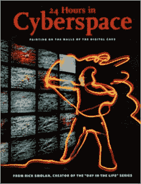
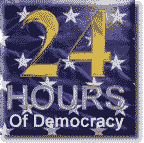
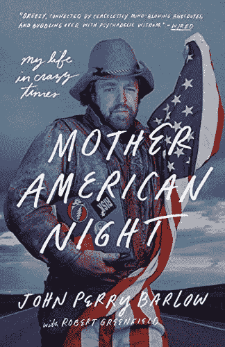

# 网络空间宣布独立的那一天

> 原文：<https://thenewstack.io/webreduce-the-day-cyberspace-declared-independence/>

我记得网络空间发表自己的独立宣言的那一天。

这一切都始于 1996 年，当时的雄心勃勃的计划是[举办](https://baychi.org/calendar/19970909/)有史以来规模最大的一天在线活动。一个创意团队召集了一大群摄影师、程序员、“互动设计师”和编辑来记录“ [24 小时在网络空间](https://en.wikipedia.org/wiki/24_Hours_in_Cyberspace)”，在那里，他们将筛选志愿者提交的 20 多万张照片，以捕捉“网络空间的人性面孔——我们工作、娱乐、学习、开展业务和互动的新方式，”根据[对该项目产生的书的描述。](https://www.amazon.com/24-Hours-Cyberspace-Photographed-Photojournalists/dp/0789709252/)

“他们采访了南非纳尔逊·曼德拉镇的学生，他们使用捐赠的个人电脑与外界联系；流亡藏人依靠互联网保存他们的文化，并招募他人为他们的事业而战；美国人在网上寻求收养俄罗斯孤儿；加利福尼亚州圣何塞的一位父亲出版了《威尔的页面》，这是一本电子杂志，记录了他四岁的儿子与白血病的斗争。

我参观了创作者在旧金山设立的大型指挥中心，该中心也向在线观众实时发布他们的照片。该网站在项目启动的 24 小时内获得了超过 400 万的点击量，HistoryOfDomains.com 的总结报告解释道。

但可以预见的是，也有一个与互联网相关的争议。

那一天，1996 年 2 月 8 日，比尔·克林顿总统签署了《通信体面法案》，旨在将仇恨或“淫秽”言论定为非法，这是一项有争议的法律，后来在法庭上被推翻。

批评家认为新法以保护儿童的名义侵犯了言论自由本身。许多活动家在那天把他们的网站黑了。

因此，虽然“网络空间 24 小时”网站包含了副总统戈尔的乐观文章，但它也包含了 T2 电子前沿基金会联合创始人 T4 约翰·佩里·巴洛的回应。

在这封信中，巴洛宣布了网络空间的独立。

[https://www.youtube.com/embed/Ki9A1vF8V4U?feature=oembed](https://www.youtube.com/embed/Ki9A1vF8V4U?feature=oembed)

视频

## “代表未来…”

“工业世界的政府，你们这些疲惫的钢铁巨人，我来自网络空间，心灵的新家园，”巴洛开始了他的文章。

> *“我代表未来，请过去的你放过我们。我们不欢迎你。我们聚集的地方你没有主权…*

“我没有比自由本身说话更大的权威。我宣布，我们正在建设的全球社会空间将自然地独立于你们试图强加给我们的暴政。你没有统治我们的道德权利，也没有任何我们有理由害怕的强制手段。”

具体来说，巴洛认为，新签署的法律“侮辱了杰斐逊、华盛顿、密尔、麦迪逊、托克维尔和布兰代斯的梦想。这些梦想现在必须在我们心中重生。”

> “我们将在网络空间创造精神文明。愿这个世界比你们的政府以前创造的世界更加人道和公平……”

在 2004 年的一篇文章中，*原因*杂志记得它是“[文件转发‘环游世界](https://reason.com/2004/08/01/john-perry-barlow-20-2/)”。至少有 20，000 个网站高兴地转载了巴洛要求独立的呼吁。很快，一个虚拟的裁判官成立了，负责仲裁网上的不满，政策由一个名为[网络空间法律研究所](http://web.archive.org/web/19970208010202/http://www.cli.org/whatis.html)的法律思想家网络指导。

几周之内，一场更大的反抗议正在形成。

Scripting.com 的戴夫·温纳仍然主持着他 1996 年的网页，承诺“庆祝互联网上的言论自由，展示网络能量…和简洁的网络技巧！”

“1996 年 2 月 22 日，我请求互联网写一篇关于自由的文章，”Winer 在另一页上记起了[，结果是一个由 1000 多个网站组成的相互链接的“网络环”,上面有作为回应而写的文章。他们都佩戴着同样的星条旗。GIF 文件，宣布了他们的活动名称。](http://scripting.com/twentyFour/readingTheEssays.html)

“24 小时民主”

## 庆祝言论自由

这是一场真正的草根运动，旨在阐明民主对他们意味着什么，网络空间在其中的位置，以及对保护我们言论自由重要性的思考。

甚至比尔·盖茨[也写了一篇文章](https://web.archive.org/web/19961203232059/http://www.scripting.com/davenet/96/02/billgatesonfreedom.html):

从二十年前开始，美国的个人电脑产业在没有政府控制和监管的情况下发展起来。由此带来的个人电脑革命的好处是深远的…

言论自由也符合我们的国家利益。纵观历史，自由一直是我们国家的标志，它使我们的社会受益，并帮助我们为世界树立了榜样。在全球范围内自由交流思想对美国的政治和经济都很重要。当谈到计算机网络上的言论自由时，让我们不要树立一个坏榜样，从而破坏世界范围内的言论自由趋势。

《权利法案》是我们建国的基础。互联网是一个非常有价值的地方，这些权利必须在其中继续茁壮成长。权利法案和互联网都有潜在的脆弱性。对他们中的任何一个太过分，我们可能会毁了他们。

我们不能让这种事情发生。

在这个过程中的某个地方，这个系统发挥了作用。注意到立法者越权的论点，美国最高法院于 1997 年否决了《通信得体法》中有争议的“不雅言论”保护条款，宣称它们违反了美国宪法。

世界开始了其他的战斗…

## 之后的时代

许多 1996 年的文章现在已经从互联网上消失了，连同最初的“网络空间 24 小时”网站——都消失在不断变化的网络主机的变迁和时间的蹂躏中。

2004 年 *Reason* 问巴洛关于他在 20 世纪 90 年代预测我们的数字未来的早期著作，指出“那时你听起来乐观得多，带着更多‘现在没有什么能阻止我们’的态度。”

巴洛回答说，“我们都会变老，变聪明。”

但这是一个值得记住的时刻，当新的一天开始时，普通美国人表现出他们为自由而战的意愿。

为大声说话而大声说话。

在[2016 年的一次采访中 *Wired* 强调巴洛“想要澄清:他今天仍然信守诺言，就像他在 1996 年点击‘发送’时一样。”](https://www.wired.com/2016/02/its-been-20-years-since-this-man-declared-cyberspace-independence/)

也许独立日真正庆祝的是我们所有人心中的那种精神。为我们的信仰而战。永不放弃。

就在四年前，世界收到了约翰·佩里·巴洛的最后一本回忆录——在他死后于 2018 年出版。在“美国母亲之夜:我疯狂时代的生活”中，巴洛调查了一次漫长而狂野的骑行，该骑行始于怀俄明州的乡村，地形崎岖，他曾在 7 月 4 日看到过下雪。

这本书以一个关于一位祖父的故事开始，他在医生诊断后多活了半个世纪。这本书的序言讲述了巴洛自己在一次濒死体验后复活的疯狂故事。

整个事件中最让我吃惊的是，经过这么多年的思考，我真的明白你死时发生了什么，但我什么也没看见。没有向上席卷的光之河，没有天使，没有基路伯，没有六翼天使，没有天上的人。一切都变黑了。我已经走下了永恒的隧道，结果只不过是一个廉价的嘉年华骑无处可去。

当我把这件事告诉我的老朋友和歌曲创作伙伴鲍勃·威尔时，他看着我说，“嗯，这可能是因为你还没死够。”

## 美国的灵魂

是的，今天人们很容易对互联网感到气馁。在 EFF 成立 30 周年的庆祝活动上，EFF 执行董事辛迪·科恩承认了社交平台霸权的新世界，EFF 联合创始人米切尔·卡普尔谴责他们“放大错误信息和仇恨，因为它服务于这些公司的商业模式。”

后来，卡普尔补充道，“我越是看到互联网实际发生的事情，就越觉得这是资本主义功能失调的结果。”

但与此同时，科恩也指出，在一个政府希望制定针对加密通信的法规的世界里，该组织实际上帮助“改变了动态”。

我把 7 月 4 日视为反思日。也许真正的教训是美国精神仍然存在于某处。个人可以有所作为。也许只有在个人层面上，差异才会真正产生。

当美国思考 1 月 6 日国会大厦袭击听证会的最终意义时，CBS 新闻记者史蒂夫·哈特曼[发现了一个完全不同的视角](https://www.cbsnews.com/news/covid-icu-nurse-patient-message-hope/)。哈特曼在 2021 年写道，他分享了疫情时代的一个故事，讲述了一名 ICU 护士和一名来自 Covid 的怀孕六个月的“病危”患者。但是在插管和紧急剖腹产后，这位母亲活了下来。在圣路易斯的某个地方，重症监护室的护士最终为她举办了一个非常特别的婴儿送礼会，并筹集了数千美元。她甚至成了孩子的教母。

哈特曼指出，这一切都发生在美国历史经历 2021 年 1 月 6 日的黑暗之时。“重要的是，尤其是在这个糟糕的一周结束的时候，要知道，当所有这些都在发生的时候，这个也在发生。当混乱笼罩着华盛顿时，同情统治着这个中心地带的角落和整个国家。

“因为美国的灵魂不会被洗劫一空，而困扰我们的问题的解决方案肯定不在穹顶之下。”

它存在于我们所有人的心中。

<svg xmlns:xlink="http://www.w3.org/1999/xlink" viewBox="0 0 68 31" version="1.1"><title>Group</title> <desc>Created with Sketch.</desc></svg>