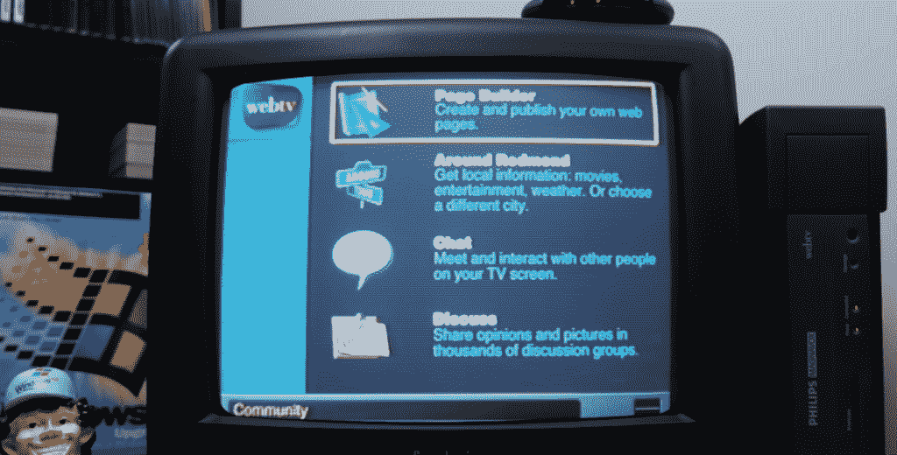

# 2022 年的网络电视？复古技术爱好者在 YouTube 上展示如何

> 原文：<https://thenewstack.io/webtv-in-2022-vintage-tech-enthusiast-shows-how-on-youtube/>

网络电视这个名字让人想起了网络的早期。复古技术爱好者“迈克尔·MJD”记得这款设备是“90 年代中后期的瘦客户端平台，它将万维网这种新奇的东西带到了你舒适的客厅”电视上。它于 1995 年首次亮相，并于 1997 年被微软收购。

在他的 YouTube 频道上，迈克尔拆开了一台 1998 年的网络电视，将其连接到自己的电视上——并在 2022 年开始用它上网冲浪。

[https://www.youtube.com/embed/NjteQv6oYgA?feature=oembed](https://www.youtube.com/embed/NjteQv6oYgA?feature=oembed)

视频

当然，这个奇迹是在现代网络电视爱好者社区的一点帮助下完成的，他们保持着这种体验，迈克尔告诉他的观众。“尽管微软在 2013 年关闭了让网络电视和后来的 MSN 电视盒子工作的服务，但在现代，仍有一些人试图创建定制服务器，以获得这些盒子的一点功能。”

他为“jarhead”和“nitrate92”大声疾呼，让这次时光倒流之旅成为可能——这两位狂热分子向现代用户提供了原始网络电视欢迎屏幕的实际字节。这些精心重建的屏幕是从以前使用的网络电视设备的硬盘中精心提取出来的，尽管他们的服务器尚未向公众开放，但他们给了迈克尔一个早期的预览。

由于他们的努力，迈克尔能够带着他的观众一起进行他的冒险，通过网络电视明显对消费者友好的界面，向观众展示 1998 年体验互联网是什么样子的。

## 回到未来

通常，网络电视给人的感觉和以前一模一样:试图通过你的电视机将互联网接入推向大众市场。它让没有个人电脑或显示器的人也能使用基本的互联网功能——不仅仅是网页浏览，还有实时聊天、讨论板，甚至发送电子邮件和建立网页。他们只需每月支付订阅费，就可以访问为他们的电视格式化内容的服务器——这个价格和你支付给当地互联网服务提供商的价格差不多。

除此之外，网络电视仍然通过你家的电话线上网。因此，从一开始，重新创建其基于手机的功能就需要一些修补。迈克尔首先必须获得一个戴尔 NW147 调制解调器，然后将其连接到一个装有特殊软件的 Raspberry Pi。

“Dream Pi”软件使世嘉的老式、90 年代末的“Dreamcast”控制台能够连接到现代服务器上继续播放，迈克尔安装了一个经过修改的版本，用于连接网络电视服务器。除此之外，Dream Pi 播放一个循环播放的拨号音音频文件，并基本上欺骗网络电视盒，使其认为它连接到一条直播电话线。

然后，迈克尔还必须建造自己的线路电压感应器，“以便在电话线上实际发送适当的电压。”

“这真的很容易做到，”他告诉他的观众。“你只需要拿一根电话线，切开外套，找到一根环形线，然后基本上连接直流变压器的正极和负极……并将它们连接起来。”

但最终，迈克尔迎来了“这个网络电视盒子等待了 25 年的时刻。”他打开了一个 24 年前从未打开过的网络电视盒子的封条。除了电缆和“分离器”电话插孔，迈克尔还找到了非常重要的网络电视遥控器，它可以在“电视模式”和“网络电视模式”之间切换但是最后，迈克尔拿出了他的聚苯乙烯泡沫塑料包裹的奖品——一个炭黑色的 Phillips Magnavox 网络电视单元。

由于 25 年已经过去了，迈克尔没有费事邮寄附上的保修卡。

唯一没有包含的东西？一个键盘。(网络电视键盘作为配件单独出售。)迈克尔讽刺地说，没有它会让这种体验“更真实”，重现了在屏幕键盘上滚动到每个字母后，必须一个接一个选择它的痛苦。更令人沮丧的是:默认设置不是 QWERTY，而是一个字母从 A 到 z 按字母顺序排列的键盘。

在视频的结尾，迈克尔承认他后悔没有买键盘。

“你可能需要有键盘来真正完成创建网站的过程，而不想把遥控器扔向电视。”

## 建立联系

这并不总是即时的满足。通过电话线拨打服务器，首先会触发任何网络电视所有者都熟悉的屏幕序列——一个双色图像，显示黄色高速公路向黄色城市天际线行驶，并伴有一些活泼的电子音乐。

[https://www.youtube.com/embed/brZYWcGgg4Y?feature=oembed](https://www.youtube.com/embed/brZYWcGgg4Y?feature=oembed)

视频

Michael 最终成功连接到新的定制服务器，该服务器仍然神奇地重新创建了最初的注册过程，显示每月订阅费和服务协议，并提示用户键入帐户名。(最初，这将成为您在 WebTV.net 的电子邮件地址，但现在它只是这台特定服务器的一个帐户名。Jarhead 的一个更新承诺，“希望你也能很快在服务器之外发送和接收邮件。”该服务还有一个新的定制服务条款，写于 2022 年 1 月。

他们还重新创建了最初的欢迎屏幕，甚至一个解释最初的网络电视互动电视列表的屏幕，以及一个解释如何使用网络电视编程你的… VCR 的屏幕。(“在本周的电视列表中找到一个节目，然后选择录制，”屏幕解释道。“剩下的事情由网络电视来做。”)

虽然，因为迈克尔的电视没有连接到有线电视或无线天线，它的电视观看模式只是在画中画窗口中显示静态。

但很快他就来到了网络电视的主屏幕，提供了 1998 年以来所有相同的图标。微软的旧短信服务 MSN Messenger 已经被一个名为 Escargot 的项目复兴，现在也可以通过这个网络电视服务器访问。Michael 用他自己的 Messenger 帐户演示了这一点。该服务器还与 Libera Chat IRC 建立了工作连接，这是一个最近为自由/开源软件项目建立的 IRC(互联网中继聊天)网络。

社区图标背后还有更多值得一看的东西。最初，它带来了天气和其他当地信息，不知何故，这些都被忠实地重现了(对于华盛顿州的雷蒙德镇)。这包括一个链接到 1998 年的顶级搜索引擎——雅虎，尽管页面上的大多数其他链接都不起作用。

还可以访问论坛，其中一个主题是 MIDI 音乐文件，另一个论坛从 Usenet 新闻组“alt . discuse . webtv . hacking”中提取信息，这是正在进行的将所有论坛连接到当前新闻组论坛的一部分。

甚至有一个工具可以创建你自己的网页。

在这里，复兴团队保留了该工具的大部分原始功能，让用户从预先设计的模板中进行选择。很快，迈克尔在这个现代网络电视迷你社区中创建了自己的[简单网页。](http://community.webtv.zone/michaelmjd/MyWebsite/index.html)

## 一些调整

今天还有多少功能幸存下来，这是一个小小的奇迹。搜索图标会弹出一个输入窗口，旁边的横幅自豪地宣称“由 InfoSeek 提供支持”，尽管这个搜索引擎在 23 年前就已经关闭了。但是不要绝望。这个定制服务器交换来自 [FrogFind](https://www.reddit.com/r/retrobattlestations/comments/mhilic/announcing_frogfind_a_search_engine_and_web/) 的搜索结果，这是一个专门为老式计算机设计的 DuckDuckGo 搜索结果的纯 HTML 包装器。FrogFind 的搜索结果也被 TheOldNet.com 使用，该网站使用互联网档案馆的 API 来调出旧版本的网页(并去掉不兼容的 JavaScript)。

因此，迈克尔在网络电视的浏览器上调出了 TheOldNet.com 的视频，以证明即使浏览网页也是可能的。

但是有趣的事情开始了。由于内容是通过一个家庭自制的网络电视服务器传送的，“我已经看到一些这样的盒子，他们用一些非常搞笑的东西修改了文本，”迈克尔笑着说。例如，现在购物页面在购买网络电视接收器时会宣传“买一台，享受 0%的折扣”。点击那个链接会弹出一个承诺，“你的信息会被盗。我保证，否则我们会亲自拿走你的钱。”

尽管右边的文本承诺“可以尝试的东西”，但实际上选择它的链接会得到令人惊讶的相反的反应。(比如“不”、“停止”和“停止访问 20 年前的网站。”)而催促你“办一张信用卡”的链接甚至会弹出一个对话框说，“这是个糟糕的主意。我不知道那家伙在说什么。”

WebTV Today 链接现在是复兴项目的更新日志。

当然，“获取星座”链接无法连接到[webtv.astroadvice.com](https://web.archive.org/web/19991013070723/http://webtv.astroadvice.com/)。(不过，Archive.org 可以向你展示它在 1999 年的样子。)

大约 1999 年的 AstroAdvice.com 截图(经 Archive.org)

但“今日新闻”部分实际上确实会吸引最新的新闻、体育和娱乐头条——所有这些都来自今天的“纽约时报”(显示了 FrogFind 的简化友好结果)。

然而，最赚钱的故事并不存在，取而代之的是复兴项目团队的一个占位词:“嗯。”

## 用网络电视遥控器毁灭

JarHead 甚至向迈克尔提供了两个 90 年代后期游戏的硬盘映像——“厄运”和“你不知道杰克”——只有精英集团才能使用 DISH TV 卫星服务及其特殊的网络电视捆绑。“回到 90 年代末/21 世纪初的某个时候，网络电视黑客场景中的一群人能够进入一个名为 TestDrive 的内部网络电视服务，”迈克尔解释说，该服务存储了两个游戏的所有文件，并以某种方式允许它们被走私到 2022 年。

最后，迈克尔承认只用一个网络电视遥控器玩《毁灭战士》非常困难。但“即使在目前的状态下，这也是一个令人难以置信的复兴项目，”迈克尔滔滔不绝地说。

尽管已经有近十年的时间没有人能够用网络电视正式上网了，“我认为看到这个东西公开发布会非常棒。”

<svg xmlns:xlink="http://www.w3.org/1999/xlink" viewBox="0 0 68 31" version="1.1"><title>Group</title> <desc>Created with Sketch.</desc></svg>