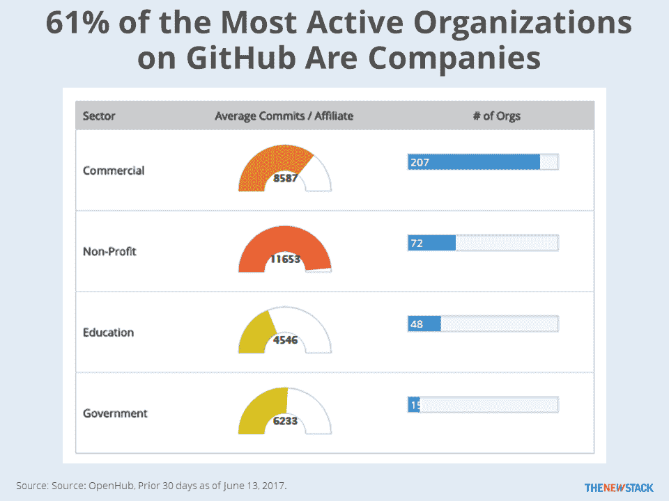

# 本周数字:比较 GitHub 组织的企业开源贡献

> 原文：<https://thenewstack.io/week-numbers-comparing-corporate-open-source-contributions-github-organizations/>

你还记得[读到过](https://octoverse.github.com/)微软和脸书在 GitHub 上的贡献者比其他任何组织都多吗？这个数据的价值有限，因为大量的开发工作发生在雇主的 GitHub 组织账户之外。例如，Red Hat 员工代表了大量与云和容器相关的项目的贡献者，但可能不会因此得到认可，因为这发生在非公司组织中。此外，公司为流行项目创建单独的组织是很常见的。因此，使用这种方法，谷歌的 Angular 项目没有得到认可，但脸书可以享受 React 的光芒。

评估 GitHub 组织的另一种方式是基于它们的活动。 [Open Hub](https://www.openhub.net/) 数据显示 GitHub 组织中 61%最活跃的组织是商业企业。这些公司中的大多数都在从事几乎所有贡献者都是雇员的项目。像那些支持 Linux 和 Kubernetes 的非盈利组织平均拥有最高的提交数量。教育机构最少，因为他们维护的许多项目只是管理教学大纲和家庭作业的方法。

展望未来，我们希望根据开发人员投入到公司控制的开源软件项目、其他开源工作以及专有工作中的时间百分比来评估公司的开源软件。如果不使用愚蠢的虚荣心指标，你将如何衡量公开参与度？

劳伦斯·赫克特每周六都会推出一个新的“[本周数字](/tag/this-week-in-numbers/)”专栏。

由[布雷迪·贝里尼](https://unsplash.com/photos/_hpk_92Crhs?utm_source=unsplash&utm_medium=referral&utm_content=creditCopyText)在 [Unsplash](https://unsplash.com/?utm_source=unsplash&utm_medium=referral&utm_content=creditCopyText) 上拍摄的特征图像。

<svg xmlns:xlink="http://www.w3.org/1999/xlink" viewBox="0 0 68 31" version="1.1"><title>Group</title> <desc>Created with Sketch.</desc></svg>