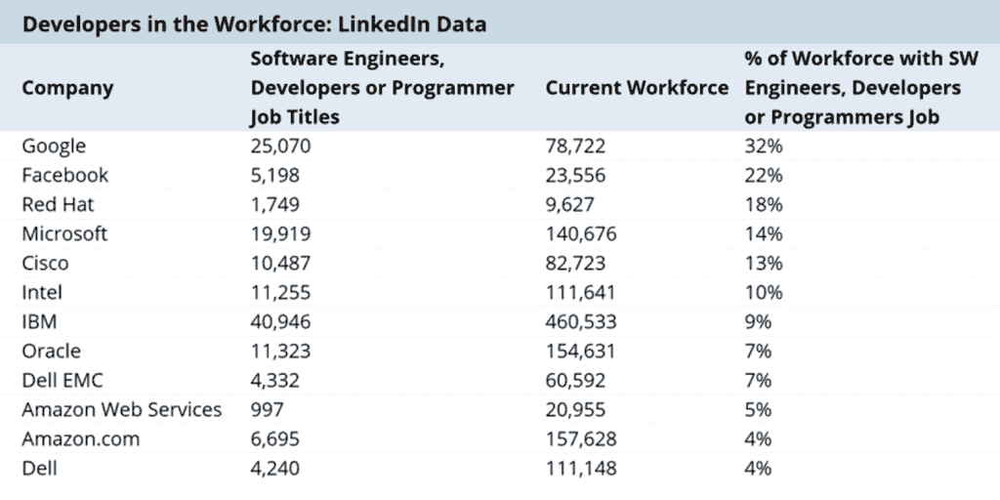
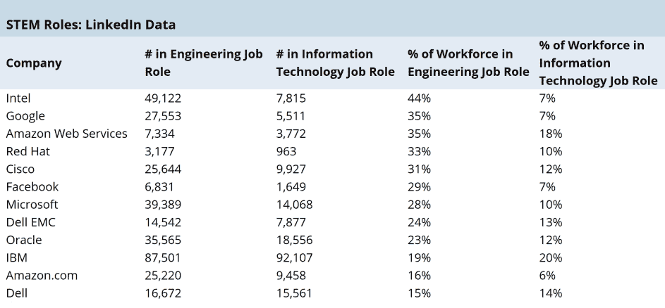
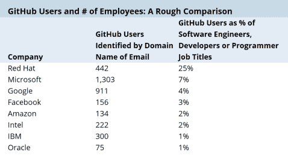

# 本周数字:大公司的开源开发

> 原文：<https://thenewstack.io/week-numbers-data-lots/>

一家大型 IT 公司应该愿意投入多少开发人员来构建和维护开源软件项目？下面，我们收集了 12 家最大的 IT 公司中致力于开源的开发人员的百分比。然而，要小心下结论。

你可能认为这个百分比预示着公司的成功。在那里我们不能确定任何关系。我们也无法证明利润与开源采用、数据驱动决策或 DevOps 实践之间的直接联系。尽管许多其他人做出了努力，但我们对显示这些因素和实际公司收入之间存在直接因果关系的研究持怀疑态度。要考虑的因素太多了。相反，新的堆栈已经分析了一些数据，并将让您得出自己的结论:

利用 LinkedIn 的数据，我们对 12 家最大的科技公司的员工进行了描述，以确定他们部署了多少开发人员。IBM 拥有 40，946 名开发人员、软件工程师和程序员，远远超过其他公司；谷歌紧随其后，有 25070 个。然而，这种工作角色的人只占 IBM 员工的 9 %,而在谷歌占 32%。

然而，LinkedIn 员工数据中包含的 STEM(科学、技术、工程和数学)并不都是开发人员。从工作角色来看，亚马逊网络服务是领导者，53%的员工从事工程或信息技术。

就工程师员工的比例而言，英特尔以 44%的比例位居第一，其次是谷歌(35%)、AWS(35%)和 Red Hat(33%)。

[上周的帖子](https://thenewstack.io/week-numbers-making-sense-open-source-projects/)指出，至少从使用公司电子邮件地址的开发人员数量来看，IBM 和 AWS 在 GitHub 托管项目的员工数量上远远落后于微软和谷歌。其他人指出，这些数据似乎也低估了 Red Hat 和 Pivotal 在开源社区中的地位。所以，我们决定利用 LinkedIn 的数据来获得不同的视角。

事实上，GitHub 贡献者的数量占所有红帽开发者的 25 %,相比之下，微软只占 7%。排名靠后的是 Amazon.com，占 2%，英特尔、IBM 和甲骨文甚至更低。对于英特尔、IBM 和甲骨文，我们相信他们的许多开发人员正在从事专有项目，或者亲自帮助他们的客户进行定制部署。注意，我们没有提到 AWS，因为我们无法区分他们的开发人员和那些为大公司工作的人员。

LinkedIn 的数据清楚地划分了为 AWS 工作的人和公司其他人，显示该公司 11%的员工为云提供商工作。这与它在最新季度报告中占总销售额的 10%非常接近。当然，AWS 员工为亚马逊创造了更大比例的利润，但这是另一回事了。如上所述，AWS 拥有最大比例的工程师和 IT 工作者。有趣的是，Amazon.com 的最低。

这是有道理的，因为后者是一家零售和物流公司。然而，仅仅基于职称，AWS 和亚马逊的开发人员比例是相似的——4.8%比 4.3%。我们认为这是因为 AWS 的职位与他们的业务相关职能联系更紧密。

因为只使用了谷歌 Felipe Hoffa 的一篇文章中引用的 GitHub 数据，所以该表中的公司较少。

谷歌、微软和红帽是新堆栈的赞助商。

由[斯科特·韦伯](https://unsplash.com/@scottwebb)通过 [Unsplash](https://unsplash.com/photos/xgAcJZRk9_8) 拍摄的特写图片。

<svg xmlns:xlink="http://www.w3.org/1999/xlink" viewBox="0 0 68 31" version="1.1"><title>Group</title> <desc>Created with Sketch.</desc></svg>