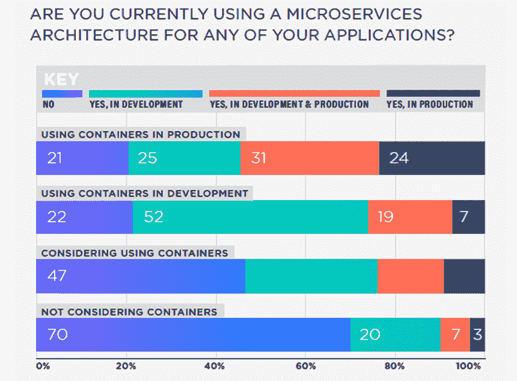
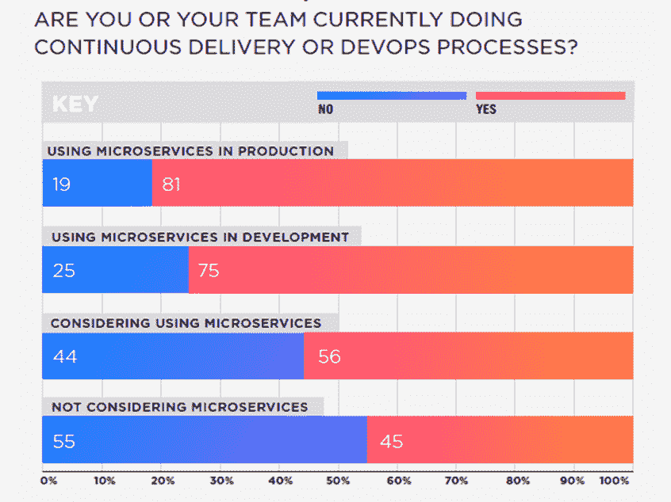

# 本周数字:DevOps 青睐微服务

> 原文：<https://thenewstack.io/week-numbers-devops-favor-microservices/>

不需要将每个应用程序分解成[微服务](/category/microservices/)，但是传统观点认为这种做法正在变得普遍。DZone[最近对 605 名软件专业人员的调查](https://dzone.com/guides/microservices-breaking-down-the-monolith)揭示了这个问题:26%的受访者至少在一个生产应用中使用微服务架构。另外 27%的人在开发中使用微服务，剩下 47%的人没有接触过这种类型的架构。

这些数据提醒我们，许多热门趋势在最初的采用热潮之后会降温。然而，深入调查还显示，在阅读新堆栈的人群中，微服务的采用率明显更高。事实上，55%在生产中运行的容器也将微服务架构用于生产应用。开发运维之间的相关性更为显著，81%在生产中使用微服务的用户也遵循连续交付或开发运维实践。

微服务的采用可能会继续，尤其是随着最佳实践的不断发展。然而，对于许多不值得重构的应用程序，这个过程可能是渐进的。

顺便提一下，在生产中使用微服务的人实施开发运维及持续交付的可能性增加了 80 %:

由 [David Sonluna](https://unsplash.com/photos/AyHYbR6mzRI?utm_source=unsplash&utm_medium=referral&utm_content=creditCopyText) 在 [Unsplash](https://unsplash.com/search/photos/Favor?utm_source=unsplash&utm_medium=referral&utm_content=creditCopyText) 上拍摄的特征图像。

<svg xmlns:xlink="http://www.w3.org/1999/xlink" viewBox="0 0 68 31" version="1.1"><title>Group</title> <desc>Created with Sketch.</desc></svg>